# SAP 后台作业处理 SM36：创建，计划，重新计划

> 原文： [https://www.guru99.com/background-job-processing.html](https://www.guru99.com/background-job-processing.html)

### 什么是后台工作？

Background job is a non-interactive process that runs behind the normal interactive operations. They run in parallel and do not disturb interactive (foreground jobs) processes and operations.

It is scheduled from SM36\. You can analyze it from SM37 by viewing its job log.

## 后台工作的优势

*   它减少了手动工作&自动化任务。
*   可以根据用户的选择进行安排。
*   它减少了用户交互，无需用户输入即可在后台无缝运行
*   为后台作业定义变体后，用户不必担心在字段中输入值。 因此，也减少了用户的困惑。
*   可以安排在夜间（系统负载较低时）运行的耗时/资源密集型程序的理想选择。

## 后台作业分为三类-

1.  **A 级（高/紧急优先级）**：-某些任务紧急或紧急，必须与 A 级优先级作业一起安排。 A 级优先级保留一个或多个后台工作流程。 用户必须决定应为 A 级优先任务分配多少后台工作流程。 假设用户为此类别选择了 2 个后台工作流程，则类别 B 和 C 的可用后台工作流程=（在操作模式 RZ03 中设置的工作流程总数）-（允许将工作类别划分为 A 类）。
2.  **B 类（中等优先级）**：-A 类作业完成后，B 类作业将在 C 类作业之前在后台开始执行。
3.  **C 类（低优先级）**：-A 类和 B 类作业均完成后运行。

## 后台作业的可能状态

1.  **已计划：-**您已定义程序名称和变体，但未定义开始条件，如开始日期，结束日期，频率等。这意味着您尚未定义何时在系统中计划作业。
2.  **已发布：-**满足作业定义的所有必需条件。 作业必须处于开始状态才能处于释放状态。
3.  **准备就绪：-**满足了在后台工作流程中运行作业的所有必需条件。 但是作业调度程序已将作业放入队列中，因为它正在等待后台工作进程释放。
4.  **活动：-**作业已开始在后台运行。 作业处于活动状态后，我们将无法更改其状态。
5.  **完成：-**作业成功执行。 这意味着所要完成的任务没有任何错误。
6.  **已取消：-**有两种可能性。 管理员已强行取消了作业，否则作业可能会出现问题。 您可以从作业日志中进行调查。

## 如何安排后台作业？

您可以使用 **SM36** 安排后台作业。 可以安排计划或即时的工作。

步骤 1）执行 T 代码 **SM36** 。

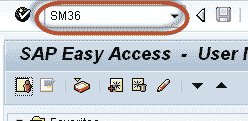 

**步骤 2）**填写作业名称，优先级**（A / B / C）**和目标服务器。 一旦在目标服务器上安排了后台作业，该作业就会在该服务器上运行。 定义目标服务器的主要目的是工作负载平衡。

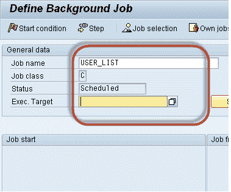 

**步骤 3）**单击“ **假脱机列表收件人”** 。 您将在邮箱中获得输出。 您可以从 **SBWP 检查电子邮件。**

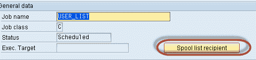 

**步骤 4** ）插入 **SAP** 用户名，然后单击复制按钮。

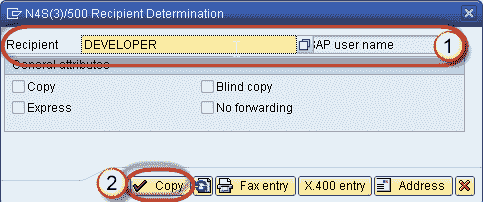 

**步骤 5** ）单击**步骤**按钮定义 ABAP 程序，变量的详细信息等。

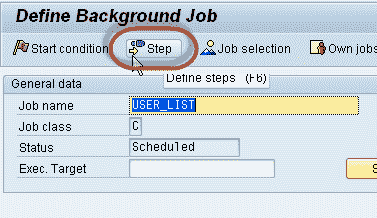 

**步骤 6）**定义程序名称，变体详细信息。

1.  在字段中输入您的程序名称，变体名称。 如果尚未根据要求创建变体，则将其留空。
2.  按保存按钮。

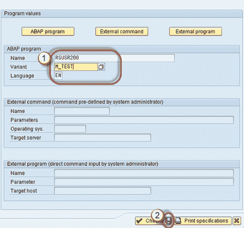 

**步骤 7）**计划作业后，将显示以下屏幕。

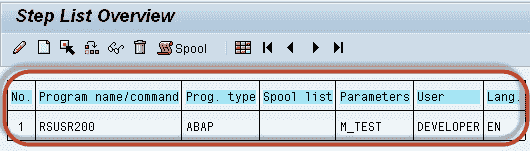 

**步骤 8）**单击开始条件以填写作业的开始日期，结束日期，频率等。 如果您未指定开始条件**，则作业将始终保持计划状态**。 计划状态的作业将永远不会运行。

1.  单击**日期/时间（对于定期作业）**。 如果单击“立即”，则作业将立即开始运行。 但这不会设置为定期工作。 就像“ **按下并运行”。**
2.  定义作业的开始日期/时间，结束日期/时间。 作业只有在达到其**计划的开始日期/时间**后才会被释放。
3.  按周期值。

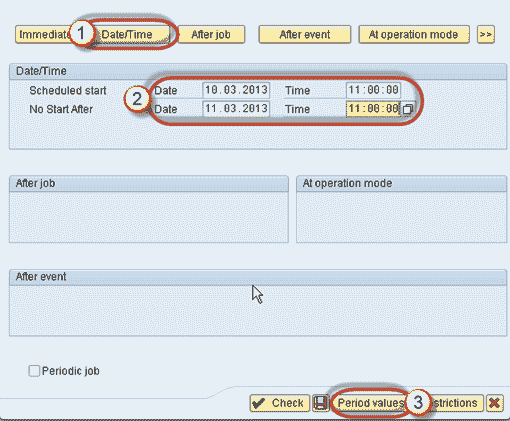 

**步骤 9）**单击“每小时/每天/每周”以根据您的要求定义工作频率。我们将选择“其他时间”

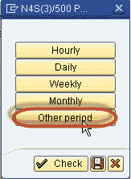 

**步骤 10）**此处指定作业的重复条件。例如，您可以从开始日期起每 5 天运行一次作业。 在这里，我们选择每 10 分钟运行一次的作业

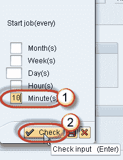 

**步骤 11）**单击**保存**按钮。

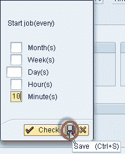 

**步骤 12）**单击**再次保存**。

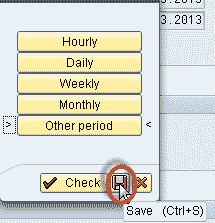 

**步骤 13）**单击**再次保存**

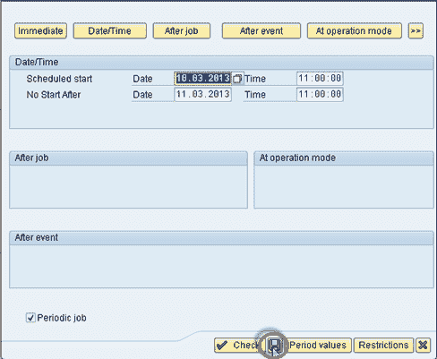 

**步骤 14）**一旦定义了**作业步骤和开始条件**，将出现以下窗口。

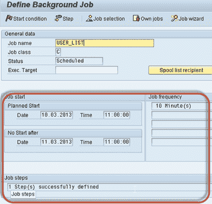 

**步骤 15）**按**保存。**

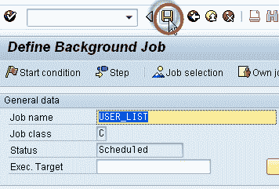 

**步骤 16）**转到 **SM37** 了解作业状态。

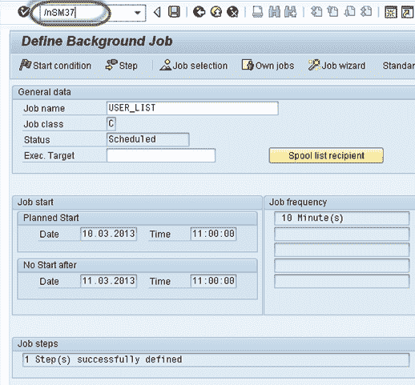 

**步骤 17）**选择要监视的作业的条件。

1.  输入安排工作的工作名称和用户名。
2.  选择作业的状态。
3.  指定日期范围。 在我们的方案中，我们只指定结束日期，同时保持“从日期开始”。

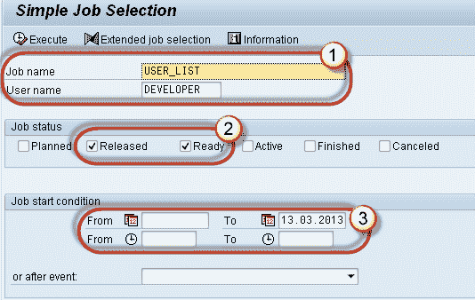

**步骤 18）**您将获得以下屏幕。 查看状态，它是已释放，表示已满足启动条件，并且该作业在队列中，正在等待**后台工作进程空闲。**

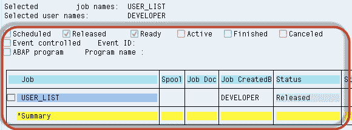

## 如何重新安排后台作业

重新安排的工作将来将不再运行。 请记住，一旦作业处于**处于活动状态**的状态，就无法调度该作业。

步骤 1）执行 **SM37。**

 

步骤 2）填写条件。

1.  计划作业的作业名称和用户名。
2.  选择状态。 要调度作业，您只能选择已发布/就绪状态。
3.  指定日期范围。
4.  按执行（F8）按钮。

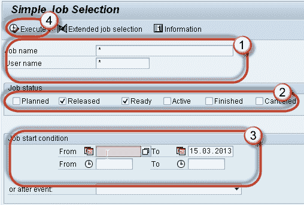

步骤 3）选择指定的作业，然后按**作业->（已发布->已排定）。**

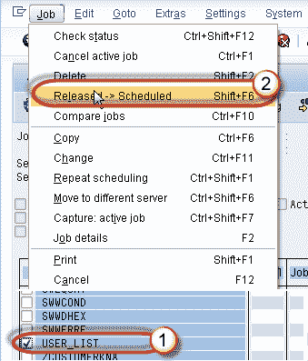

步骤 4）一旦按下“ **Released-> Scheduled** ”，您将在状态栏中找到消息。

