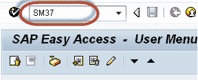
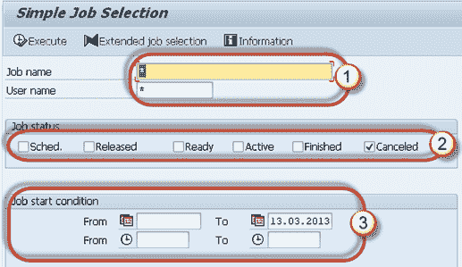
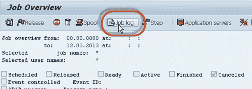
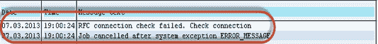
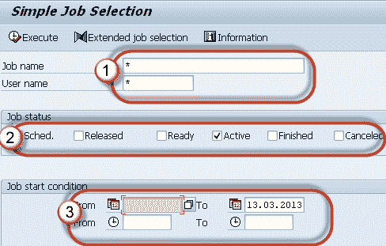
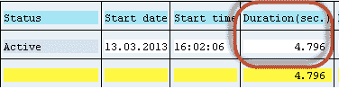
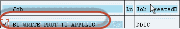
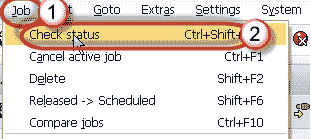
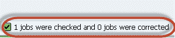
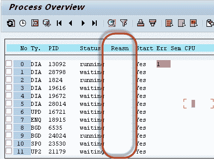

# SAP SM37：如何监视后台作业

> 原文： [https://www.guru99.com/how-to-monitor-a-background-job.html](https://www.guru99.com/how-to-monitor-a-background-job.html)

监视后台作业很重要，因为一旦安排了作业，由于某些错误它可能会被取消。 要调查根本原因，请使用 SM37。

**步骤 1）**执行 T 代码 **SM37。**

**步骤 2）**填写所需标准。

1.  **作业名称和用户名**（安排作业的人员）。 您可以输入*以获取所有用户计划的所有作业的详细信息。
2.  选择您要监视的作业状态。 如果发现后台作业尚未完成，请选择``取消状态''。
3.  根据您的要求输入日期范围。

**步骤 3）**您将得到如下所示的屏幕。

**步骤 4）**单击**作业日志**按钮以跟踪由于取消了作业而导致的错误。

**步骤 5）**您将获得以下详细信息。 在下面的示例中，作业被取消，因为与远程系统的 RFC 连接出现问题。 作为解决方法，请使用 SM59 来检查远程系统是否存在授权问题。

> 有时处于“活动”状态的作业也可能导致问题。

您可能会遇到表空间已满等问题; 重复的作业以相同的名称和时间运行，作业正在选择或更新大数据，等等。

您也可以从 SM37 检查此类作业。 请按照以下步骤操作。

**步骤 1）**执行 **SM37** 。

**步骤 2）**填写所需的条件。

1.  作业名称和用户名（按计划的作业）。
2.  选择您要监视的作业状态。 **如果发现系统性能问题或很长时间未完成任务，请选择活动状态。**
3.  根据您的要求输入日期范围。

**步骤 3）**查看**持续时间**列（表示作业自 n 秒起开始运行）。 如果您发现工期长，请从作业日志中调查作业详细信息。 某些作业使用大量数据。使用 SE16 检查表条目查找作业使用的表。

> 有时，即使已完成，作业也显示为“活动状态”。

如何纠正它们？ 请遵循以下步骤-

**步骤 1）**如上所示，执行 T 代码 **SM37** 并选择处于活动状态的作业。

**步骤 2）**选择导致问题的**活动**作业。

**步骤 3）**单击**作业->检查状态**。

**步骤 4）**在窗口的**状态栏**中，您会看到以下消息。 **如果出现问题，这将修复作业状态**

**步骤 5）**如果仍然有作业处于运行状态，请转到 **SM50** 。 下面的屏幕将打开。 看一下**“原因”** 列，其中显示了任何错误或特殊问题。 进一步调查。

