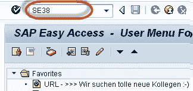
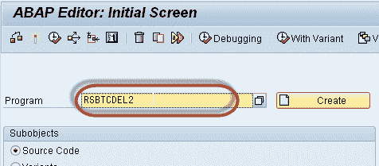
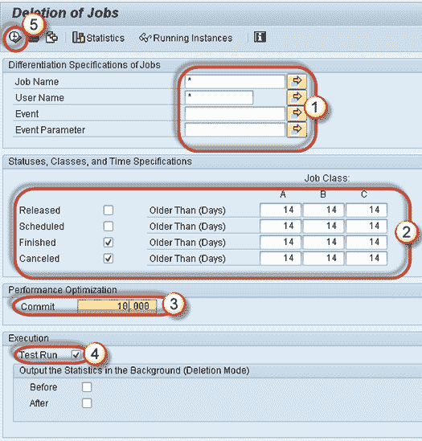
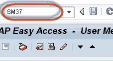
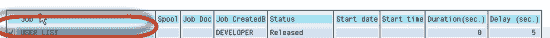
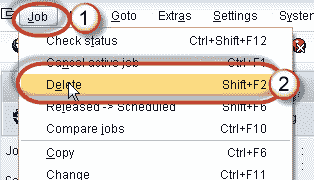

# SAP RSBTCDEL2：如何删除后台作业

> 原文： [https://www.guru99.com/how-to-delete-a-background-job.html](https://www.guru99.com/how-to-delete-a-background-job.html)

### 为什么要删除后台作业？

旧工作会占用系统空间。 为了避免系统内的任何不一致，通常我们会删除日志。 因为如果文件系统已满，则您的 SAP 系统将崩溃！

您可以通过两种方式删除作业：

1.  一次执行多个作业。
2.  单个作业删除。

## 一次删除多个作业

最好的方法是使用报告 **RSBTCDEL2（RSBTCDEL 的新版本）。** 旧的作业日志将被删除，并且不会显示在作业概述中。

**步骤 1）**执行 T 代码 **SE38。**

**步骤 2）**在 **RSBRCDEL2 字段中输入程序名称。**

**步骤 3）**填写正确的详细信息。

1.  您要删除哪个作业？如果输入*表示所有作业。 如果要从特定用户删除作业，请提供 UserName。
2.  指定要删除的作业状态。 指定删除的时间段。 例如，删除早于 14 天的作业。注意：作业处于非活动状态后，将无法删除它们。
3.  指定提交。 提交值与程序性能成正比。 **如果提交值较高，则作业删除将运行得更快**。 推荐值为> = 1000。
4.  选中测试运行以模拟删除。 作业不会被删除。 一旦确定，请取消选中**测试运行**。
5.  按执行。

## 删除单个作业

您也可以从 **SM37** 中删除单个作业。

**步骤 1）**执行 **SM37** 。

**步骤 2）**符合您的**标准**。

1.  职位名称和用户名
2.  工作状态。
3.  选择日期范围。

**步骤 3）**选择要删除的作业

**步骤 4）**转到**作业->删除**。

您也可以从 OS 级别的目录下删除作业

> / usr / sap / < SID > / SYS / global / < CLNT > JOBLG。 夹。

但是从操作系统级别删除可能会导致 **Temse** 不一致问题。要消除不一致之处，请转到 **SP12- >一致性检查**。获得列表后，删除对象。

通常，作业 **SAP_REORG_JOBS** （删除旧后台作业的程序）必须在系统中以程序 **RSBTCDEL2** 的频率进行调度。