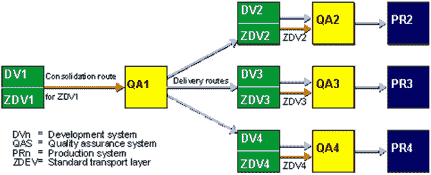
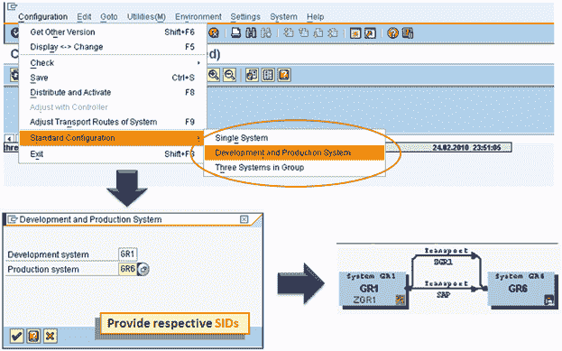
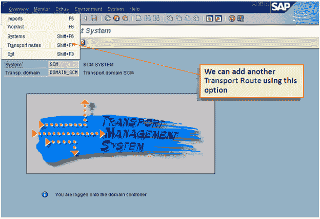
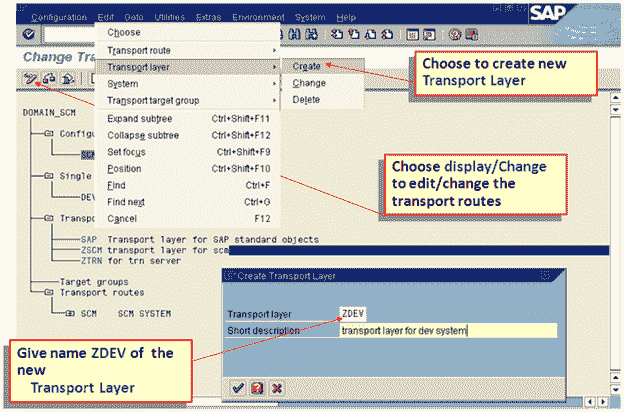
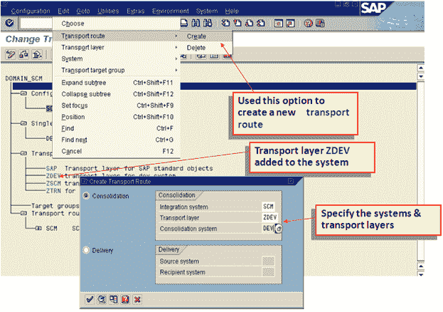
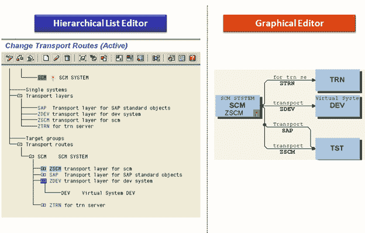

# SAP 路由&层：逐步配置

> 原文： [https://www.guru99.com/how-to-configure-transport-routes-and-layers.html](https://www.guru99.com/how-to-configure-transport-routes-and-layers.html)

**合并路径**-我们需要为每个传输层建立合并路径。 开发/集成系统被视为这些整合途径的来源。 质量保证/合并系统作为运输目标。 对其传输层具有合并路线的任何已修改对象都可以包含在更改/传输请求中。 释放请求后，可以将对象导入合并系统。 如果对没有为它们的传输层设置合并路线的对象（或在没有传输目标的定制请求中）对对象进行更改，则此类更改将自动视为本地更改请求，即不可传输。 **只能在每个系统的每个传输层设置一条合并路径**。

 

## 
设置运输路线

定义了域和景观的其他系统后，我们需要在适当的运输路线（和层）的帮助下将它们连接起来。 由于许多客户的系统状况属于同一类别，因此 TMS 提供了一些标准系统组，可用于轻松定义路线。 使用标准选项时，将自动生成路由。 我们可以选择以下选项之一：

*   单系统
*   两系统格局：DEV 和 PRD
*   三种系统格局：DEV，QAS 和 PRD

如果我们需要定义一个更复杂的运输系统，我们也可以在定义其他合并和交付路线之后，在开始时使用标准选项。

**传输路线–标准配置**

**传输路线–手动配置**

 

 

 

**运输路线**

## 分发和验证配置

*   在域控制器中设置或修改了传输路由设置之后，域中的所有其他成员系统都应该知道新配置。 为此，我们需要执行 **STMS->传输路线屏幕->系统概述->配置->分发并激活配置**
*   此外，我们还应验证各种检查点，以确保整个布置以所需的方式运行：
    *   对于 **RFC 连接**：概述->系统-> SAP 系统->检查->连接测试
    *   对于**网络**：传输路由概述->配置。 ->检查->请求一致性
    *   对于 ***tp* & TPPARAM** ：系统概述屏幕-> SAP 系统->检查->传输工具