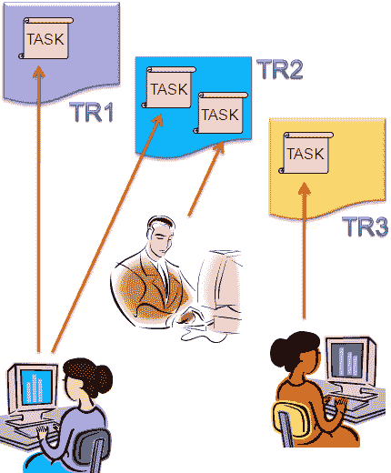
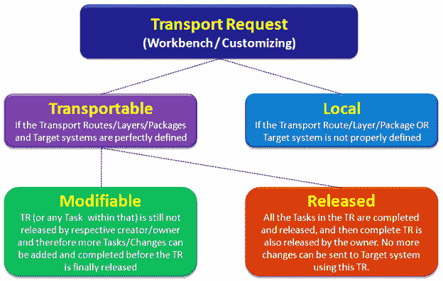
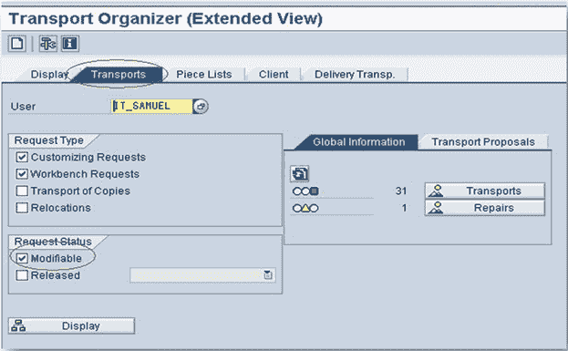
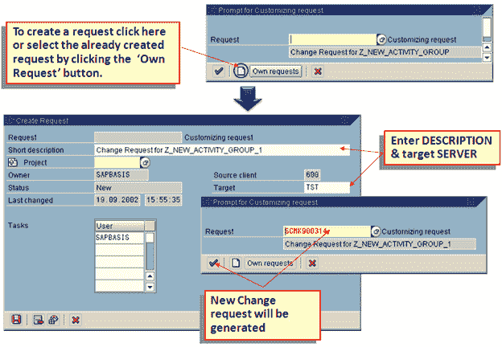
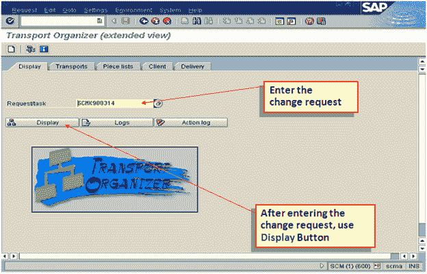
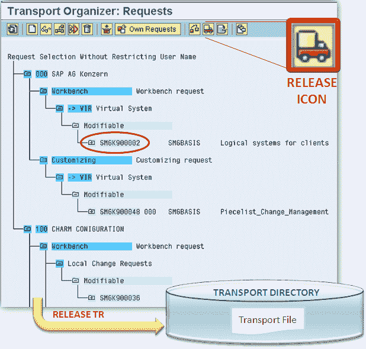
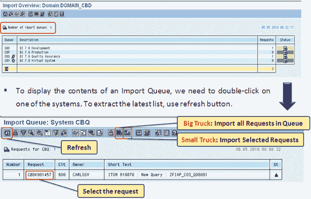
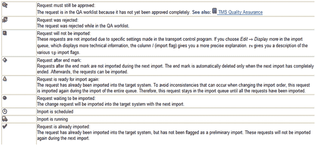
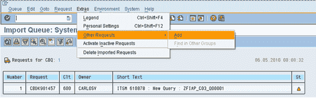
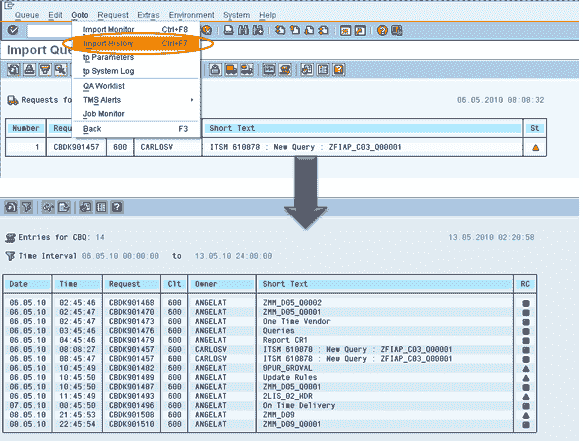

# 什么是 SAP 传输请求？ 如何导入/导出 TR

> 原文： [https://www.guru99.com/what-is-transport-request-how-to-importexport-it-check-logs.html](https://www.guru99.com/what-is-transport-request-how-to-importexport-it-check-logs.html)

### 什么是运输请求？

*   **运输请求（TR）** –是开发系统中所做更改的一种“容器/集合”。 它还记录有关更改类型，运输目的，请求类别和目标系统的信息。 也称为变更请求。
*   每个 TR 包含一个或多个变更作业，也称为变更**任务**（可运输变更的最小单位）。 任务存储在 TR 中，就像多个文件存储在某个文件夹中一样。 只有完成，释放或删除 TR 内部的所有任务后，才能释放 TR。
*   更改任务实际上是由特定用户修改的对象的列表。 每个任务只能分配给一个用户（并由其释放）。 但是，可以将多个用户分配给每个传输请求（因为它可以包含多个任务）。 任务本身不能运输，而只能作为 TR 的一部分。

更改请求以标准格式命名为： **< SID > K <编号>** [*无法由系统管理员修改*]

*   **SID** –系统 ID
*   **K** -是固定的关键字/字母
*   **数字** –可以是从 900001 开始的范围内的任何数字

示例： **DEVK900030**

**任务**也使用相同的命名约定，其中'numbers'与包含它们的 TR 中使用的数字连续。

例如，上述 TR 示例中的任务可以命名为： **DEVK900031，DEVK900032…**

 

*   项目经理或指定负责人负责创建 TR，并通过为每个项目成员创建任务来将项目成员分配给 TR。
*   因此，她/她是拥有该 TR 中记录的所有更改的控制权的所有者，因此，她/他只能释放该 TR。
*   但是，一旦完成，分配的项目成员就可以释放他们各自的变更任务。

 

**工作台请求–** 包含存储库对象以及'*跨客户端*'的自定义对象。 这些请求负责在 ABAP 工作台对象中进行更改。

**定制请求–** 包含属于“ *客户端特定*”定制的对象。 根据客户端设置，当用户执行自定义设置时，将自动记录这些请求，并根据传输层（如果已定义）自动分配目标系统。

**SE01 –运输管理器–扩展视图**

 

## 创建变更请求

*   更改请求可以通过两种方式创建：
    *   **自动**-每当创建或修改对象或执行自定义设置时，系统本身都会显示“对话框”，用于创建更改请求或提及已创建请求的名称（如果有）。
    *   手动–从运输组织者创建更改请求，然后输入所需的属性并插入对象。

 

 >
**释放传输请求（导出过程）**

*   将光标置于 TR 名称或任务名称&上，选择 Release 图标（卡车），TR 的记录将自动添加到 TMS 中定义的系统的相应导入队列中。
*   释放和导入请求将生成导出&导入日志。

 

## 导入过程

将 TR 导入目标系统

*   在请求所有者释放“来自源的运输请求”系统之后，应该在质量和生产系统中进行更改； *，但这不是自动过程*。
*   导出过程完成（TR 释放）后，将在操作系统级别的公共传输目录中创建相关文件（共文件和数据文件），并在**导入缓冲区**（OS 视图）中进行输入 / **QAS 和 PRD 的导入队列**（SAP App.View）。
*   现在执行导入，我们需要访问导入队列，为此，我们需要执行事务代码 **STMS->导入按钮**或选择**概述->导入**
*   它将显示当前域中的系统列表，描述以及“导入队列”中可用的请求数量和状态。

**导入队列->** 是公共目录中可用的 TR 列表，可以准备将​​其导入到目标系统中，这是 SAP Application View，在 OS 级别上也称为[ **导入缓冲区。**

 

## 导入状态

导入队列在最后一列中显示一些标准的'**状态图标**'，以下是其定义的图标，如 SAP 所定义：

如果即使存在 OS 级别文件，也不会自动将请求添加到导入队列/缓冲区中，那么我们可以通过以下方法添加此类请求，但是，我们应该知道预期 TR 的名称：

 

## 导入历史

我们还可以按如下方式检查系统中以前发生的导入：

 

## 运输日志和返回码

*   执行传输后，系统管理员必须检查传输是否正确执行，因为 SAP 已向我们提供了以下类型的日志。**（SE01-> GOTO->传输 日志）**：
    *   **操作日志** –显示已执行的操作：导出，测试导入，导入等。
    *   **传输日志** –保留传输日志文件的记录。
*   日志提供的重要信息之一是返回码：
    *   **0：**导出成功。
    *   **4：**发出警告，但所有对象均已成功传输。
    *   **8：**发出警告，并且至少一个对象无法成功运输。
    *   **12 或更高版本：**发生严重错误，通常不是由请求中的对象引起的。