# 支持软件包&堆栈升级：SAP SPS

> 原文： [https://www.guru99.com/support-package-stack-updates.html](https://www.guru99.com/support-package-stack-updates.html)

## 什么是支持包？

*   当 SAP 的最终用户发现 SAP 产品中的错误时，会将其报告给 SAP 支持人员。 SAP 程序员检查该错误并为该错误进行更正。 **此更正称为 SNOTE（SAP 注释）。**
*   随着时间的推移，多个最终​​用户将报告 SAP 发布 SNOTE 的错误。 SAP 将所有这些更正集中在一个地方，这种收集称为支持包。 该支持软件包还包括对 SAP 早期版本的增强。
*   简单来说，SAP NOTES 的收集称为支持包。
*   支持包是使用 Transaction SPAM（支持包管理器）在 SAP 系统中实现的

## 什么是支持包堆栈（SPS）？

支持软件包堆栈是 SAP NetWeaver 中包含的所有软件组件（SC）的 ABAP 和 [Java](/java-tutorial.html) 支持软件包的列表。 它用于使 SAP NetWeaver 的每个软件组件达到定义的支持包（SP）级别。

支持程序包堆栈，通常称为 STACK，捆绑了所有必需的组件或已经测试过的单个补丁，建议将其应用为 SPS 而不是单个补丁（直到除非您遇到某些需要对某些组件进行补丁的问题，否则除非 ）。

转到 [*https://service.sap.com/sp-stacks*](https://support.sap.com/en/my-support/software-downloads/support-package-stacks.html) */* ，选择您的 NW 版本以检查当前的 SPS。 级别和其他详细信息。

## 什么是 Support Pack Stack 版本号？

支持程序包堆栈具有发行号和堆栈号，例如 SAP NetWeaver '04 支持程序包堆栈 11。

***每个软件组件都有单独的支持程序包序列。*** 以下列表包含许多组件的技术名称及其支持软件包的表示法：

*   COP（组件包）：
*   SAP_APPL（SAP APPL 支持包）：SAPKH <相对> <否>
*   SAP_BASIS（基础支持包）：SAPKB <相对> <否>
*   SAP_ABA（应用程序基础 SP）：来自>的 SAPKA <相对> <
*   SAP_HR（SAP HR 支持包）：SAPKE <相对> <否>
*   SAP_SCM（SCM 支持包）：SAPKY <相对> <否>
*   SAP_BW（BW 支持包）：SAPKW <相对> <否>
*   SAP_CRM（CRM 支持程序包）：SAPKU <相对> <否>

## 支持软件包实施的先决条件：

*   支持软件包应始终应用于客户端 000。
*   用于支持包实施的用户必须具有与 DDIC 或 SAP *等效的授权
*   致电事务 SPAM，查看以前的支持包导入是否不完整。 除非先前的支持包导入成功，否则您可以继续进行。
*   确保传输目录中有足够的空间。 传输目录位于/ usr / sap / trans

## 升级支持包的步骤：

**步骤 1：下载支持包**

支持包位于 SAP 支持门户的 **service.sap.com/patches** 下。

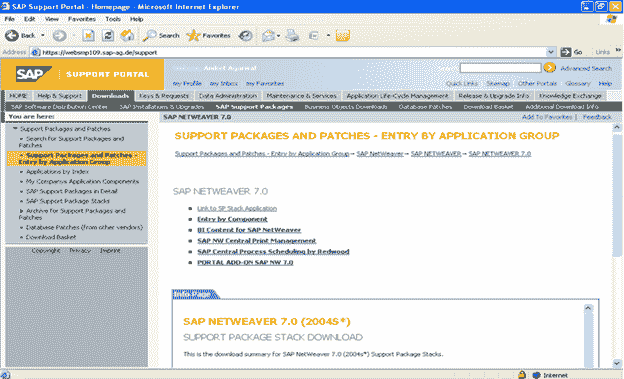 

**步骤 2：加载支持包**：

要加载支持包，我们有两个选择：

1.  从应用程序服务器
2.  从前端

**来自应用程序服务器**

1.  从*服务市场*下载支持软件包，并将它们保存在 OS 级别的目录/ usr / sap / trans 中。
2.  使用 sapcar 可执行文件解压缩这些文件

```
sapcar –xvf <support package name>
```

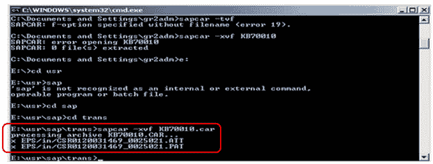 

***在操作系统级别解压缩支持包后，.PAT 和.ATT 文件存储在目录**中的/ usr / sap / trans / EPS /中。*

接下来，通过选择 *Support Package-> *Load Packages* ->从 Application Server* 中将支持包加载到 SAP 系统中

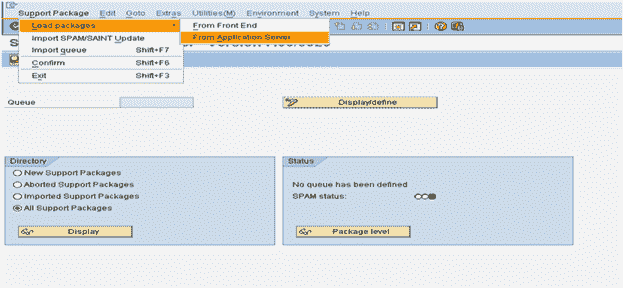 

**来自前端**

选择支持包->加载包->来自前端

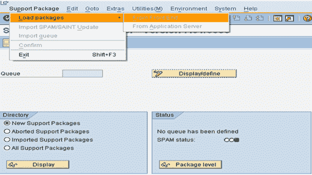 

**步骤 3：SPAM / SAINT 更新**：

SPAM / SAINT 更新包含对支持程序包管理器（SPAM）和附加安装工具（SAINT）的更新和改进。 每个版本始终有一个 SPAM 更新。 在升级任何支持包之前，必须先进行 SPAM / SAINT 更新。

 

**步骤 4：定义队列**

队列包含可用于系统中安装的不同 SAP 组件的支持包。 该队列信息来自于步骤 2 中上传的支持包。

1.在支持包管理器的初始屏幕上，选择*显示/定义*。
2.显示已安装的软件组件（例如 SAP_BASIS，SAP_HR，SAP_BW）的列表。

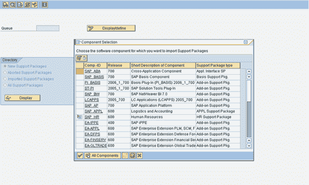 

3.选择所需的组件后，将显示当前队列。 此队列包含可用于系统中所选组件的支持包。 如果要为另一个软件组件定义队列，请选择*其他组件*。 如果显示的队列满足您的要求，则可以通过选择*确认队列*
进行确认。

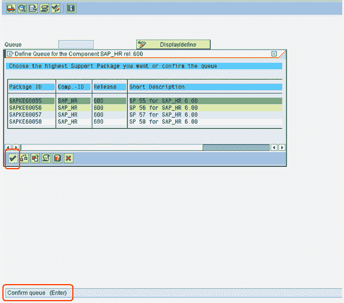 

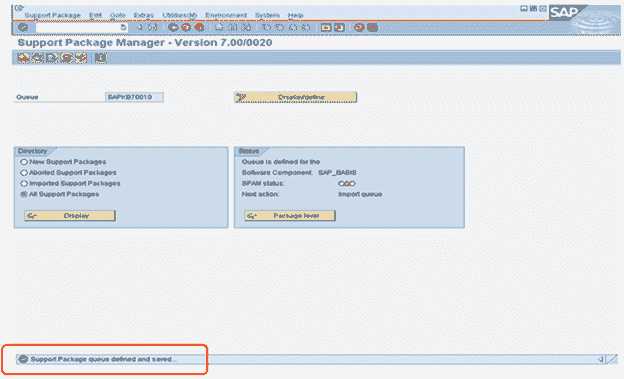 

**步骤 5：导入队列。**

在选择特定组件（我们要为其升级支持包）的同时定义队列（步骤 4）后，我们需要执行“导入队列”以开始导入/应用该特定组件 选定的支持包（按照标准 SAP 流程）。

选择*支持包->导入队列*

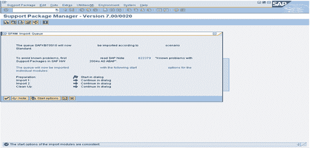 

***要熟悉已知的问题，请务必阅读上述屏幕快照中提到的注释。***

支持包导入已开始

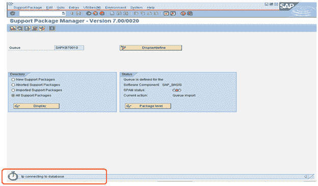

**步骤 6：确认队列**：

确认队列已成功导入到您的系统中。 这使您可以在将来导入支持包。 如果您不确认队列，则将无法进一步导入支持包。

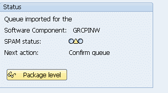 

导入队列后，SPAM 状态变为黄色

通过选择*支持包à确认，将支持包成功导入系统。*

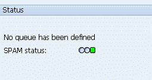 

## 检查日志

*   **IMPORT LOG:** It displays logs for *Support Package Manager Phases* that are used by transport control program tp(transport control program).Go to-->Import log-->Queue

    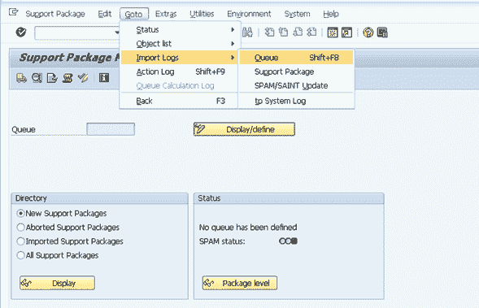

*   **ACTION LOG: **It contains information about *the actions that take place during the individual phases* (while importing the current queue).
    It also includes information about the point at which a phase was stopped, as well as detailed error information.

    To display the logs for the current queue Go to-->Action log

    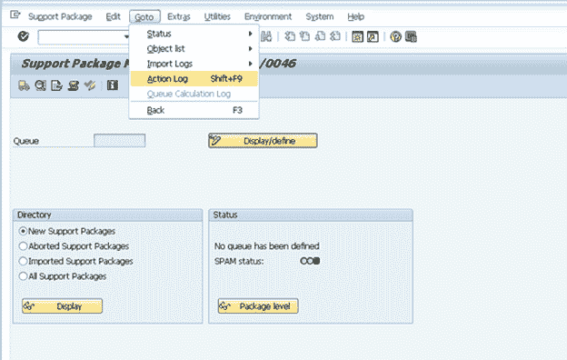

*   *导入支持包时，会将日志记录到 tmp 目录（路径：usr / sap / trans / tmp）中*
*   *导入过程完成后，可以从日志目录中查看日志（路径：usr / sap / trans / log）*