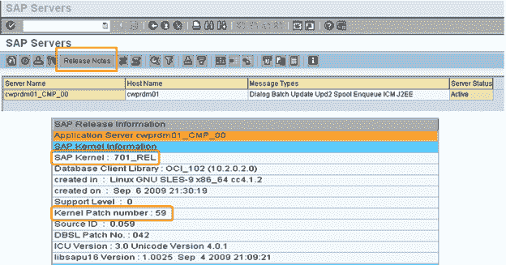
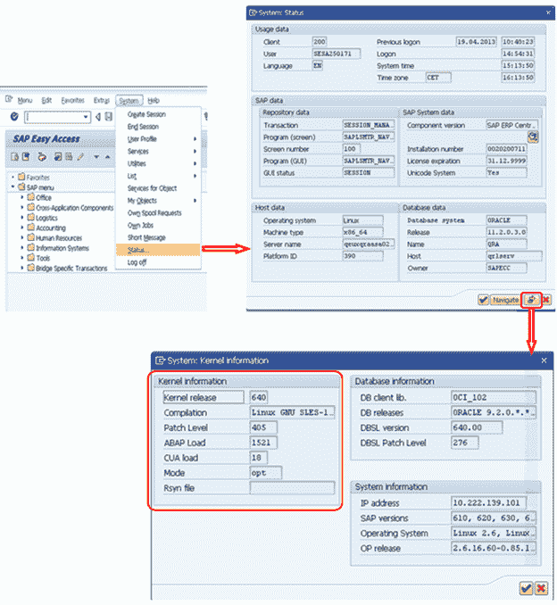
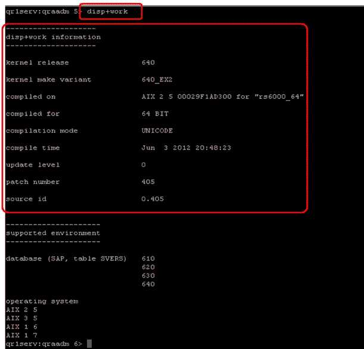
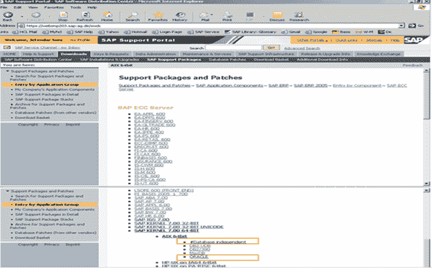
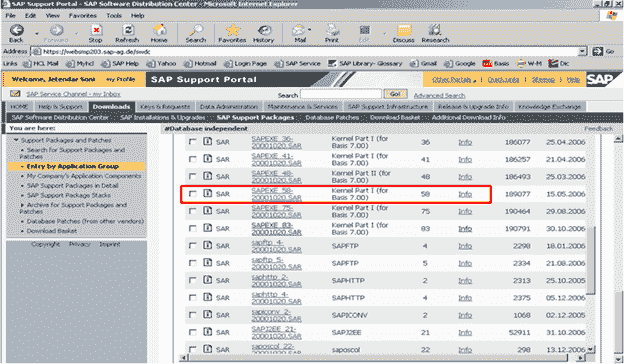
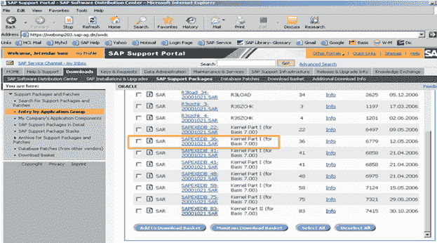
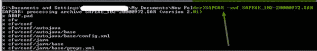

# 下载&升级 SAP 内核：分步教程

> 原文： [https://www.guru99.com/sap-kernel.html](https://www.guru99.com/sap-kernel.html)

## 什么是内核？

*   内核是一个中央程序，充当 SAP 应用程序和操作系统之间的接口。
*   内核由位于路径“ / sapmnt / < SID > / exe”（UNIX）或\ usr \ sap \ SID \ SYS \ exe \ run（Windows）下的可执行程序组成。
*   这些文件可帮助启动 R / 3 系统，初始化内存，创建缓冲区并开始管理用户的请求并有效利用硬件资源。
*   内核还负责启动和停止所有应用程序服务，例如调度程序，消息服务器，收集器等。

## 为什么要升级内核？

*   SAP 内核是应用程序的核心。 与所有其他应用程序一样，内核包含可执行文件（用于说明 SAP 中各种进程的.EXE 文件）。
*   内核是操作系统的核心。 它包含用于运行 SAP 中的每个事件的那些文件。 例如：|：启动数据库，关闭数据库，启动 sap，关闭 sap，saposcol，解包 sap 文件等。
*   这就是为什么在完成内核升级后意味着各种 EXE 文件的新版本替换了旧版本的原因。

## 如何检查内核版本？

有多种方法可以检查内核版本-

**方法 1）**登录 SAP 系统并转到 SM51à发行说明

 

**方法 2）**登录到 SAP 系统并转到菜单栏中的**系统**选项卡，然后选择**状态**

 

**方法 3）**在操作系统中登录，切换到用户< SID > adm 并发出命令 **disp + work**

您也可以给 **] disp + work –version**

 

## 从服务市场下载内核

 

*   转到“ SAP Service Marketplace。”（https：\\ service.sap.com）您将需要 OSS ID 和密码。
*   然后转到下载àSAP 支持软件包-按应用程序组输入>-> SAP 内核 6.00 64 位->选择您的操作系统（LINUX / WINDOWS / SOLARIS / AIX）->依赖数据库且独立于数据库 内核补丁。
*   从 Service Marketplace 下载了两个 SAR 文件 SAPEXE.SAR 和 SAPEXEDB.SAR。

 
独立于数据库

 
数据库相关：ORACLE

## 内核升级步骤：

**步骤 1**：在 OS 级别上创建一个具有足够空间的新目录。 Dir 的名称可以是“ exe_new < ddmmyy >”。

**步骤 2**：将已下载的这些 SAPEXEDB.SAR & SAPEXE.SAR 文件传输到操作系统级别的新目录。

**步骤 3**：将当前目录更改为创建.SAR 文件的路径（cd / sapmnt / PR2 / exe_new20122006）。 使用命令'pwd'检查目录路径，以确保您位于同一目录（exe_new < ddmmyy >）。

**步骤 4**：现在解压缩它们。 sapcar exe 的 SAR 文件。 用于相同命令的命令为

```
SAPCAR –xvf sapexe. SAR
```

```
SAPCAR –xvf sapexedb.SAR
```



**步骤 5**：现在在该路径中再创建一个目录，名称为“ exe_old < ddmmyy >”。 备份现有内核。将现有内核从 exe 目录复制（仅复制不移动）到“ exe_old < ddmmyy >”

**步骤 6**：现在停止 SAP 应用程序。 （对于内核升级，关闭数据库不是必需的，但是我们需要停止 SAP 应用程序）

```
stopsap r3
```

**步骤 7**：

Then copy the files from the new kernel directory exe_new<ddmmyy> to the existing kernel directory exe

```
cp -rp /sapmnt/<SID>/exe_new<ddmmyy>/* /sapmnt/<SID>/exe/
```

**步骤 8**：这会将现有内核目录中的所有文件复制/替换为新的内核文件。

然后通过命令 disp + work 从 OS 级别检查内核版本。 它应该显示补丁号已增加。

**步骤 9**：

Then logon to OS level as root (specific to UNIX). In the kernel directory, there is a script called saproot.sh. Execute this script

```
./saproot.sh <SID>
```

**步骤 10**：该脚本为内核中的所有可执行程序（如 br *文件等）分配了正确的权限。

**步骤 11**：

Then start the SAP system

```
startsap r3
```

**步骤 12**：现在，您还可以从 SM51 或通过选择系统àstatus 来检查内核版本级别