# SAP 监视&性能检查：完整的 Tcode 教程

> 原文： [https://www.guru99.com/system-monitoring-performance-checks.html](https://www.guru99.com/system-monitoring-performance-checks.html)

## 什么是系统监控？

系统监视是*的日常活动*，该文档为服务器监视提供了系统的分步过程。 它概述了主动系统监视的技术方面和概念。 其中很少有：

*   检查应用服务器。
*   监视系统范围的工作流程。
*   监视单个实例的工作流程。
*   监视锁条目。
*   CPU 利用率
*   数据库中的可用空间。
*   监视更新过程。
*   监控系统日志。
*   缓冲区统计

其他一些是：

*   监视批处理作业
*   假脱机请求监视。
*   打印请求数
*   ABAP 转储分析。
*   数据库性能监视器。
*   数据库检查。
*   监视应用程序用户。

## 为什么要进行每日基本检查/系统监视？

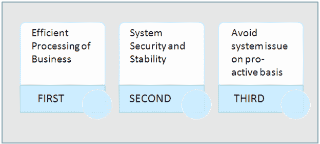

## **我们如何监视 SAP 系统？**

## 检查应用服务器（SM51）

此事务用于检查所有活动的应用程序服务器。

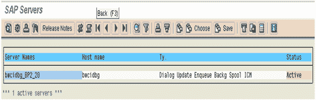 

在这里，您可以看到每个实例中配置了哪些服务或工作流程。

## 监视单个实例的工作流程 SM50：

显示与特定实例相关的所有正在运行，正在等待，已停止和 PRIV 进程。 在这一步，我们检查所有过程； *进程状态应始终为等待或运行*。 如果任何进程的状态不是正在等待或正在运行，我们需要检查该特定进程并进行相应报告。

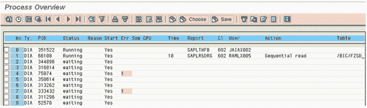 

此事务显示很多信息，例如：

1.  工作流程的状态（是否已占用）
2.  如果工作流程正在运行，则可以在“操作”列中看到它所采取的操作。
3.  您可以在哪个表上工作

一些典型的问题：

*   用户花费很长时间登录/无法登录/在线交易非常缓慢。 这可能是 DIA 工作流程得到充分利用的结果。 也可能是作业长时间运行的结果（“时间”列下的红色指示器）。 如有必要，您可以通过选择作业来取消会话，然后转到处理>取消不带核心的会话。 这将取消作业并为其他用户/进程释放工作流程
*   在**原因**列下，某些用户可能具有 PRIV 状态。 这可能是因为用户事务量太大，因此需要更多的内存。 发生这种情况时，DIA 工作流程将由用户“拥有”，并且不会让其他用户使用。 如果发生这种情况，请与用户确认，并在可能的情况下将其作为后台作业运行。
*   如果 SPO 工作流程上的打印作业很长，请调查该问题。 可能是与打印服务器或打印机有关的问题。

## 监视系统范围的工作流程（SM66）

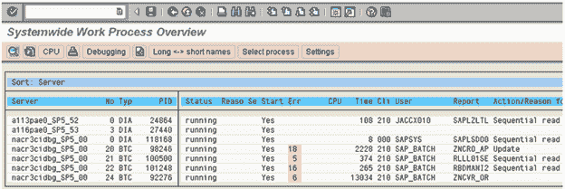 

通过使用全局工作流程概述检查工作流程负载，我们可以快速调查导致系统性能问题的潜在原因。

监视系统上所有活动实例**上的工作流程负载**

使用*全局工作流程概述*屏幕，我们可以一目了然 ：

*   每个应用程序服务器的状态
*   它没有运行的原因
*   是否已重新启动
*   CPU 和请求运行时间
*   登录的用户和他们登录的客户端
*   正在运行的报告

## 监视应用程序用户（AL08 和 SM04）

此事务显示活动实例的所有用户。

 

## 监视更新过程（SM13）

执行事务 SM13，并在“ USER”字段中输入“ ***** ”，然后单击  按钮。

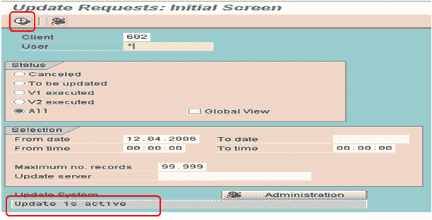 

如果没有长时间的未决更新记录，或者没有正在进行的更新，则此队列将为空，如以下屏幕快照所示。

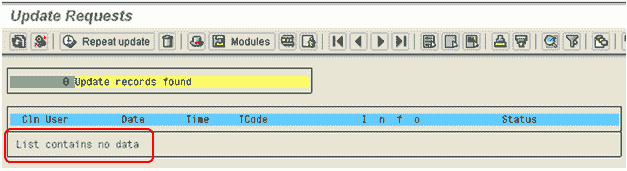 

但是，如果更新未处于活动状态，则查找以下信息：

*   更新是否处于活动状态（如果未激活），是由系统还是由用户禁用的？
    *   单击  按钮，并获得以下信息：
    *   单击  按钮并获取信息。
*   是否有任何更新被取消？
*   是否有长于 10 分钟的待处理更新队列？

## 监视锁条目（SM12）

执行事务 SM12，并在“用户名”字段中输入“ *”

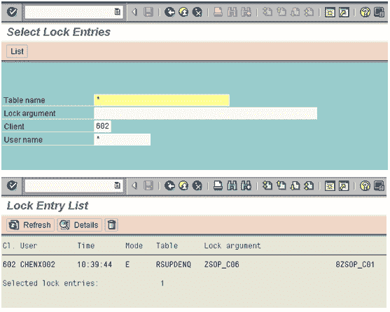 

SAP 提供了*锁定机制*，以防止其他用户更改您正在处理的记录。 在某些情况下，不会释放锁。 如果用户因网络问题而被切断，然后才能够释放锁，则可能会发生这种情况。

这些旧锁需要清除，否则可能会阻止访问或更改记录。

我们可以使用锁统计信息来监视系统中设置的锁。 我们仅记录具有前一天日期时间戳记的那些锁条目。

## 监视系统日志（SM21）

我们可以使用日志来查明并纠正系统及其环境中发生的错误。
我们使用以下选择/选项来检查前一天的日志：

*   输入日期和时间。
*   选择单选按钮问题和警告
*   按重新读取系统日志。

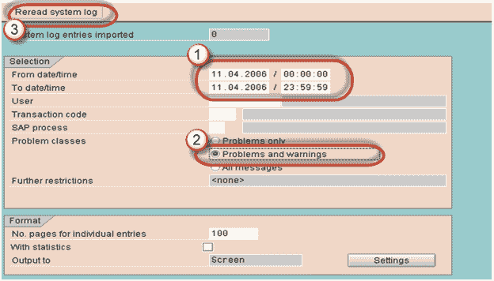 

## 音调摘要（ST02）

**步骤 1：**转到 ST02 检查音调摘要。

**步骤 2：**如果看到任何红色值，请在 SWAPS 中，双击相同的值。

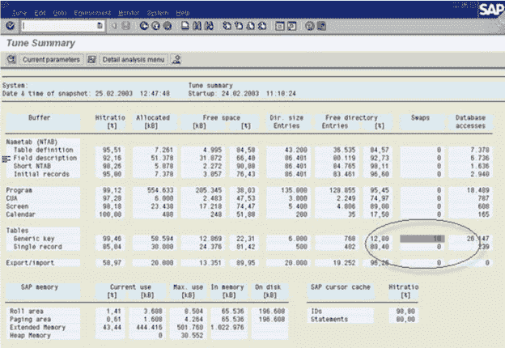 

**步骤 3：**在下面的屏幕中，单击选项卡'*当前参数*'

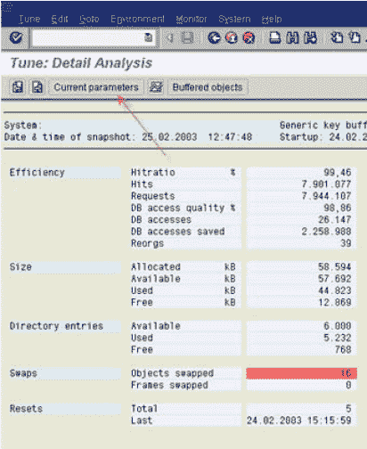 

**步骤 4：**记下*值*和*配置文件参数*

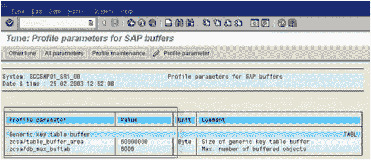 

**步骤 5：**转到 RZ10（更改 Profile 参数值）

**步骤 6：**保存更改。

**步骤 7：**重新启动服务器以产生新的更改效果。

## CPU 使用率（ST06）

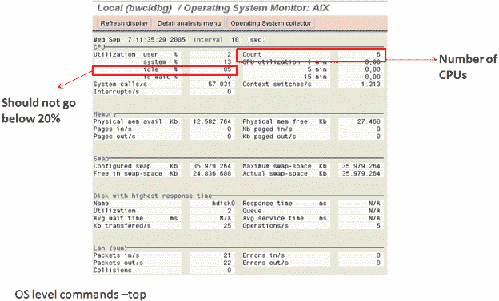 

空闲 CPU 利用率必须为 60-65％，如果超过该值，则必须至少检查以下内容：

*   运行 OS 级别的命令–置顶并检查哪些进程占用了最多的资源。
*   转到 SM50 或 SM66。 检查所有长时间运行的作业或正在运行的任何长时间更新查询。
*   转到 SM12 并检查锁定条目
*   转到 SM13 并选中“更新活动状态”。
*   检查 SM21 中的错误。

## ABAP 转储（ST22）

在这里，我们检查前一天的转储

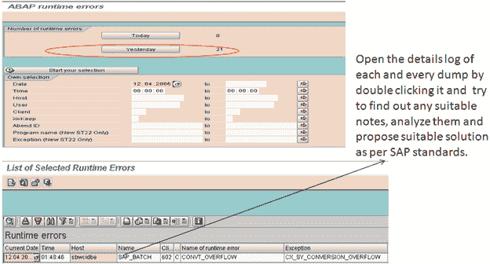

## 假脱机请求监视（SP01）

对于假脱机请求监视，执行 SP01 并选择如下：

*   在创建的*字段中输入“ *”*
*   单击  执行按钮。

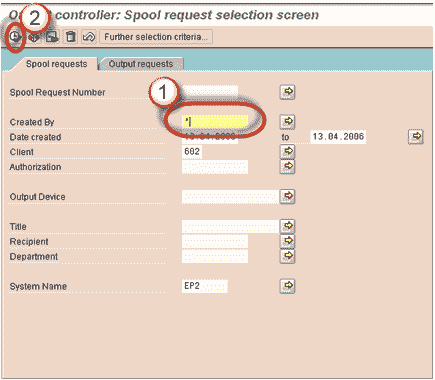 

在这里，我们仅记录那些因问题而终止的请求。

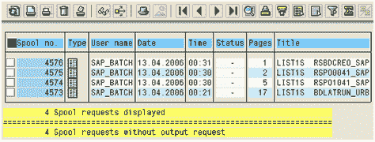 

## 监视批处理作业（SM37）

对于监视后台作业，执行 SM37 并选择如下：

*   在*用户名*和*作业名*字段中输入“ *”
*   在作业状态中，选择：计划的，已取消的，已下达的和已完成的请求。

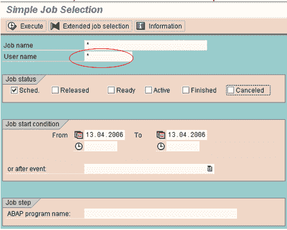 

## 事务性 RFC 管理（SM58）

事务 RFC（tRFC，最初也称为异步 RFC）是一种异步通信方法，仅在 RFC 服务器中执行一次被调用的功能模块。

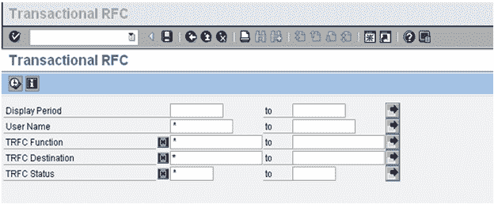 

我们需要选择要查看其 tRFC 的显示时间，然后在用户名字段中选择“ *”以查看所有未正确执行或在队列中等待的呼叫。

## QRFC 管理（*出站队列* -SMQ1）

我们应该在此处指定客户端名称，然后查看是否有任何待发 qRFC 处于等待或错误状态。

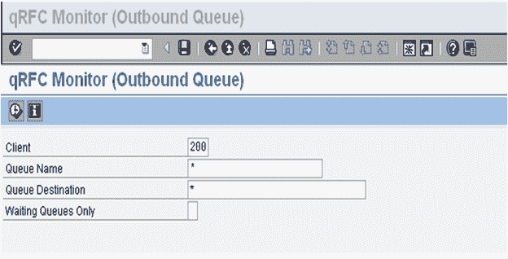

## QRFC 管理（*入站队列* -SMQ2）

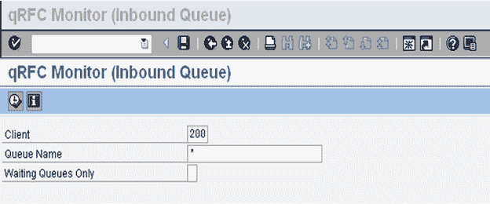

我们应该在此处指定客户端名称，并查看是否有任何传入的 qRFC 处于等待或错误状态。

## 数据库管理（DB02）

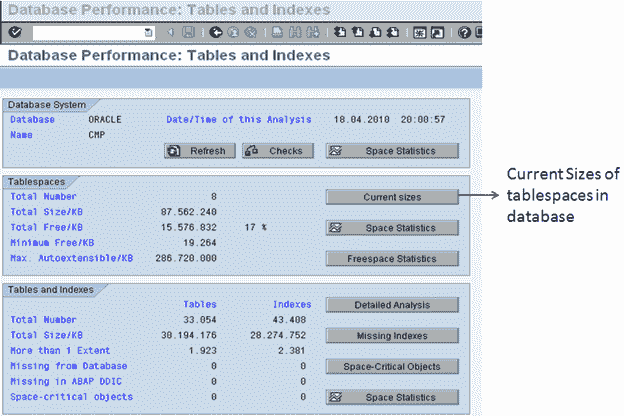 

在第一个屏幕上选择**当前大小**后，我们进入以下屏幕，该屏幕向我们显示系统中所有表空间的当前状态。

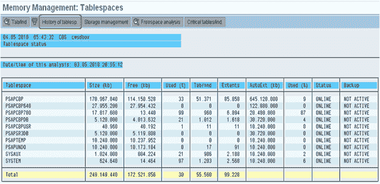 

如果任何表空间超过 95％，并且自动扩展功能已关闭，则我们需要添加一个新的数据文件，以使数据库不满。
我们还可以确定表空间的历史记录。

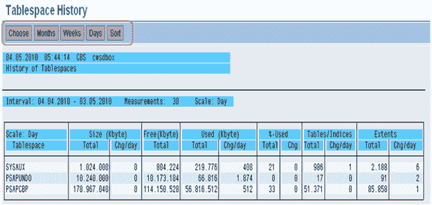 

我们可以在此处选择月，周或天，以查看表空间中发生的更改。
我们可以通过分析这些值来确定表空间的增长。

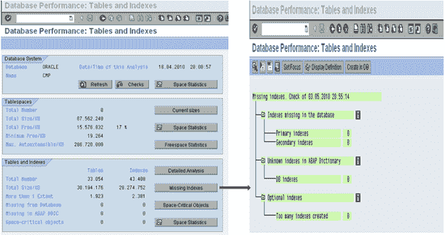 

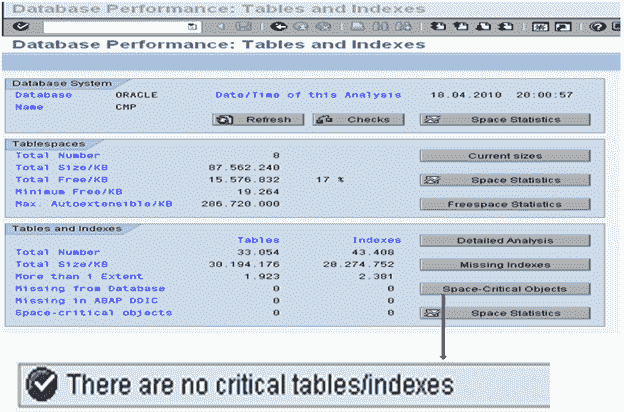 

## 数据库备份日志（DB12）

通过该事务，我们可以确定系统上一次成功备份的时间。 我们可以查看前一天的备份，看看是否一切正常。

我们也可以查看重做日志文件，并查看重做日志备份是否成功。

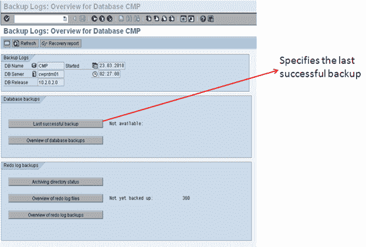 

## 快速复审

日常监控任务

1.  关键任务
2.  SAP 系统
3.  数据库

**关键任务**

| 

**否**

 | **任务** | **交易** | **程序/备注** |
| --- | --- | --- | --- |
| 1 | 检查 R / 3 系统是否已启动。 |   | 登录到 R / 3 系统 |
| 2 | 检查每日备份是否正确执行 | DB12 | 检查数据库备份。 |

**SAP 系统**

| 

**否**

 | **Task** | **Transaction** | **Procedure / Remark** |
| --- | --- | --- | --- |
| 1 | 检查所有应用程序服务器是否都已启动。 | SM51 | 检查所有服务器是否都已启动。 |
| 2 | 检查工作流程（从 SM51 开始）。 | SM50 | 所有工作流程处于“正在运行”或“正在等待”状态 |
| 3 | 全球工作流程概述 | SM66 | 检查没有任何工作进程在运行超过 1800 秒 |
| 3 | 查找任何失败的更新（更新终止）。 | SM13 | 

*   将日期设置为一天前
*   在用户 ID 中输入*
*   设置为“全部”更新检查带有“ Err”的行。

 |
| 4 | 检查系统日志。 | SM21 | 将日期和时间设置为上次日志查看之前。 检查：

*   错误
*   警告
*   安全消息
*   数据库问题

 |
| 5 | 查看已取消的工作。 | SM37 | 在用户 ID 中输入星号（*）。验证所有关键作业是否成功。 |
| 6 | 检查“旧”锁。 | SM12 | 输入一个星号（*）作为用户 ID。 |
| 7 | 检查系统上的用户。 | SM04AL08 | 查看未知或不同的用户 ID 和终端。此任务应一天执行几次。 |
| 8 | 检查阀芯问题。 | SP01 | 为 Created ByLook 输入一个星号（*），以查看已“处理中”一个小时以上的假脱机作业。 |
| 9 | 检查作业日志 | SM37 | 检查：

*   新作业
*   不正确的作业

 |
| 10 | 查看并解决转储。 | ST22 | 寻找过多的转储。 寻找不寻常性质的垃圾堆。 |
| 11 | 查看缓冲区统计信息。 | ST02 | 寻找交换。 |

**数据库**

| 

**No**

 | **Task** | **Transaction** | **程序/备注** |
| --- | --- | --- | --- |
| 1 | 查看错误日志中的问题。 | ST04 | 
 |
| 2 | 数据库增长缺少索引 | DB02 | 如果使用的表空间超过 90％，则向其中添加新的数据文件重建丢失的索引 |
| 3 | 数据库统计日志 | DB13 | 
  |