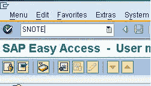
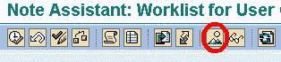
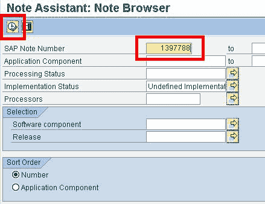
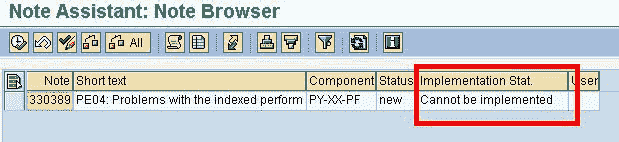

# 什么是 OSS 注释？ SAP SNOTE 教程

> 原文： [https://www.guru99.com/how-to-trace-if-an-oss-note-is-deployed-in-your-landscape.html](https://www.guru99.com/how-to-trace-if-an-oss-note-is-deployed-in-your-landscape.html)

### 什么是 OSS 注意？

OSS Note 是 SAP 经常发布的错误修复，新程序开发或增强或其他杂项更新。 OSS 代表“在线 SAP 支持”

在开始工作之前，有时需要检查 SAP 系统中是否存在特定的注释

要确保您的 SAP 系统中存在特定的 OSS 注释，请执行以下步骤：

**a）**在 SAP 命令提示符下，输入 TCode＃SNOTE

 

**b）**在下一个屏幕中，单击 SAP Note 浏览器

**c）**在相应的文本字段中输入您的 SAP 注释编号，然后单击执行

 

**d）**下一个屏幕显示 SAP 注释
的状态

 

作为背景，SAP 注释可以具有以下七个状态之一-

*   可以实施
*   无法实施
*   完全实施
*   实施不完全
*   过时的
*   已过时版本
*   未定义的执行状态