# 如何在 SAP 中配置&测试 RFC 连接-SM59

> 原文： [https://www.guru99.com/how-to-configure-and-test-rfc.html](https://www.guru99.com/how-to-configure-and-test-rfc.html)

本教程分为 4 个部分

**步骤 1**：设置 RFC 连接

**步骤 2**：受信任的 RFC 连接

**步骤 3**：测试 RFC 连接

**步骤 4**：错误解决方案

## 步骤 1：建立 RFC 连接的步骤：

输入交易代码 **SM59**

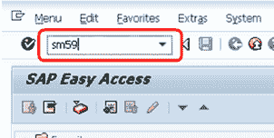 

在 SM59 屏幕中，您可以在选项树的帮助下浏览已创建的 RFC 连接，这是一种基于菜单的方法，用于按类别组织所有连接。

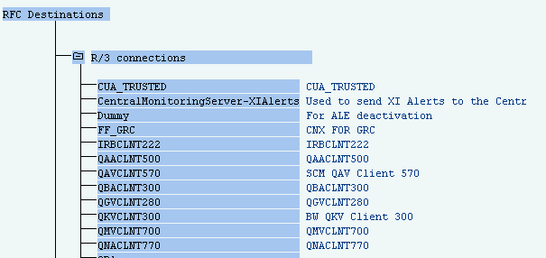 

点击' *CREATE* '按钮。 在下一个屏幕中，输入-

*   **RFC 目标**-目标名称（可以是目标系统 ID 或任何相关的名称）
*   **连接类型** –在这里，我们根据要求选择 RFC 连接的一种类型（如前所述）。
*   **描述**-这是一个简短的说明性描述，可能是为了解释连接的目的。

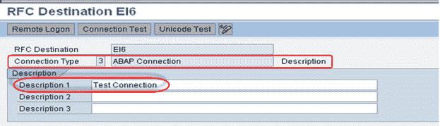 

在您**'保存'**连接后，系统将带您进入“技术设置”选项卡，我们在其中提供以下信息：

*   **目标主机** –在这里，我们提供目标系统的完整主机名或 IP 地址。
*   **系统编号–** 这是目标 SAP 系统的系统编号。
*   点击保存

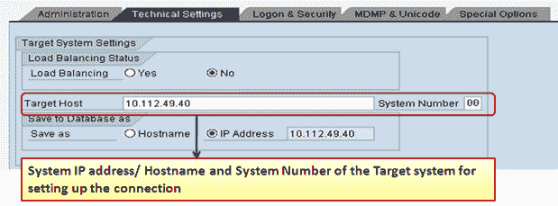 

在**'登录和安全'**选项卡中，输入目标系统信息

*   **语言** –根据目标系统的语言

*   **客户端** －在 SAP 中，我们从不登录到系统，始终必须有一个特定的客户端，因此我们需要在此处指定客户端编号以正确执行。

*   **用户 ID 和密码** –最好不要是您自己的登录 ID，应该有一些通用 ID，这样连接就不会受到不断变化的最终用户 ID 或密码的影响。 *通常，此处使用“系统”或“通信”类型的用户。* 请注意，这是目标系统的用户 ID，而不是我们创建此连接的源系统的用户 ID。

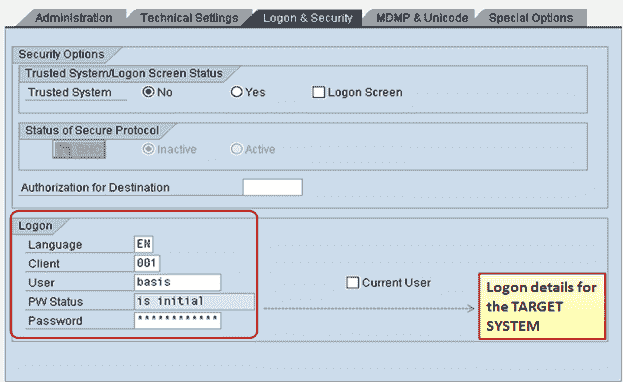 

单击保存。 RFC 连接已准备就绪，可以使用
**注意**：默认情况下，连接定义为 aRFC。 要将连接定义为 tRFC 或 qRFC，请转到菜单栏->目标 aRFC 选项/ tRFC 选项； 根据要求提供输入。 要定义 qRFC，请使用特殊选项选项卡。

## 步骤 2：信任的 RFC 连接

有一个选项可以将 RFC 连接设为**'受信任'。** 一旦选择，呼叫（可信）系统就不需要密码即可连接目标（可信）系统。

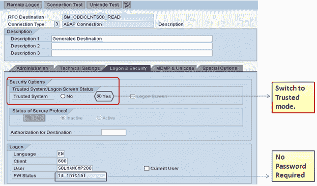 

以下是使用受信任渠道的优势：

*   跨系统单点登录功能
*   不需要通过网络发送密码
*   登录数据的超时机制可防止滥用。
*   防止由于超时机制而导致登录数据处理不当。
*   检查呼叫/受信任系统的特定于用户的登录详细信息。

*RFC 用户必须在信任系统中具有必需的授权（授权对象 **S_RFCACL** ）。* 可信连接通常用于将 SAP Solution Manager 系统与其他 SAP 系统（卫星）连接

## 步骤 3：测试 RFC 连线

创建 RFC 之后（或者有时对于已经存在的 RFC），我们需要测试连接是否成功建立。

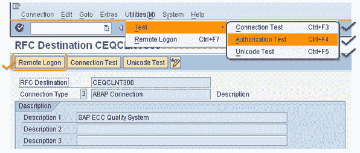 

如上所示，我们转到 SM59 选择要测试的 RFC 连接，然后展开下拉菜单-“ **实用程序->测试->…**”。 我们有三个选项：

**连接测试->** 这将尝试与远程系统建立连接，从而验证 IP 地址/主机名和其他连接详细信息。 如果两个系统都无法连接，则会引发错误。 成功后，它将显示带有响应时间的表。 该测试仅用于检查呼叫系统是否可以到达远程系统。

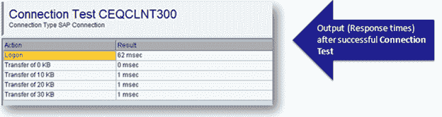

**授权测试->** 用来验证用户 ID 和密码（在目标系统的“登录和安全性”选项卡下提供）以及提供的授权。 如果测试成功，则将显示如上所示的连接测试相同的屏幕。

**Unicode 测试->** 用来检查目标系统是否为 Unicode。

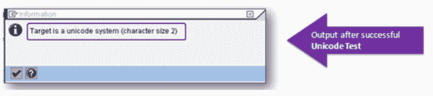 

**远程登录– >** 这也是一种连接测试，其中打开目标系统的新会话，我们需要指定登录 ID 和密码（如果尚未在“ 登录和安全”标签）。 如果用户的类型为“对话”，则创建对话会话。 为了证明连接测试成功，输出将是通信数据包的响应时间，否则将显示错误消息。

 

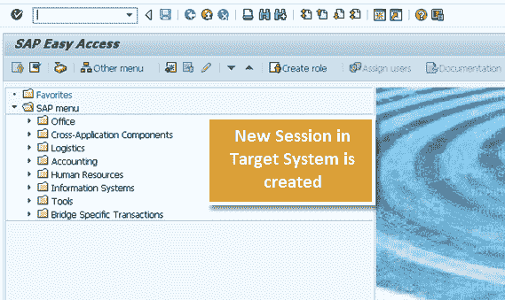 

## 步骤 4：出了什么问题？

如果无法成功建立 RFC 连接，我们可以在“ WORK”控制器中的 OS 级别检查日志（以分析问题）。 在这里，我们可以找到命名约定为“ *dev_rfc <序列号>* ”的日志文件，并且可以从此类文件中读取错误说明。

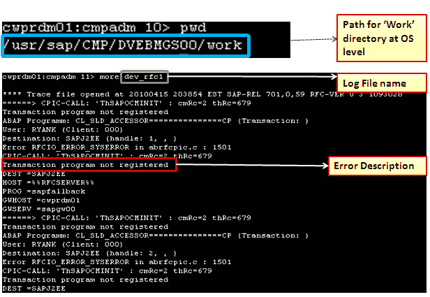