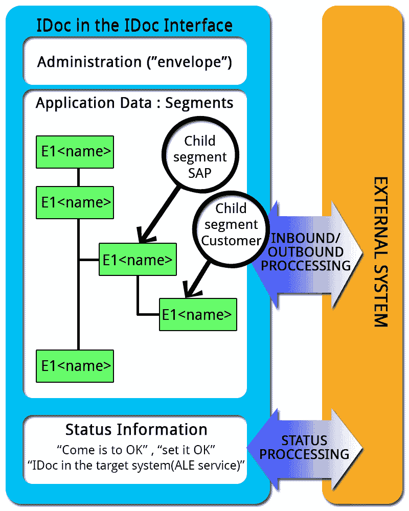
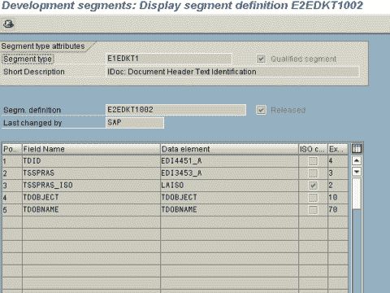
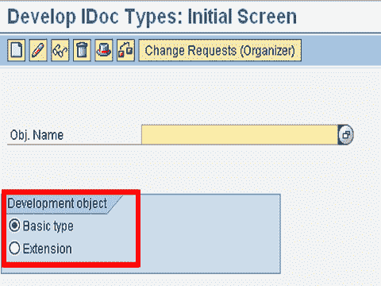
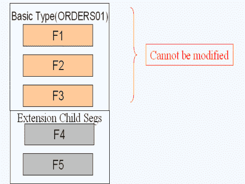
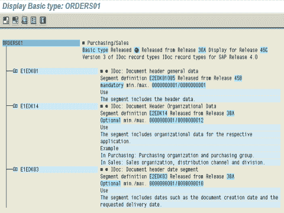
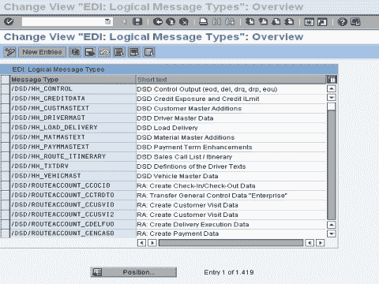
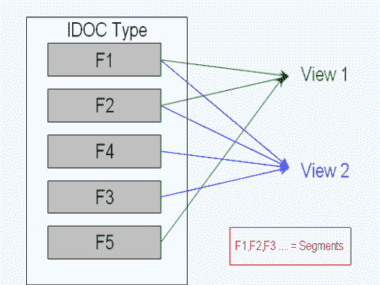
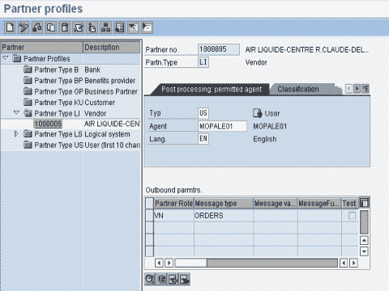
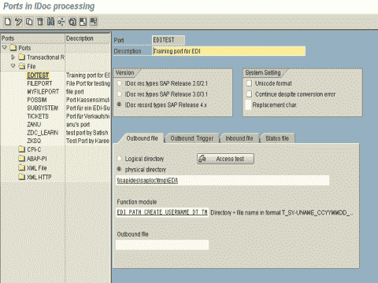

# SAP IDOC 教程：定义，结构，类型，格式&表

> 原文： [https://www.guru99.com/all-about-idocdefinition-architecture-implementation.html](https://www.guru99.com/all-about-idocdefinition-architecture-implementation.html)

## 什么是 IDOC？

IDOC 是**，只是一个数据容器**，用于在任何两个可以理解数据的语法和语义的进程之间交换信息。

换句话说，IDOC 就像具有指定格式的数据文件，该文件在知道如何解释该数据的 2 个系统之间交换。

IDOC 代表“ **中间文档”**

当我们执行**出站** ALE 或 EDI 流程时，将创建一个 IDOC。

在 SAP 系统中，I DOC 存储在数据库中。 每个 IDOC（在客户端内）都有一个**唯一编号**。

在本教程中，您将学习：

*   [什么是 IDOC？](#1)
*   [IDOC 的结构](#2)
*   [IDOC 类型](#3)
*   [什么是细分？](#4)
*   [什么是扩展 IDOC 类型？](#5)
*   [IDOC 视图](#6)
*   [合作伙伴资料](#7)
*   [端口](#8)
*   [出站处理](#9)
*   [入站流程](#10)

**Key Features**

*   IDOC 是**，独立于发送和接收系统。** （SAP 到 SAP 以及非 SAP）
*   IDOC 基于 EDI 标准，ANSI ASC X12 和 EDIFACT。 如果数据大小有冲突，则采用长度更大的数据。
*   IDOC 是**，与数据交换**的方向无关。 ORDERS01：采购模块：入站和出站
*   可以在**文本编辑器**中查看 IDOC。 数据以字符格式而不是二进制格式存储。

## IDOC 的结构

I doc 结构由 3 部分组成-

1.  具有 idoc 类型，消息类型，当前状态，发送者，接收者等的管理部分（**控制记录**）-称为控制记录。
2.  应用程序数据（**数据记录**）-包含数据。 这些被称为数据记录/ ***段*** 。
3.  状态信息（**状态记录**）-这些信息为您提供有关 idoc 经历的各个阶段的信息。

您可以使用事务 **WE02** 或 **WE05** 查看 I-DOC

**** 

如上图所示，IDOC 记录的屏幕截图包含三个部分：控制，数据和状态。 让我们详细研究一下-**控制记录**

*   所有控制记录数据都存储在 EDIDC 表中。 该表的关键是 IDOC 号
*   它包含诸如 IDOC 编号，方向（入站/出站），发件人，收件人信息，正在使用的通道，正在使用的端口等信息。
*   方向“ 1”指示出站，方向“ 2”指示入站。

**数据记录**

*   数据记录包含应用程序数据，例如员工标题信息，每周详细信息，客户详细信息等
*   所有数据记录数据都存储在 EDID2 到 EDID4 表中，EDIDD 是一个结构，您可以在其中查看其组件。
*   它包含诸如 idoc 编号，idoc 中段的名称和编号，层次结构和数据之类的数据
*   实际数据作为字符串存储在一个名为 SDATA 的字段中，该字段为 1000 个字符长的字段。

**状态记录**

*   状态记录会在每个里程碑或遇到错误时附加到 I-DOC。
*   所有状态记录数据都存储在 EDIDS 表中。
*   状态 1-42 用于呼出，状态 50-75 用于呼入

## IDOC 类型

I DOC 类型（基本）定义了要交换的业务文档的结构和格式。 **IDOC 是 IDOC 类型**的实例，就像编程语言中的变量和变量类型的概念一样。 您可以使用 **WE30**
定义 IDOC 类型

## 什么是细分？

段定义了 I-DOC 中**数据记录**的格式和结构。 段是可重用的组件。

SAP 为每个细分创建

*   段类型（与版本无关）
*   细分定义（取决于版本）
*   分类文档

最后 3 个字符是段

的版本。定义根据版本不断变化，但段类型保持不变。

交易： **WE31**

 

## 什么是扩展 IDOC 类型？

IDOC 有两种类型：-

1.  基本的
2.  延期

 

SAP 提供了许多预定义的基本 IDOC 类型，这些类型无法修改。 如果您想向这些受限制的基本类型添加更多数据，则可以使用扩展类型。 在大多数情况下，您将**而不是**使用扩展名。

 

## 文献资料

每个 IDOC 在交易 **WE60** 中都有详细记录

 

## 讯息类型

消息表示在两个伙伴 Ex 之间传输的特定类型的文档。 订单，订单响应，发票等

idoc 类型可以与许多消息类型相关联

此外，消息类型可以与不同的 idoc 类型相关联。 交易 **WE81**

 

## IDOC 视图

IDOC 类型可用于多种消息类型，这将导致 IDOC 包含的字段超过特定消息类型所需的字段。
IDOC 视图用于提高生成 IDOC 的性能，以确保仅在相关段中填充数据。 IDOC 视图仅对出站处理很重要。

 

## 合作伙伴资料

伙伴定义为与您进行业务和交换文档的商业伙伴

在我们与之交换 Idocs 的伙伴的伙伴档案中，我们维护交换数据所必需的参数。 使用的交易是 **WE20** 。

## 端口

该端口定义了 SAP 系统和您要与之传输数据的另一个系统（子系统）之间的连接的技术特性。 端口定义了在两个系统之间交换数据的介质。

有不同类型的端口。 最常用的 2 个是 ALE 中使用的 **TRFC 端口**和 EDI 使用的**文件**端口。

对于 TRFC 端口，我们必须提供使用 **SM59** 创建的逻辑目的地的名称。

使用文件端口时，您可以指定应放置 IDOC 文件的目录。 另一个系统或中间件将从此处获取文件。 功能模块可用于为 idoc 生成文件名。 在[测试](/software-testing.html)时，您可以使用“出站文件”指定一个恒定的文件名。 如果要在此位置创建 idoc 时触发子系统上的某些处理，则可以使用选项卡“ **出站触发器**”来提供信息。 我们必须指定命令文件名和必须运行的目录。

 

## 这是*，所以*令人困惑！

让我们通过示例来了解创建 IDOC 的过程-

*   每当创建采购订单（PO）时，我们都希望将 IDOC 发送给供应商。
*   采购订单以 IDOC 的形式发送给供应商（合作伙伴）。 该伙伴必须在该系统中启用 EDI。 SAP 应该意识到它可以通过电子方式将文档发送给该供应商。
*   客户作为出站 idoc 发送的 PO 将成为供应商的入站 idoc。 卖方方面的 SAP 系统可以对此进行处理，以在其系统上创建应用程序文档（销售订单）。
*   报价，RFQ，PO，SO，发票，交货单等是通过 IDOC 经常交换的一些文件

从 SAP 系统中传输数据的过程称为**出站过程**，而将数据传输到 SAP 系统中的过程称为**入站过程**。 作为开发人员或顾问，将参与为您的组织设置这些流程。 以下是如何设置它们的步骤-

## 出站流程

涉及的步骤-

1.  创建细分（WE31）
2.  创建一个 idoc 类型（WE30）
3.  创建消息类型（WE81）
4.  将消息类型与 idoc 类型相关联（WE82）
5.  创建一个端口（WE21）
6.  如果要使用消息控制方法来触发 idocs，则创建用于创建 idoc 的功能模块，并将功能模块与出站流程代码相关联
7.  否则，创建将创建 idoc 的功能模块或独立程序
8.  创建一个合作伙伴配置文件（WE20），在要与之交换 idoc 的合作伙伴的出站参数中包含必要的信息。触发 idoc。

## 入站流程

涉及的步骤-

1.  创建基本的 Idoc 类型（交易 WE30）
2.  创建消息类型（事务 WE81）
3.  将消息类型与基本 Idoc 类型相关联（事务 WE82）
4.  创建用于处理 idoc 的功能模块
5.  定义功能模块特征（BD51）
6.  将入站功能模块分配给消息类型（WE57）
7.  定义过程代码（事务 WE42）
8.  创建合作伙伴资料（事务 WE20）