# 什么是 SAP LSMW？ 使用 LSMW 迁移数据的步骤

> 原文： [https://www.guru99.com/what-is-sap-lsmw.html](https://www.guru99.com/what-is-sap-lsmw.html)

##### 什么是 SAP LSMW？

LSMW 是一种工具，支持将数据从非 SAP 系统（旧版系统）传输到 SAP R / 3 系统。 这可以是一次性传输，也可以是周期性传输。

LSMW 还以多种方式支持旧系统的数据转换。 然后可以通过批输入，直接输入，BAPI 或 IDoc 将数据导入 SAP R / 3 系统。

此外，LSM Workbench 提供了一种记录功能，该功能允许生成“数据迁移对象”以允许从任何必需的事务中进行迁移。

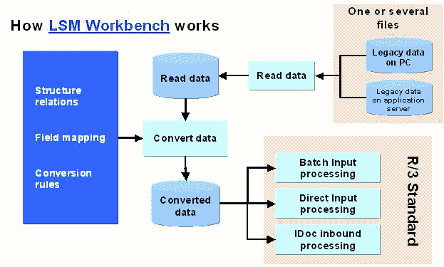

LSMW 可用于以下 3 种功能-

The main functions of the LSM Workbench are:

1.  **导入数据**（电子表格表格和/或顺序文件中的旧数据）
2.  **转换数据**（从源格式到目标格式）
3.  **导入数据**（到 R / 3 应用程序的数据库中）

To start the LSMW workbench use transaction LSMW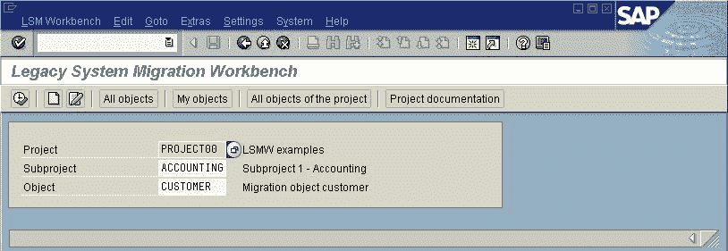

*另外，请查看下一个有关逐步执行 LSMW 的教程*

在 SAP 中输入事务 **LSMW** ，以启动工作台。

LSMW 工作台显示以下信息-

*   **项目**：一个最多 10 个字符的 ID，用于命名您的数据传输项目。 如果您要从多个旧系统传输数据，则可以创建一个项目，例如 对于每个旧系统。
*   **子项目**：最多 10 个字符的 ID，用作进一步的结构化属性。
*   **对象**：最多 10 个字符的 ID，用于命名业务对象。

输入项目 ID，子项目 ID，对象 ID。 单击执行。下一个屏幕在您的 LSMW 数据迁移中提供**步骤**

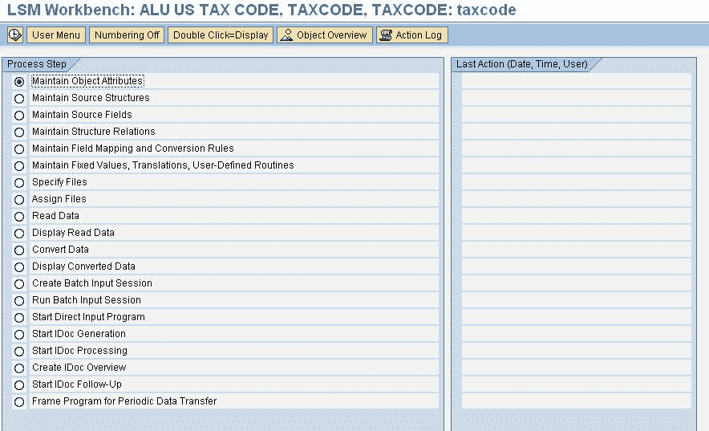

您可以选择所需的步骤，然后单击执行。 让我们详细研究每个步骤

## 第 1 步-维护对象属性。

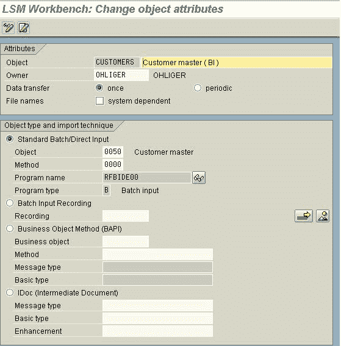

**有四种数据传输**模式：

1.  **标准/批量输入**：标准上传程序
2.  **批量输入记录**：您可以在此处创建自己的记录，并使用其上载/更改数据
3.  **BAPI** ：标准 BAPI 用于上传数据
4.  **IDOC** ：任何入站 IDOC 功能模块均可用于处理数据

根据要求，我们尝试找到合适的方法进行处理。 如果它是标准的 Master，我们可以在第一种方法中找到它。 否则，我们尝试使用 BAPI 或 Idocs。 如果要求是非常定制的，我们可以使用记录来处理数据。

## 第 2 步-维护源结构

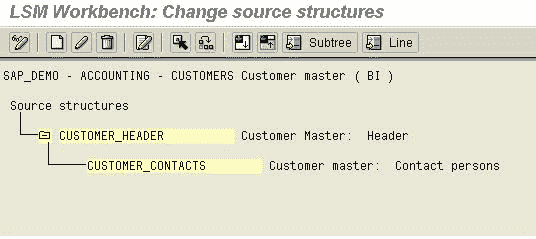

The source structures can be used to design the hierarchy of the files to be uploaded.

## 步骤 3-维护来源字段

在此屏幕中，可以在此处维护将从文本文件上载的字段。 具有相同名称的字段用作键

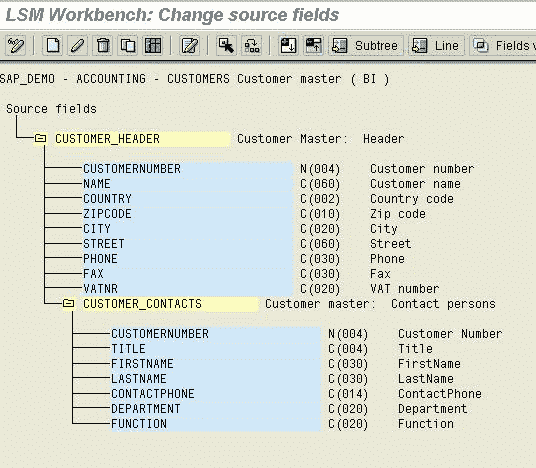

Source Filed is used to identify whether a certain record should go to the specified structure. Eg: Suppose a file contains header rows and item rows, we can specify the first field as the indicator say 'H' for a header and 'I' for Item. Thus when the file is being read, it checks the first field, if it is 'H' then it is read into the Header source structure else it is written to the item source structure.The Source fields can be easily maintained in the form of a table maintenance.

## 步骤 4-维护结构关系

The Structures which are needed for the processing of the data need to be assigned here. The Object may contain many structures and many source structures. The Mapping between the source and the target structures should be done after careful checking.

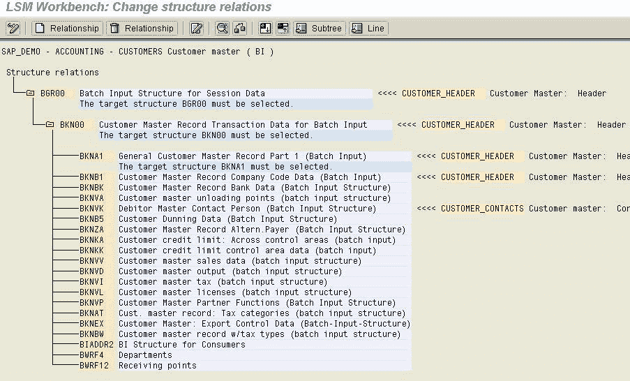

## 步骤 5-维护字段映射和转换规则

在此步骤中，您将源字段分配给目标字段，并定义如何转换字段内容。

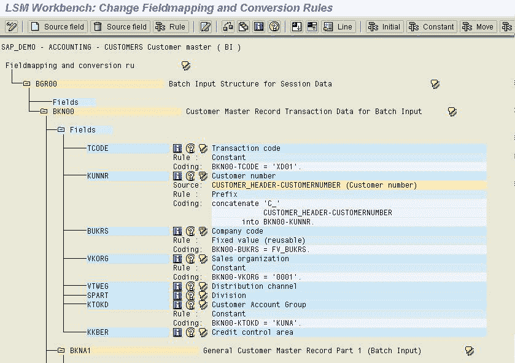

将显示您在上一步中选择的所有目标结构的所有字段。 对于每个目标字段，将显示以下信息：

*   栏位说明
*   分配的源字段（如果有）
*   规则类型（固定值，转换等）
*   编码。

> 注意：某些字段由系统预设。 这些字段称为“技术字段”，带有“默认设置”标记。 首次进入字段映射时，不会显示这些字段的编码； 可以通过 display 变体显示。 更改默认设置可能会严重影响数据转换的流程。 如果错误地更改了默认设置，则可以通过选择 Extras-> Restore to default 恢复它。

## 步骤 6-维护固定值，翻译和用户编写的例程

Here the 3 reusable functions are maintained:

1.  **固定值**：固定值是在整个项目中固定的值，例如：公司代码。 我们可以为 BUKRS 分配一个固定值，并且该固定值可以在该项目中的所有对象中使用。 因此，如果值更改，我们只能在一个位置（即固定值）更改，而不能在每个对象中更改。
2.  **翻译**：在这里，您可以维护任何旧字段的固定翻译，并且可以在“字段映射和转换规则”中将翻译分配给已归档的字段。 翻译可以是 1：1 或很多：1 等。
3.  **用户定义的例程**：这些是用户定义的子例程，在对象中用于处理数据。

上面提到的所有三个功能都是可重用的规则，这些规则对一个项目中的所有对象均有效。

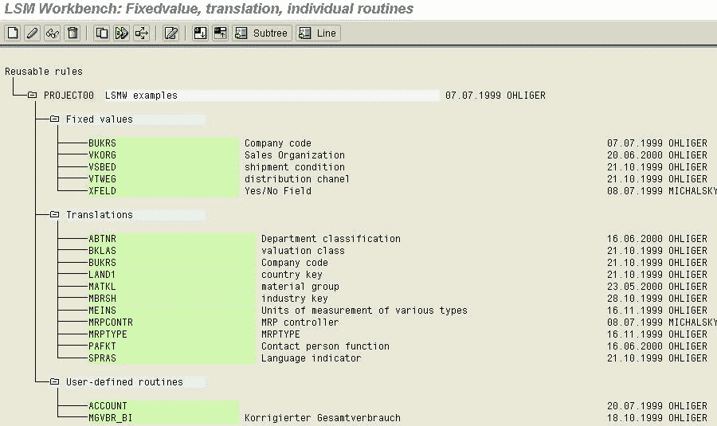

## 步骤 7-指定文件

在这里，我们定义了用于上传数据的文件。 该文件可以在前端或在应用程序服务器中。

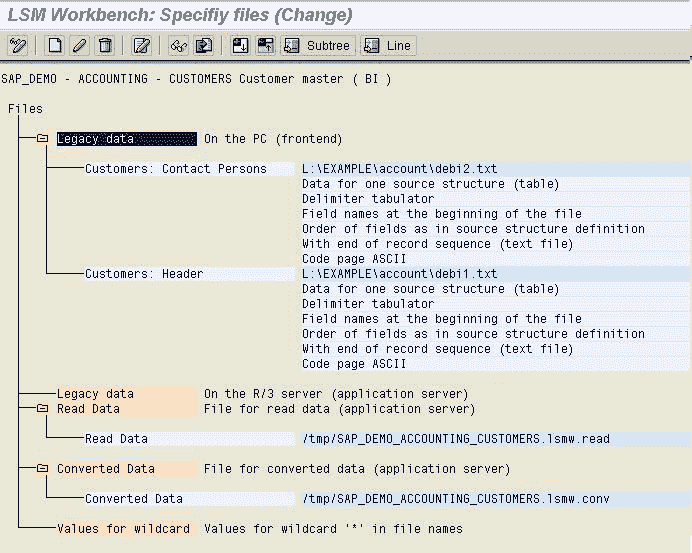

## 步骤 8-分配文件

在这里，我们定义要用于当前上传的文件，即该文件是在 Presentation 服务器上还是在应用程序服务器上。

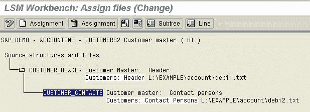

## 第 9 步-读取数据

Reading the data from the file gives us an option to read only a few records and not the entire chunk in order to enable [Testing](/software-testing.html) of first few records. This also provides the user defined selection parameter which can be used to restrict the read data based on the condition specified.

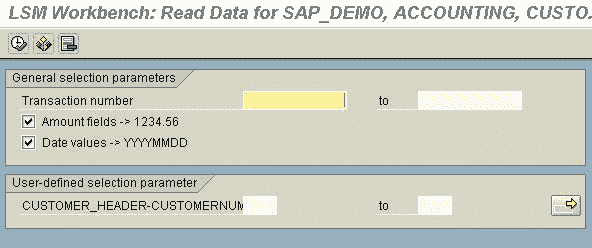

## 步骤 10-显示读取的数据

*   在此步骤中，您可以表格形式显示全部或部分读取的数据。 单击一行将以清晰的方式显示该行的所有信息。 单击字段内容时，也会发生同样的情况。
*   更改显示允许选择单行或多行视图。
*   显示调色板显示各个层次结构级别的颜色。

## 步骤 11-转换数据

数据转换是基于维护字段映射和转换例程中编写的转换例程，将数据从源结构传输到目标结构。

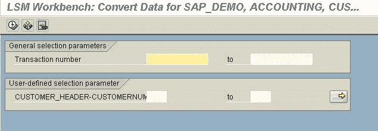

## 第 12 步-导入数据

程序显示的步骤取决于所选的对象类型：

*标准批输入或记录：*

1.  生成批输入会话
2.  运行批输入会话

*Standard direct input:*

1.  开始直接输入会话

*BAPI or IDoc:*

1.  开始创建 IDoc
2.  开始 IDoc 处理
3.  创建 IDoc 概述
4.  开始 IDoc 后处理

This completes a detailed overview of steps to transfer your data using LSMW in SAP.