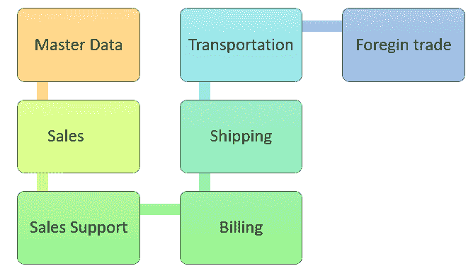

# 什么是 SAP SD？ SAP Sales &分发模块简介

> 原文： [https://www.guru99.com/sap-sd-introduction.html](https://www.guru99.com/sap-sd-introduction.html)

## 什么是 SAP SD？

SAP 销售和分销（SD）是 SAP ERP 的重要模块，由销售，运输和开票所需的业务流程组成。 该模块与 SAP MM & SAP PP 紧密集成。 SAP SD 的关键子模块是客户和供应商主数据，销售，交付，开票，定价和信用管理。

在此 SAP SD 教程中，您将学习：

*   [什么是 SAP SD？](#1)
*   [SAP SD 模块](#2)的功能
*   [SAP SD](#3) 的关键组件
*   [SAP-SD-MD（主数据）](#4)
*   [SAP-SD-SLS（销售）](#5)
*   [SAP-SD-BIL（计费模块）](#6)
*   [SAP-SD-SHP（运输）](#7)
*   [SAP-SD-TBA（运输）](#8)
*   [SAP-SD-CAS（销售支持）](#9)
*   [SAP-SD-FTT（外贸）](#10)
*   [SAP SD 软件](#11)的优势

## SAP SD 模块的功能

这是 SAP SD 模块的一些重要功能：

*   **价格和税收：** –它可以帮助您评估在授予客户的各种条件（如折扣或折扣）下商品和服务的价格。
*   **可用性检查：**检查组织仓库中产品的可用性。
*   **开票&发票：**帮助您生成账单或发票。
*   **物料确定：**帮助您根据特定条件确定物料的详细信息。
*   **信用管理：**这是一种管理客户信用额度的方法。 它可以用两种不同的方式来表示：简单的信用检查和自动的信用检查。
*   **帐户确定：**帮助您根据给定的条件类型确定客户的详细信息。

## SAP SD 的关键组件

SAP SD 模块是 SAP 开发的最重要的 ERP 模块。 它有助于更​​好地管理组织中的销售和客户分布数据以及流程。

SAP Sales and Distribution 模块中的重要组件是：

*   主要的数据
*   营业额
*   物料运输
*   帐单相关
*   销售支持
*   产品运输
*   外贸

<figure>

<figcaption style="display: table;">Sub Modules of SAP SD</figcaption>

</figure>

## SAP-SD-MD（主数据）：

SAP SD 具有主数据，可帮助您跟踪数据中的每个事务。 SD 主数据包括客户和物料数据以及信用管理。 此模块包括订单和现金流程。

### 资料功能

主数据是“销售和分销”模块中最重要的因素。

SD 中有两个级别的母版。

*   客户主管
*   物料主
*   定价条件

而二级主存储的详细信息如下：

输出条件

*   有关客户，材料和业务合作伙伴的详细信息
*   灵活的数据结构支持业务环境。

## SAP-SD-SLS（销售）：

SAP SD 销售可帮助您处理每笔销售的详细信息。 从记录产品到客户详细信息，价格，反馈，使用此模块可以跟踪所有内容。

### 销售模块的功能

*   查询&报价
*   销售订单
*   寄售
*   计划协议
*   紧急订单和拖延订单
*   贷记&借项凭单请求

## SAP-SD-BIL（计费模块）：

开票是销售和分销过程中最关键的部分。 消费者可以选择通过在线媒体还是货到付款。 这个特定的模块应该以适当的方式跟踪所有计费数据。

### 计费模块的功能

*   自动或手动创建发票
*   全面的计费功能
*   实时整合财务
*   完全整合和全面的定价

## SAP-SD-SHP（运输）：

销售始终与运输和交付相关。 产品需要正确运输并交付给客户。

有不同的运输方式，此模块跟踪每种产品的每次交货。 使用此模块记录从发货到交付或退回的整个过程。

### SAP-SD-SHP 的功能

*   生成运输单据
*   拣配，包装&库存管理
*   运输管理与调度
*   交货计划，退货交货
*   库存转移

## SAP-SD-TBA（运输）：

该组件与运输模块一起使用。 由于每种产品的运输方式各不相同，因此该模块可帮助您跟踪所有与运输有关的数据。

### SAP-SD-TBA 功能：

*   它是一个灵活且易于使用的组件，使您可以收集，合并和利用销售和分销过程中的数据。
*   它被广泛用于（LIS）后勤信息系统。

## SAP-SD-CAS（销售支持）：

从销售产品到维护产品，客户一直与销售团队互动。 通过此模块记录并报告在提供产品支持时销售团队和客户之间交换的数据。

### 销售支持：

它提供了支持员工的功能，涉及业务发展和与客户服务相关的流程。

### 销售支持的功能：

*   销售前景
*   联系人
*   竞争对手和竞争产品
*   销售活动
*   直销

## SAP-SD-FTT（外贸）：

它可以帮助您管理与外贸相关的数据，其中包括进口和出口产品。 该模块是跨不同大陆贸易的企业的理想选择。

## SAP SD 软件的优势

这是 SAP SD 的优点：

*   追踪销售交易
*   跟踪销售数据以及团队绩效
*   记录售前和售后流程
*   确定的销售和分销流程
*   帮助您对各种销售和流程进行分类
*   在特定系统中有效管理销售单据

### 摘要：

*   SAP Sales and Distribution（SD）是重要的模块，其中包含销售，运输，产品开票等所需的业务流程。
*   1）价格和税收，2）可用性检查，3）开票&发票，4）物料确定，5）信用管理是 SAP SD 的一些重要功能
*   主数据，2）销售，3）物料运输，4）与计费相关，5）销售支持，6）产品运输，7）外贸是 SAP SD 的一些重要组成部分。
*   主数据，可帮助您跟踪数据中的每笔交易
*   SAP SD 销售可帮助您处理每笔销售的详细信息
*   SAP 计费模块以适当的方式跟踪所有计费数据
*   SAP SD 运送模块可帮助您记录从运送到交付或退回的整个过程。
*   SAP SD 运输模块可帮助您跟踪所有与运输有关的数据
*   SAP SD 销售支持模块记录并报告销售团队与客户之间的数据
*   SAP SD 外贸可以帮助您管理与外贸有关的数据
*   SAP SD 可帮助您跟踪销售交易以及团队绩效