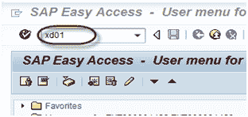
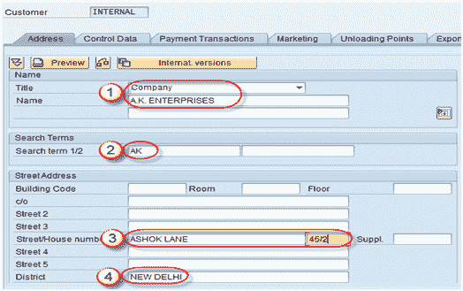
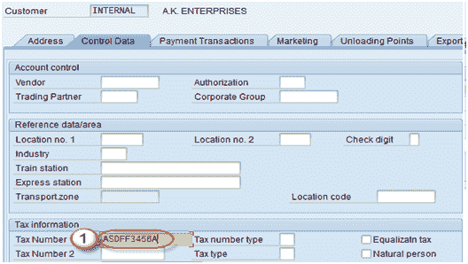
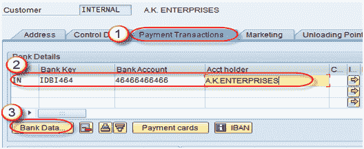
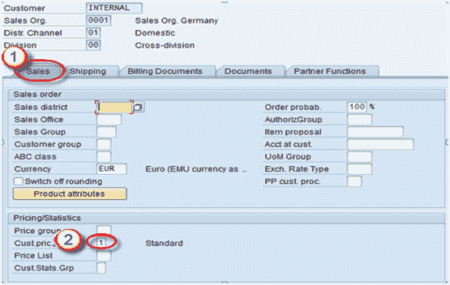

# 创建客户主数据：SAP XD01

> 原文： [https://www.guru99.com/create-customer-master-by-t-code-xd01-3.html](https://www.guru99.com/create-customer-master-by-t-code-xd01-3.html)

**Background**

客户主数据是 SAP SD 中的**主**主数据。 要创建客户主数据，我们需要帐户组。 **帐户组**：帐户组是类似帐户的累积。 *客户*层次结构中的主记录由他们的*帐户组*控制。

1.  它为客户确定“可选”，“强制”和“不需要”信息。
2.  合作伙伴职能也与客户组关联。
3.  帐户组定义将号码分配给客户的方式。

用于创建客户主数据的 T 代码-FD01 / XD01 / VD01

*   FD01-公司代码级别&数据将存储在表 KNA1 和 KNB1 中。
*   XD01-包含销售区域&的数据将存储在表 KNA1，KNB1 和 KNVV 中（包含公司代码数据）。
*   VD01-包含销售区域&的数据将存储在表 KNA1，KNB1 和 KNVV 中（不包括公司代码数据）。

我们将在这里使用 XD01 来创建客户主数据。

**步骤 1-在“命令”字段中输入 T-Code XD01。**

**步骤 2-在“地址”选项卡屏幕中，如下所示输入详细信息-**

1.  输入客户的标题和名称。
2.  输入搜索词，以搜索客户。
3.  输入街道/门牌号。
4.  输入地区/邮政编码/城市/国家/地区。

**步骤 3-在“控制数据”选项卡屏幕字段中输入数据**

1.  输入税号

**步骤 4-在“付款交易”标签上输入数据。**

1.  单击付款交易选项卡。
2.  输入银行城市/银行密钥/银行帐户/帐户持有人姓名。
3.  要输入有关银行的更多详细信息，请单击“银行数据”按钮。

单击“银行数据”按钮后，出现以下屏幕-

1.  输入银行名称/地区
2.  输入城市
3.  输入 Swift 代码

单击勾选按钮。

**步骤 5-输入销售区域数据-**

1.  单击应用程序工具栏上的销售区域按钮。
2.  输入客户定价程序/运输数据/合作伙伴功能。

**步骤 6-保存记录。**

点击保存按钮。

将使用客户编号创建客户。

## 客户主数据中的主要交易代码

| 交易代码 | 描述 |
| **XD01，XD02，XD03** | 用于集中创建/更改/显示客户 |
| **VD01，VD02，VD03** | 用于创建/更改/显示客户销售区域 |
| **FD01，FD02，FD03** | 用于创建/更改/显示客户公司代码 |
| **XD04** | 显示变更文件 |
| **XD05** | 显示更改文档用于阻止客户-全局，订单，交货，开票，销售区域等 |
| **XD06** | 用于删除 |
| **XD07** | 更改帐户组 |
| **VAP1** | 创建联系人 |

## 客户主记录中的关键表

| 表名 | 描述 |
| KNA1 | 一般信息 |
| KNB1 | 公司代码 |
| 猪瘟病毒 | 销售区域 |
| 诺比克 | 银行资料 |
| VCNUM | 信用卡 |
| VCKUN | 信用卡分配 |
| 马斯纳夫 | 客户主数据中的常规数据 |
| 响应曲线 | 联系人 |
| KNVP | 合作伙伴职能 |
| MASSKNVK | 联系合作伙伴 |
| MASSKNVD | Rrecord 销售申请表 |
| 挪威海军 | 客户主许可证 |
| 国民党 | 税收指标 |
| 知识联盟 | 卸货点 |
| 记录下来 | 增值税登记号总则 |