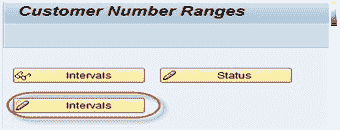
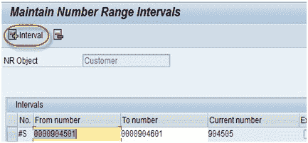
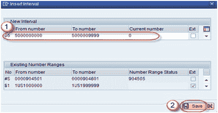
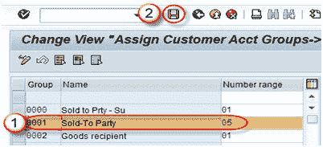

# SAP SD：创建编号范围&分配到帐户组 XDN1

> 原文： [https://www.guru99.com/create-customer-number-range-for-sales-and-assign-to-customer-account-groups.html](https://www.guru99.com/create-customer-number-range-for-sales-and-assign-to-customer-account-groups.html)

在本教程中，我们将学习如何创建数字范围&为客户帐户组分配数字范围

**步骤 1）** **客户编号范围和分配**

在命令栏中输入 T-Code XDN1，然后按 Enter 键。

 

**步骤 2）**

现在，我们创建客户编号范围。 单击间隔创建按钮。

 

**步骤 3）**

出现屏幕名称维护编号范围间隔。

点击+间隔按钮。

**步骤 4）**

出现以下屏幕。

1.  给出数字范围。
2.  点击保存按钮。

 

消息显示“更改已保存”。

 

**步骤 5）为客户帐户组分配编号范围**

在命令栏中输入 T-Code -OBAR。

1.  将编号范围分配给客户帐户组。
2.  保存屏幕。

消息显示“更改已保存”。

