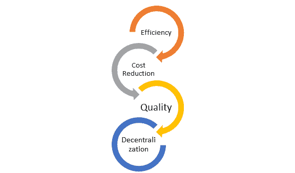

# ERP 的完整形式和含义是什么？

> 原文： [https://www.guru99.com/erp-full-form.html](https://www.guru99.com/erp-full-form.html)

## 什么是 ERP 完整表格？

ERP 的完整形式是企业资源计划。 ERP 是业务管理软件。 它是一套集成的应用程序，可帮助用户存储和管理其业务数据。

与 ERP 系统的实施相关的最重要的活动之一是通过业务流程的重新设计以及实施最佳实践和标准来简化和改善组织的业务运营的机会。

在本教程中，我们将学习-

*   [完整的 ERP 形式是什么？](#1)
*   [为什么要实施 ERP 系统？](#2)
*   [ERP 系统的主要目标是什么？](#3)
*   [在 ERP 系统](#4)上实施的步骤
*   [ERP 系统的优点和缺点](#5)

## 为什么要实施 ERP 系统？

通过向公司的所有部门的所有员工提供实时信息，ERP 是证明价值的最佳选择。

### 1.整合财务信息

企业所有者希望了解公司的整体绩效，因为在许多情况下，他们可能会发现各种不同的事实。 财务和销售有另一个版本，业务部门可能有其版本的组织收入贡献。 通过实施 ERP，他们可以获得事实的单一版本。

### 2.标准化并加快制造过程：

ERP 系统随附用于自动化制造过程的方法。 这有助于组织加快制造过程并使之标准化。

### 3.减少库存：

它有助于提高任何公司的订单履行过程的可见性。 这可能导致制造产品的库存减少。

### 4.增加和改善互动：

ERP 系统还有助于增加和改善客户与供应商之间的互动。 此外，供应商还可以与销售，市场和财务团队进行更无缝的沟通。

## ERP 系统的主要目标是什么？

任何 ERP 项目的目标都是跟踪从库存购买，处理到最终装运的供应链行动。

### 1.效率

ERP 系统中的实时信息流简化了分析，数据和报告的过程。 它还可以改善决策。 它还有助于减少维护多个数据库的需求。

### 2.降低成本

成本降低是大小企业为实施 ERP 系统投入大量时间和资源的重要原因。 它将减少浪费并提高生产率。 它还降低了总体生产成本。

### 3.质量

质量改进是 ERP 的最重要目标。 该软件技术可帮助管理层将其质量绩效与同行业中的其他制造公司进行比较。

### 4.分权化

企业资源计划系统可以在各个级别分散决策过程。 它还允许用户实时访问相同的数据，例如生产状态和财务报告。

## 在 ERP 系统上实施的步骤

### 步骤 1）战略规划

*   从销售，会计，采购和物流部门分配一组员工。
*   检查当前的业务流程和信息流。
*   检查 ERP 软件的功能，以检查它们在新系统中如何执行日常任务。
*   设定项目目标。
*   制定项目计划。

### 步骤 2）程序审查

*   查看软件并检查 ERP 软件的各个方面，并找出差距。
*   评估哪些过程是手动的，应该是自动化的
*   制定标准的操作程序。

### 第 3 步：数据收集和清理

*   通过分析当前数据来确定需要转换的信息。
*   定义需要收集的新数据。 创建电子表格以收集数据并将其分段成逻辑表
*   需要检查 ERP 数据库的准确性和完整性
*   查看并清理不需要的信息

### 步骤 4）培训和测试

*   模拟 ERP 运行以测试数据准确性。
*   确保实际测试与标准操作程序一致。
*   项目团队需要对数据和流程执行最终测试。

### 步骤 5）部署

*   一旦正确配置了 ERP 软件并整理了财务数据，就可以开始使用了。
*   在最终评估中，您需要通过牢记在计划阶段中设置的所有目标来创建结构化的评估计划。

## ERP 系统的优点和缺点

**ERP 系统的优势**

*   ERP 系统易于扩展，因此根据业务计划添加新功能非常容易。
*   通过提供准确和实时的信息，ERP 软件降低了管理和运营成本。
*   ERP 系统通过改进基础流程来改善数据质量，这些流程可帮助组织做出更好的业务决策。
*   ERP 系统通过使用高级用户管理和访问控制来帮助改善数据访问。
*   ERP 为组织提供透明度
*   有助于消除数据管理系统中的冗余
*   通过允许仅将员工帐户限制为流程来提供更高级别的安全性。
*   它有助于使报告更容易且可自定义。

**ERP 系统的缺点**

*   对于任何中小型企业而言，整个实施的前期成本都可能很高。
*   ERP 部署需要相对较长的时间。 有时可能需要 1-3 年才能实现并完全发挥作用。
*   现有数据的迁移非常难以实现。 因此，将 ERP 系统与其他独立软件系统集成同样困难。
*   在具有不同类型的业务流程和系统的分散组织中，ERP 实施非常困难。

## 结论

*   被称为 ERP 的企业资源计划是一种业务管理软件
*   ERP 系统使您有机会简化和改善业务运营。
*   通过实施 ERP，企业所有者可以获得真实情况的单一版本。
*   ERP 项目的主要目的是跟踪供应链行动。
*   质量改进是 ERP 的最重要目标。
*   这些系统中的实时信息流简化了数据收集，分析和报告的过程。