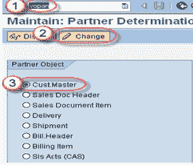
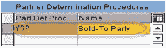
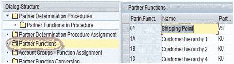
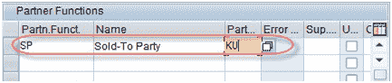
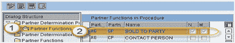
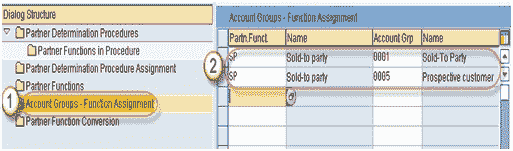

# 如何创建合作伙伴功能&合作伙伴确定：SAP VOPAN

> 原文： [https://www.guru99.com/create-partner-function-by-t-code-vopan.html](https://www.guru99.com/create-partner-function-by-t-code-vopan.html)

**什么是合作伙伴功能？**

合作伙伴功能是两个字符的识别码，描述了与您开展业务的人员和组织以及参与交易的人员和组织。 这是针对客户的一些标准合作伙伴功能-

1.  售出方
2.  收货方
3.  开票方
4.  工资

**什么是合作伙伴确定？**

SAP SD 中的“合作伙伴”和“业务合作伙伴”一词是指与您有业务往来的各方。 每个业务伙伴都有特定的角色。 例如。 卖给对方-订购商品/服务的业务伙伴。 合作伙伴确定可以通过三个步骤完成：

**步骤 1** 定义合作伙伴功能

**步骤 2** 通过将“合作伙伴”功能分组来创建“合作伙伴确定”过程。

**步骤 3** 将伙伴确定过程分配给相应的伙伴对象。

**步骤 1-定义合作伙伴功能：**

1.  在命令栏中输入 T-Code VOPAN。
2.  选择客户主要合作伙伴对象
3.  点击更改按钮，出现合作伙伴确定程序屏幕。

1.  单击“新条目”按钮。

5.  输入合作伙伴确定程序和名称。

9.  双击“伙伴功能”节点-出现如下屏幕。

13.  单击新条目  按钮。

15.  输入合作伙伴职能详细信息

输入合作伙伴功能/名称/合作伙伴类型。

| 栏位名称 | 描述 |
| 合作伙伴职能 | 每个伙伴功能的两个字符的唯一标识符。 |
| Name | 此伙伴功能的有意义的描述。 |
| 合作伙伴类型 | 它告诉合作伙伴功能是否适用于客户（KU），供应商（LI），联系人（AP）等。 |

**步骤 2-通过将伙伴功能** **分组来确定伙伴。**

1.  单击过程节点中的合作伙伴功能。
2.  输入合作伙伴检测。 程序/合作伙伴功能/名称。

**步骤 3-将伙伴确定过程分配给相应的伙伴对象。** 我们正在为客户创建合作伙伴功能，因此这里的合作伙伴对象是客户，并分配给帐户组**。**

| **合作伙伴对象** | **分配给** |
| 顾客 | 帐户组 |
| 销售单据头 | 销售单据类型 |
| 销售凭证项目 | 项目类别类型 |
| 投放标题 | 交货凭证类型 |
| 装运头 | 发货单类型 |
| 帐单标题 | 开票凭证类型 |
| 开票项目 | 帐单项目类别类型 |
| 联系 | 接触类型 |

1.  单击帐户组-功能节点，然后单击新条目按钮。
2.  输入合作伙伴功能/名称/帐户组/名称。

单击保存按钮  保存伙伴功能。