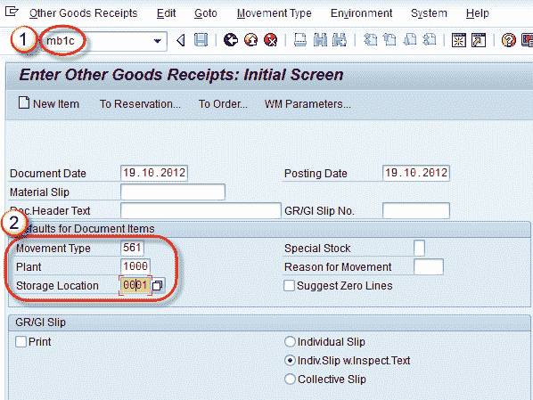
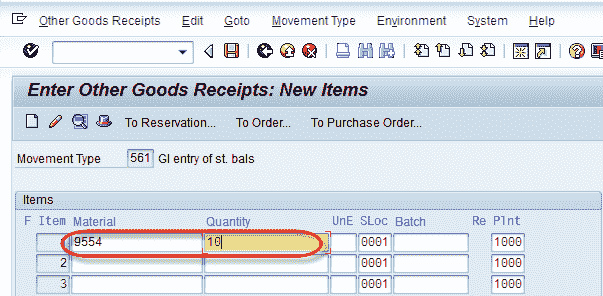

# MB1C：如何在 SAP 中创建物料库存

> 原文： [https://www.guru99.com/how-to-create-material-stock.html](https://www.guru99.com/how-to-create-material-stock.html)

**Background**

他们不止一个用于创建物料库存的 Tcode。

2.  MB 1 C（其他收货），用于创建物料的期初余额。
3.  MIGO（用于物料的发布/转移/接收）。

We use here MB1C Tcode to Create Material Stock as opening balance.

**步骤 1。**

2.  在命令字段中输入 Tcode MB1C。
3.  输入移动类型 561，工厂&的存储位置。

单击输入按钮。

**** 

**步骤 2**

在上方屏幕上输入后，出现如下所示的项目屏幕：

*   输入我们需要为其创建库存的物料代码。
*   输入用于库存创建的物料数量。

**步骤 3**

单击保存  按钮。

显示消息“文档 5000021944 已发布”。

