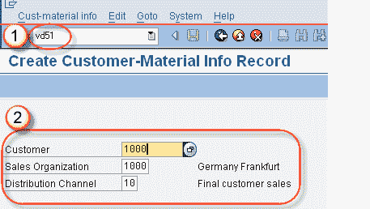
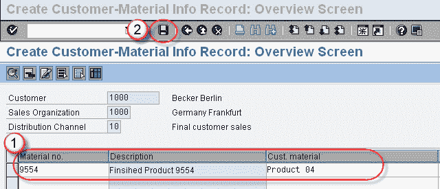

# 如何在 SAP 中创建客户物料信息记录 VD51

> 原文： [https://www.guru99.com/how-to-create-customer-material-info-record.html](https://www.guru99.com/how-to-create-customer-material-info-record.html)

**Background:**

有时，客户在采购订单中引用的是外行名称（而不是技术名称）的物料。因此，有必要使用我们的物料代码映射客户物料名称，此过程称为“客户物料信息记录” 。

T 代码为-VD51（创建）/ VD52（更改）/ VD53（显示）

**步骤 1**

2.  在命令栏中输入 T 代码 VD51。
3.  输入客户代码/销售组织/分销渠道。

按 Enter 键，将出现下一个屏幕。

**步骤 2**

2.  输入物料编号 和客户材料。
3.  点击保存按钮。

一条消息“客户材料信息已保存”。

