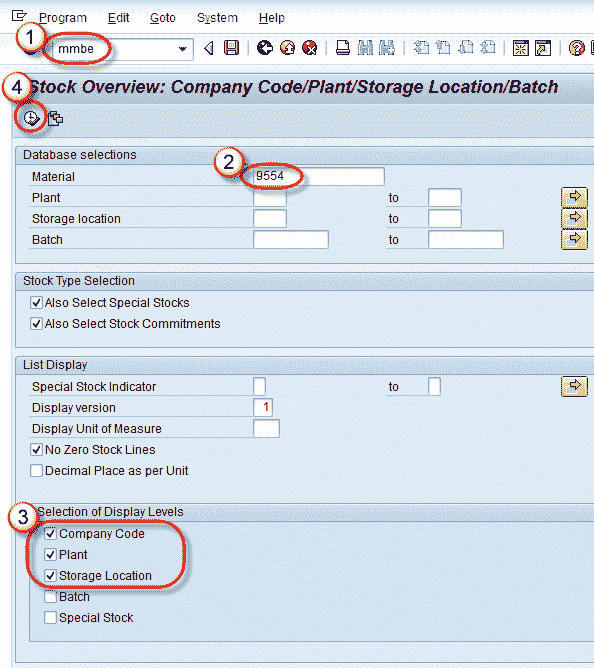
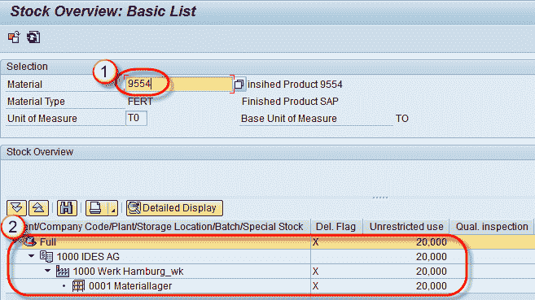
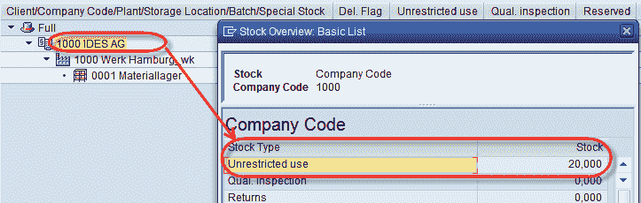

# MMBE：如何获取 SAP 库存概览

> 原文： [https://www.guru99.com/how-to-get-overview-of-material-stock.html](https://www.guru99.com/how-to-get-overview-of-material-stock.html)

我们可以通过 T-Code – MMBE 获得各个组织级别的特定物料的库存概览。
**步骤 1）**

在命令栏 MMBE 中输入 T 代码。

输入物料编号

选择我们要查看其库存概览的显示级别。 单击  执行按钮。

 

**步骤 2）**
输出将显示如下-

1.  显示物料 9554 的库存概览。
2.  显示公司/工厂/存储地点的库存。 通过双击每个级别，我们可以看到该级别的库存概览。

例如 如果我们双击公司级别，则将在公司级别获得以下详细信息-

同样，双击工厂/仓库级别后，我们可以在工厂/仓库位置获得库存概览。