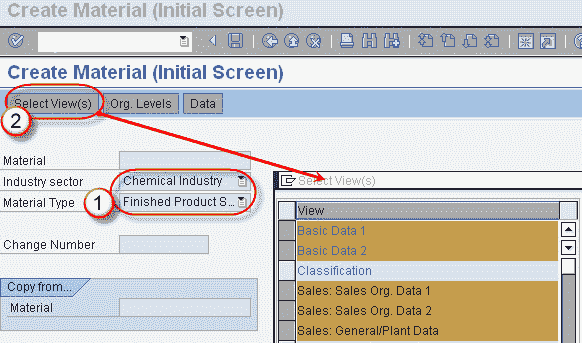
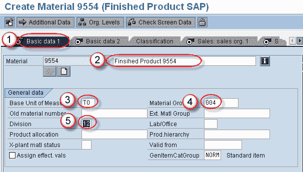
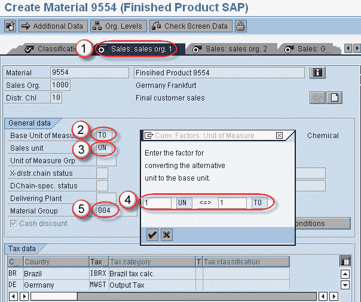
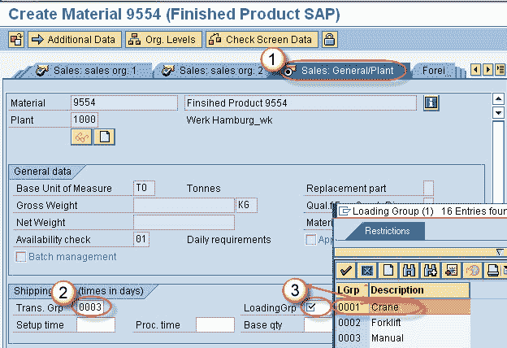
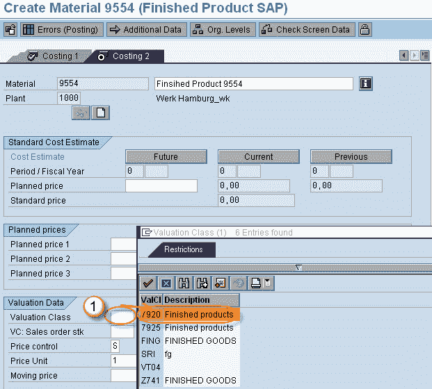
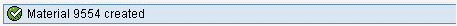

# SAP SD：创建物料主数据

> 原文： [https://www.guru99.com/create-material-master-for-sales-view.html](https://www.guru99.com/create-material-master-for-sales-view.html)

**目的**：此过程用于为不同视图手动创建物料主数据。 在这里使用销售视图-

**步骤 1）**

在 T 代码 MM01“创建材料”中

1.  输入行业和物料类型。
2.  单击选择视图按钮。 出现一个弹出窗口。 在弹出窗口中，选择要为其创建物料的视图，然后单击检查按钮。

**步骤 2）**

现在在选项卡屏幕中显示所有视图的屏幕。

1.  选择基本数据 1 选项卡。
2.  输入材料描述。
3.  输入基本计量单位。
4.  输入物料组。
5.  输入分区。

**步骤 3）**

1.  选择销售组织 1 标签屏幕。
2.  将显示基本计量单位。
3.  输入销售单位。
4.  弹出一个“转换”窗口。 因素，输入转化 因素。
5.  显示物料组。

**步骤 4）**

1.  选择销售常规/工厂标签屏幕。
2.  输入运输商组。
3.  输入加载组。

**步骤 5）**

单击选项卡列表图标。

出现所有选项卡的列表，从列表中选择成本核算选项卡 2。

1.通过选择视图输入物料的评估类别。

**步骤 6）**

点击保存按钮。 消息“物料 9554 已创建”。

