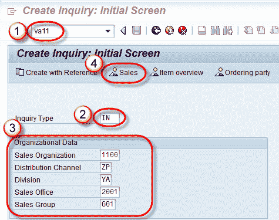
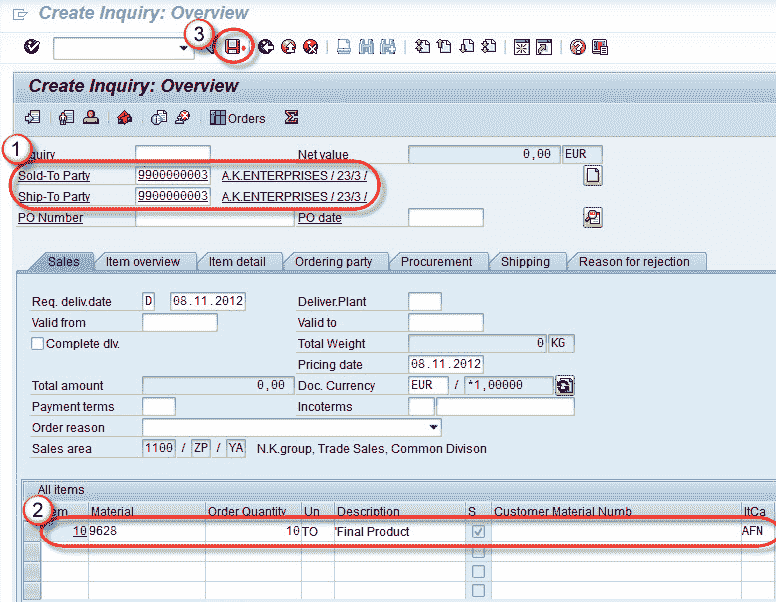

# 如何在 SAP 中创建查询：VA11

> 原文： [https://www.guru99.com/create-inquiry-2.html](https://www.guru99.com/create-inquiry-2.html)

**背景：**

查询文件是内部文件，它记录了有关要在公司中流传的潜在客户的请求的信息，而不是法律文件。

捕获的信息主要是材料和数量。更多详细信息可以添加到文档中，这是可选的。 创建查询的最大好处是减少了完成对客户答复的业务开销。

用于创建询价的 T 代码是-VA11。

**步骤 1）**

1.  在命令栏字段中输入 T 代码 VA11。
2.  从帮助中选择查询类型。 在屏幕快照中，选择了``IN''进行查询。
3.  输入销售组织/分销渠道/部门/销售办事处/销售组。
4.  选择销售图标

**步骤 2）**

1.  输入售达方/收货方（这是合作伙伴功能）。
2.  输入物料代码和数量。
3.  单击保存  按钮。

**步骤 3）**

显示消息“查询 10000015 已保存”。

