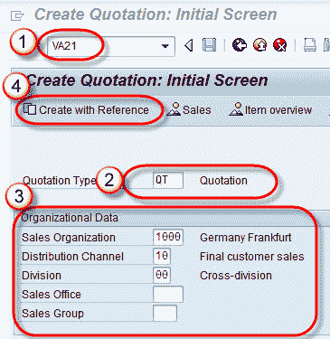
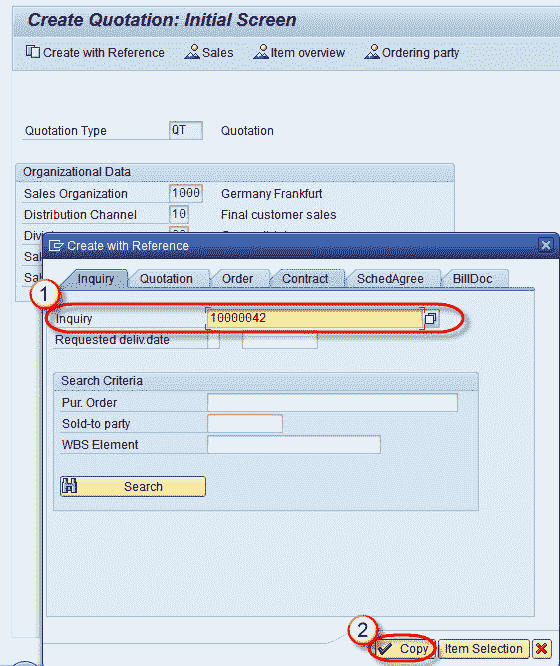
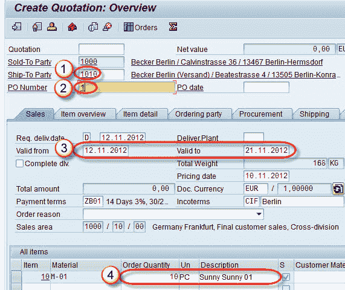

# 如何创建报价：SAP VA21

> 原文： [https://www.guru99.com/create-quotation.html](https://www.guru99.com/create-quotation.html)

**报价**：

这是一份销售文档，通知客户公司将在特定时间以特定价格交付特定数量的产品。

可以在收到客户的查询或不查询的情况下创建报价。在收到客户的查询后创建报价时，可以采用以下两种方法-

1.  参考询价创建报价。
2.  创建报价单而不参考询价​​单。

以下演示参考询价创建报价。 用于创建报价的 T 代码：VA21

**步骤 1）**

1.  在命令字段中输入 T 代码 VA21。
2.  输入报价类型
3.  在组织块中输入销售组织/分销渠道/部门。
4.  选择使用参考创建按钮。

**步骤 2）**

1.  输入查询编号。
2.  单击复制按钮。

**Step3）**

1.  输入收货方。
2.  输入 Po 编号，如果有的话。
3.  输入有效期自（Valid from）和有效期至（Valid to date）（这是该报价有效的日期。）
4.  输入物料数量。

**步骤 4）**

单击保存  按钮。

将会显示一条消息“报价 20000076 已保存”。

