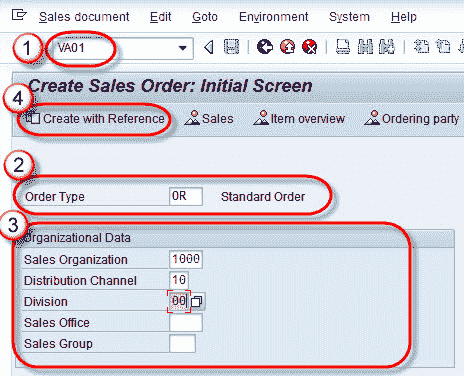
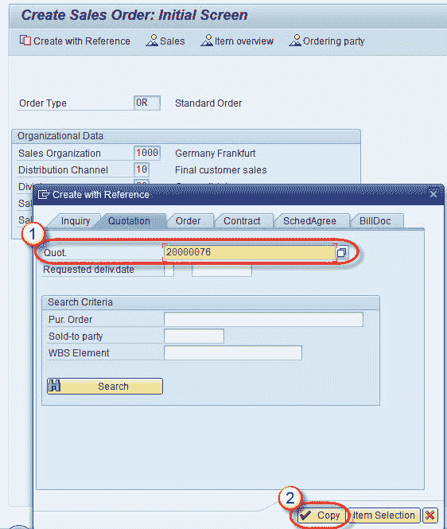
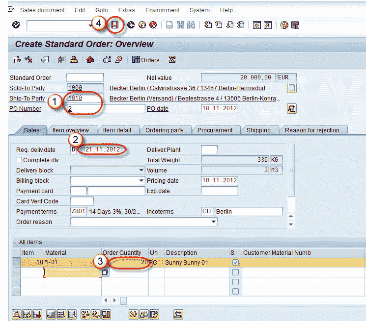

# 如何创建销售订单：SAP VA01

> 原文： [https://www.guru99.com/create-sales-order.html](https://www.guru99.com/create-sales-order.html)

**背景：**

“销售订单”是客户与销售组织之间在指定时间段内提供指定商品和/或服务的合同。 客户主记录和物料主记录中的所有相关信息都将复制到销售订单中。 可以参考诸如查询/报价之类的“先前文档”来创建销售订单。 在这种情况下，先前文档中的所有初始数据都将复制到销售订单中。 T 代码-VA01。

**步骤 1）**

1.  在命令字段中输入 T 代码 VA01。
2.  输入订单类型或标准订单。
3.  在组织数据块中输入销售组织/分销渠道/部门。
4.  点击使用参考创建按钮，用于从询价/报价创建销售订单。

**步骤 2）**

1.  在报价标签中输入报价编号。
2.  选择复制按钮。

**步骤 3）**

1.  输入收货方/订单号/订单日期。
2.  输入要求。 邮寄日期。
3.  我们可以更改订单数量。
4.  单击保存  按钮。

**步骤 4）**

显示消息“标准订单 2000958 已保存”。 