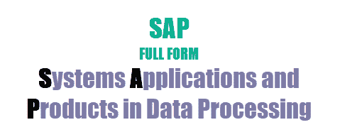

# 完整格式的 SAP：首字母缩写| 缩写

> 原文： [https://www.guru99.com/full-form-of-sap.html](https://www.guru99.com/full-form-of-sap.html)

## SAP 完整表格

**SAP** 代表数据处理中的系统应用程序和产品。 SAP 是一款 ERP 软件，可帮助企业日常运营。SAP 系统可提供整个企业的实时可见性。 SAP 也是 ERP（企业资源计划）软件的名称，也是公司的名称。 SAP Software 是一家欧洲跨国公司，由 Wellenreuther，Hopp，Hector，Plattner 和 Tschira 于 1972 年成立

SAP 软件套件可映射财务，物流，人力资源和许多其他业务流程。 SAP 系统提供整个企业的实时可见性。 组织中的每个人都可以使用它。

SAP 是基于客户端服务器的软件，也称为 R / 3。 （其中“ R”代表实时数据处理& 3 代表 3 层。

1.  数据库，
2.  应用服务器
3.  客户

## SAP 的历史和成长：

*   SAP 由 Wellenreuther，Hector，Hopp，Plattner 和 Tschira 于 1972 年成立。
*   在将其更名为 SAP 之前，它被称为系统分析和程序开发（德语：Systemanalyse und Programmentwickung）。
*   1972 年-第一个版本发布。 SAP 公司只有九名员工，年收入为 30 万美元。
*   1979 年-R / 2 大型机版本问世。 在两个国家拥有 60 名员工和 50 个客户的收入达到 510 万。
*   1992 年-推出 R / 3 客户端/服务器版本。 收入数字达到 62.66 亿。 员工人数达到 3200 人，在 35 个国家/地区拥有约 2800 个客户。
*   1999- mySAP.com 开展了第一步业务。 公司收入增加到 7341 亿，员工人数达到 25,000。 客户群扩展至 120 多个国家/地区的 15,000 个客户。

## SAP 优势

*   SAP 系统消除重复数据。
*   业务流程是标准化的。
*   计划，跟踪和调度&管理变得更加容易。
*   启用与电子商务的集成。
*   具有成本效益，因为它减少了管理费用。
*   帮助自动报告项目的&监控
*   SAP 通过更好的客户互动来帮助增强客户服务。
*   提供整个部门的一致性。
*   提高效率，生产力和更好地管理资源。

## SAP 的缺点：

*   为小型组织实施 ERP 可能会很昂贵。 因此，购买和实施它是非常昂贵的。
*   SAP 系统总是很复杂； 因此，某些组织可能不会根据它进行调整。
*   您需要聘请专家来维护 SAP 系统。

## 结论：

*   SAP 的长格式是“数据处理中的系统应用程序和产品”。
*   SAP 是一款 ERP 软件，可帮助您开展日常业务。
*   SAP 系统由 Wellenreuther，Hector，Hopp，Plattner 和 Tschira 于 1972 年成立。
*   SAP 软件，为金融，物流，人力资源等行业提供最佳解决方案。
*   SAP 系统可帮助组织消除数据的重复和冗余。
*   为小型组织实施 ERP 可能会很昂贵。 因此，购买和实施它是非常昂贵的。