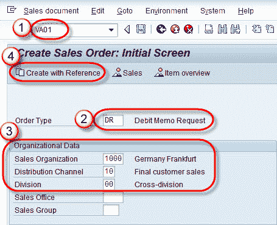
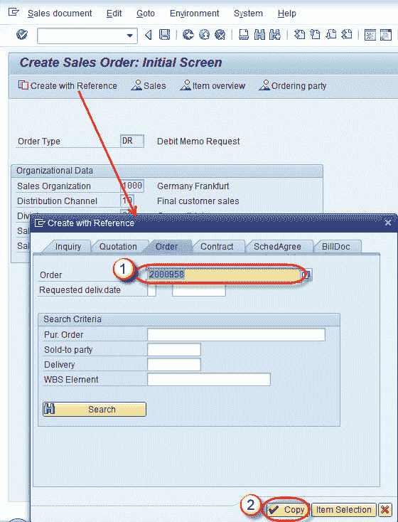
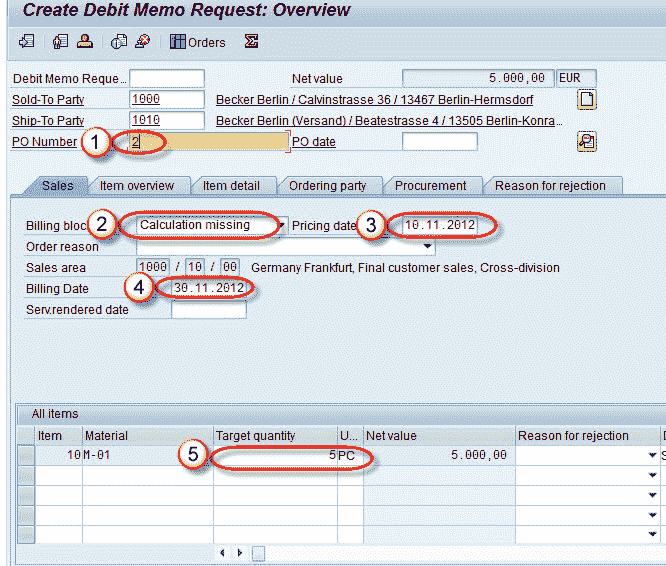

# 如何在 SAP 中创建借项凭单

> 原文： [https://www.guru99.com/create-debit-memo.html](https://www.guru99.com/create-debit-memo.html)

**背景**：

借项凭单请求是在销售单据处理中用于为客户请求借项凭单的销售单据。

示例方案，由于选择的汇率错误而导致计算的价格较低时，将创建借项凭证。

可以冻结借项凭单，以便在批准借项凭单后对其进行检查&，我们可以处理借项凭单。

**步骤 1）**

1.  在命令字段中输入 T 代码 VA01。
2.  输入订单类型借项凭单请求。
3.  在销售组织标签中输入销售组织/分销渠道/部门。
4.  单击使用参考创建按钮。

**步骤 2）**

1.  在弹出窗口的订单标签中输入销售订单编号作为参考以创建演示备忘录请求。
2.  单击复制按钮。

**步骤 3）**

1.  输入采购订单号。
2.  输入开票冻结（借项凭证的原因）。
3.  输入定价日期（*定价日期*是访问条件记录的日期）。
4.  输入帐单日期。
5.  输入目标数量（我们为其创建借项凭证的数量）。

**步骤 4）**

单击保存  按钮。

显示一条消息“借项凭证请求 700000 已保存”。

