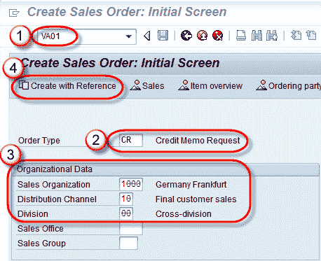
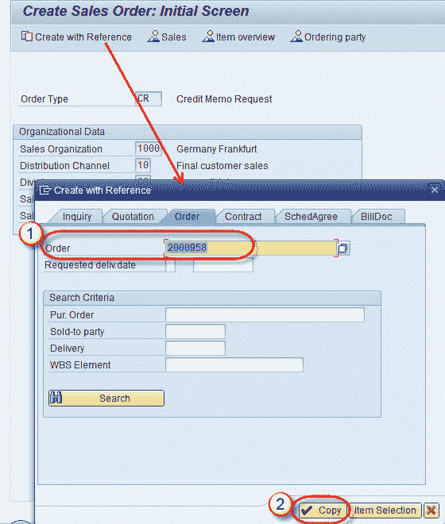
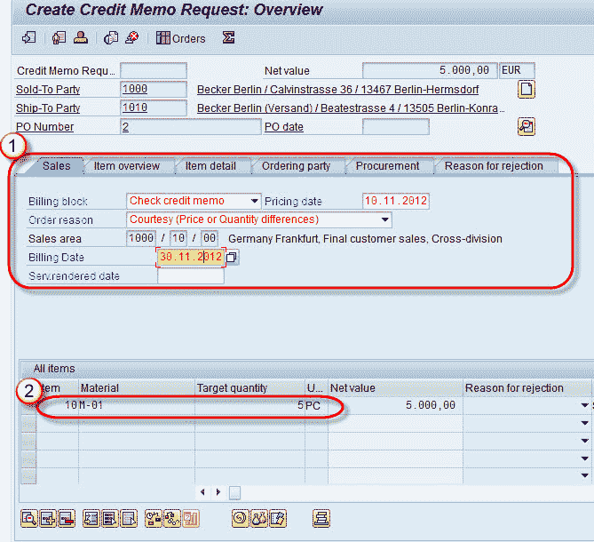

# 如何在 SAP 中创建贷项凭证

> 原文： [https://www.guru99.com/credit-memo-request.html](https://www.guru99.com/credit-memo-request.html)

**什么是贷项凭证？**

这是一种用于处理投诉的销售单据，以向客户索取贷项。以下是发放贷项凭单的一些情况-

*   为客户计算的价格不正确，例如 折扣不包含在客户的销售单据中。
*   销售凭证中的数量不正确。

**步骤 1）**

1.  在命令字段中输入 T 代码 VA01。
2.  输入订单类型字段值作为贷项凭证请求。
3.  在组织数据中输入销售组织/分销渠道/部门。
4.  单击使用参考创建按钮。

**步骤 2）**

1.  在弹出的“订单”选项卡中输入订单号。
2.  单击复制按钮。

**步骤 3）**

1.  在销售标签中输入开票冻结/定价日期/订单原因和开票日期。
2.  输入我们要为其创建贷项凭证的物料和目标数量。

**步骤 4）**

点击保存  按钮。

将显示一条消息“贷项凭证请求 60000189 已保存”。

