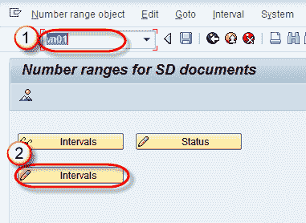
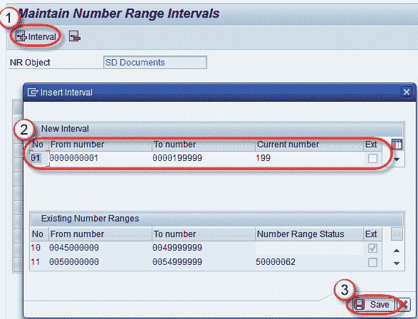
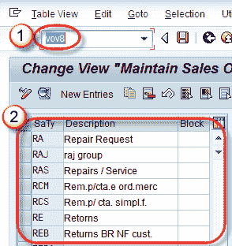
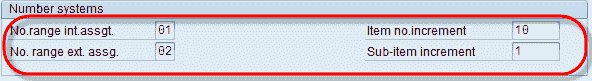
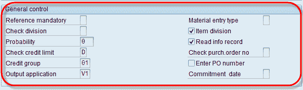
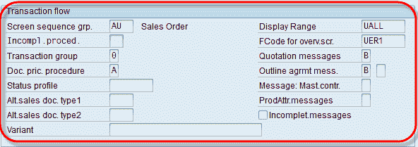
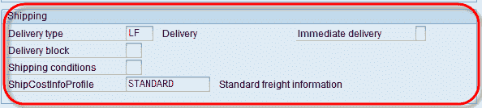

# 如何在 SAP 中创建销售单据类型

> 原文： [https://www.guru99.com/how-to-create-sales-document-types-number-range-and-assignment.html](https://www.guru99.com/how-to-create-sales-document-types-number-range-and-assignment.html)

**销售单据类型。**

Sales Documents Types 是一个 2 字符指示器，系统通过它以不同的方式处理不同的文档 SAP 提供了许多标准的销售文档类型。 销售单据类型用于-

*   售前活动（查询/报价）。
*   销售订单。
*   销售合同。
*   客户投诉。

在销售订单中，分为三个级别–

1.  标头级数据
2.  物品等级数据
3.  计划级别数据

在 SAP 中，有几种标准销售凭证类型可用。我们可以通过 T-code-VOV8 创建自定义销售凭证类型。

**为销售凭证类型创建内部编号范围。**

VN01 是用于内部编号范围创建的 T 代码。 我们将使用此内部编号。 在第 3 步中。

1.  在新的 SAP 会话的命令字段中输入 T 代码 VN01。
2.  单击间隔创建按钮。

1.  单击+ Interval 按钮创建新的间隔范围。
2.  输入从号码/到号码/当前号码/保留空白 Ext 代表外部号码范围。
3.  点击保存按钮。

显示消息“更改已保存”。

**步骤 1）**

1.  销售凭证类型的 T 代码为 VOV8。
2.  销售单据类型列表。

**步骤 2）**

要创建新的销售单据类型，请单击  

*   输入销售凭证类型。
*   从可能的输入清单中输入销售凭证类别。

该屏幕如上所述具有多个部分-

1.  编号系统
2.  通用控制
3.  交易流程
4.  计划协议
5.  运输
6.  开票
7.  要求发货日期
8.  合同
9.  可用性检查

我们将在“编号系统” /“一般控制” /“交易流程” /“运输”部分中输入数据。

**步骤 3）编号系统**

定义编号有两种方法。 销售单据的范围。

*   内部分配-此分配在内部起作用，并且自动生成销售凭证编号。
*   外部分配-此分配在外部起作用。 例如 在下面的图片编号从 02 开始。

**步骤 4）常规控制**

*   在可能值列表中的检查信用额度/信用组/输出应用程序字段中输入值/检查项目划分/读取信息记录。

**步骤 5）交易流程**

*   在屏幕顺序 grp 中输入值。 /交易组/单据定价程序。
*   在显示范围/ Fcode /报价 msg 字段中输入值。 /大纲协议味精。

**步骤 6）**

*   从可能的列表条目中输入交货类型中的值。
*   从可能的列表条目中输入运输成本信息配置文件。

**步骤 7）**

单击保存  按钮。

一条消息“数据已保存”。

