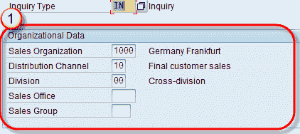
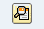
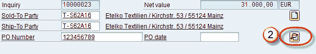
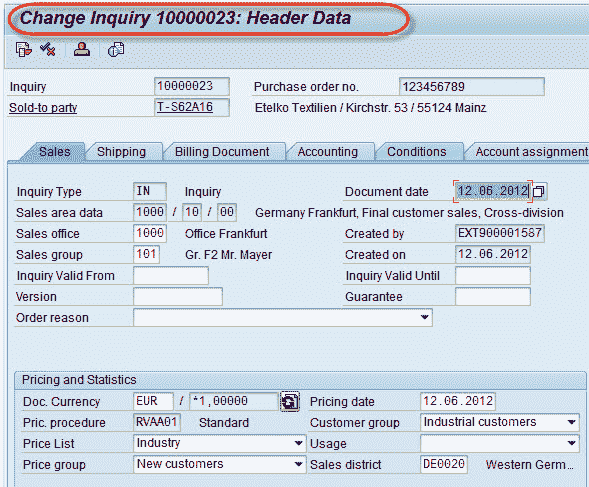
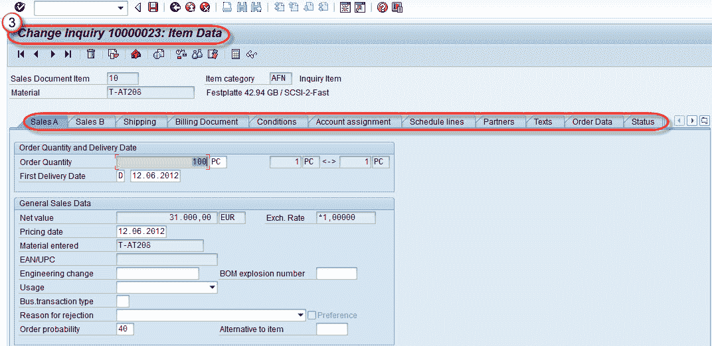
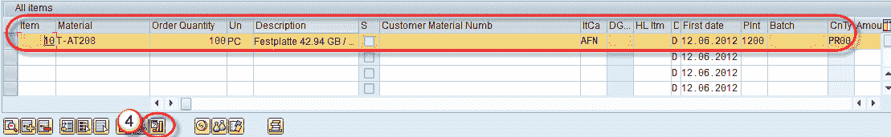
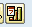
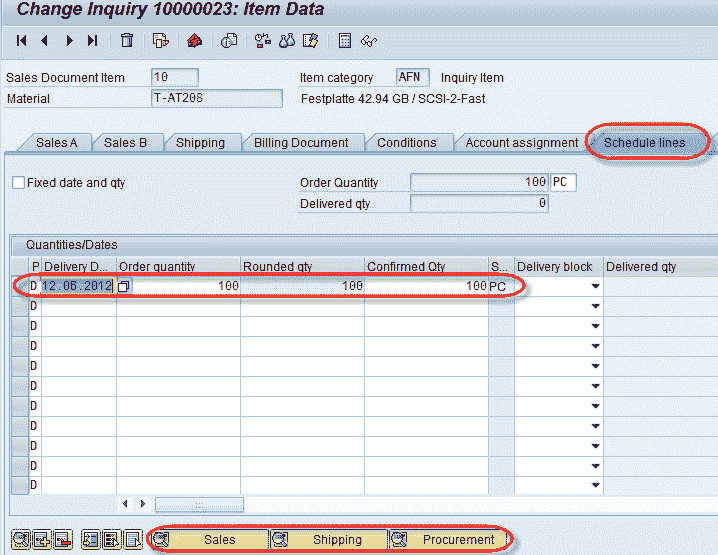

# SAP 销售文档教程：VA01，VA02，VA03

> 原文： [https://www.guru99.com/sales-order-detail-header-item-schedule.html](https://www.guru99.com/sales-order-detail-header-item-schedule.html)

销售订单是客户与销售组织之间的合同，用于在约定的时间段内向客户提供商品或服务。 销售订单屏幕上的数据来自特定销售区域的客户主数据表和物料主数据表。接受查询的销售区域负责完成合同。 销售订单的 T 代码为-

1.  VA01-创建销售订单。
2.  VA02-更改销售订单。
3.  VA03-显示销售订单。

要创建销售订单，我们需要四个级别的数据：

**1.组织数据**：组织数据是销售凭证的第一个屏幕，其中包含诸如销售组织，分销渠道，部门，销售办事处，销售组等字段。

**2.抬头数据：**销售订单抬头包含许多选项卡（销售，装运，开票等）。 标头实质上包含主要来自交易中客户主的信息。 我们可以单击标题  按钮以显示销售标题屏幕。

销售抬头屏幕显示如下-

**3.项目数据：**这包含行项目。行项目包含与客户/物料/数量有关的所有信息。

**4。 计划行数据：**每个行项目都是计划行项目。此数据描述数量和日期。 选择项目数据的项目行，然后单击计划行  按钮。

单击计划行  按钮再次-

他们是时间表行的三个视图-

*   销售：交货日期/时间/数量。
*   运输：包含运输/交付/路线等详细信息。
*   采购：它包含工厂/项目/数量的详细信息。