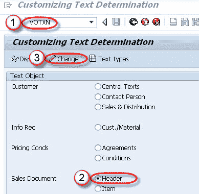
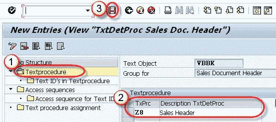
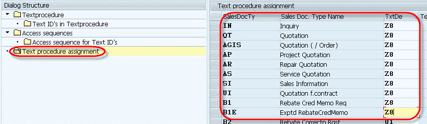
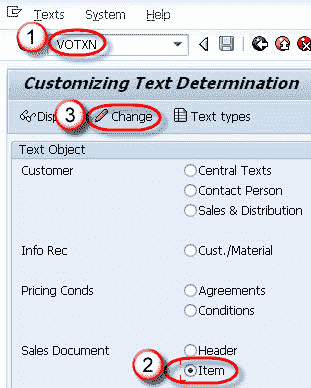
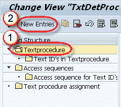
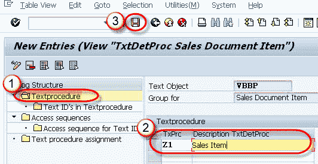
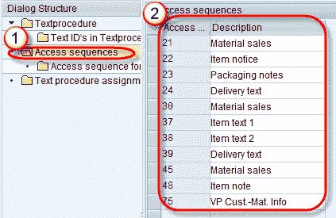
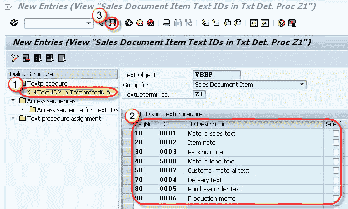
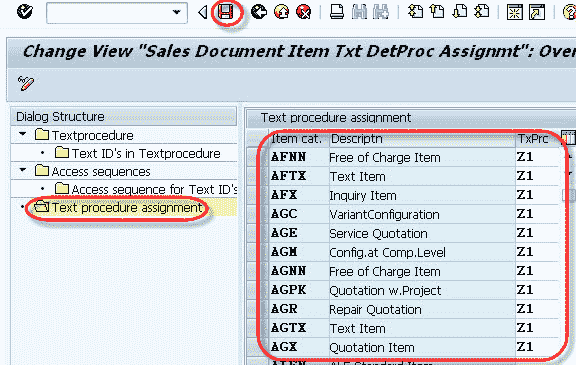

# 销售凭证的文本确定：SAP VOTXN

> 原文： [https://www.guru99.com/text-determination-for-sales-document-header-item.html](https://www.guru99.com/text-determination-for-sales-document-header-item.html)

文本可用于通过文档与合作伙伴和最终用户交换信息。 可以为对象创建文本，例如客户主数据，销售凭证抬头和物料，开票凭证抬头和物料以及条件记录。 文本可以是客户文本，销售文本，物料单，装箱单等。SAP 使用条件技术确定文本。

物料主数据包含有关物料的文本，但是此文本不足以由销售人员为该物料创建销售订单。 因此，系统确保有关销售单据项目的文本。 有许多文本，例如采购订单文本，销售订单文本，物料单，装箱单。 从相应的主数据（材料主数据等）中选择文本，或在屏幕中手动输入文本。

物料销售文本从主数据（物料主数据的销售视图）到销售订单中的行项目。 对于这个系统需要进行相应的配置。 为事务中的流程创建和配置新文本以及定义何时和何处调用文本的过程称为“ **文本确定**”。

## 确定销售凭证抬头的文本。

**步骤 1）**

1.  在命令字段中输入 T 代码 VOTXN。
2.  选择销售单据标题单选按钮。
3.  单击更改按钮。

**步骤 2）**

1.  选择文本过程，然后单击新条目按钮。
2.  输入文本过程和描述。
3.  点击保存按钮。

**步骤 3）**

1.  选择文本过程分配节点。
2.  将文本过程分配给销售单据类型。

**步骤 4）**单击保存按钮。

## 销售凭证项目的文本确定。

**Step 1)**

1.  在命令字段中输入 T 代码 VOTXN。
2.  选择销售单据项目单选按钮。
3.  单击更改按钮。

**Step 2)**

1.  选择文本过程节点。
2.  单击新条目按钮。

**Step 3)**

1.  选择文本过程按钮。
2.  输入文本过程和描述。
3.  点击保存按钮。

**步骤 4）**

**步骤 5）**

1.  在文本过程节点中选择“文本 ID”。
2.  分配序列号 到文本 ID。
3.  点击保存按钮。

**步骤 6）**

1.  选择文本过程分配。
2.  将文本过程分配给项目类别。
3.  点击保存按钮。

