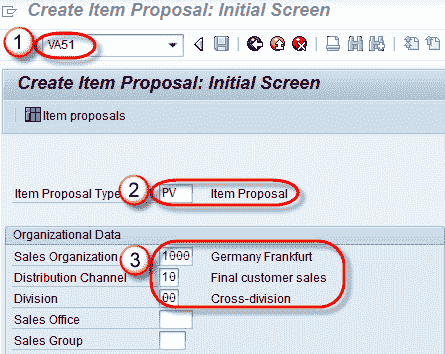
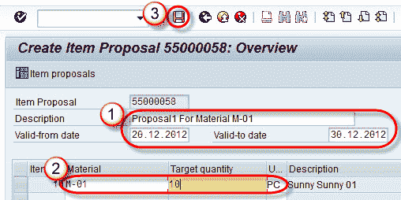

# 如何在 SAP 中创建项目建议 VA51

> 原文： [https://www.guru99.com/how-to-create-item-proposal.html](https://www.guru99.com/how-to-create-item-proposal.html)

**What is Item Proposal?**

项目建议书是可以复制到销售订单中的物料和订单数量的列表。项目建议书与产品建议书相同，SAP 可以互换使用这两个术语。“ MS”是产品建议书的标准凭证类型。自定义凭证类型 可以通过 T 代码–VOV8 为项目建议创建。

VA51 是用于创建项目建议的 T 代码。此 T 代码在保存时给出一个数字，该数字链接到销售视图中的客户数据。

**步骤 1）**

1.  在命令字段中输入 T 代码 VA51。
2.  输入项目投标类型。
3.  输入销售组织/分销渠道/部门。

**步骤 2）**

1.  输入提案编号/说明/有效期自日期/有效期至日期。
2.  输入物料编号/数量。

**步骤 3）**

1.  单击保存  按钮。
2.  消息“项目建议 50000071 已保存”。

