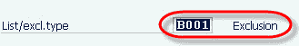
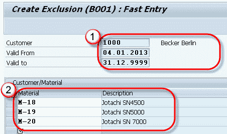
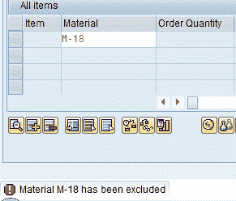
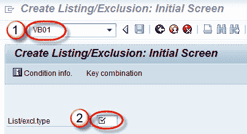
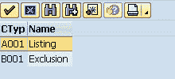
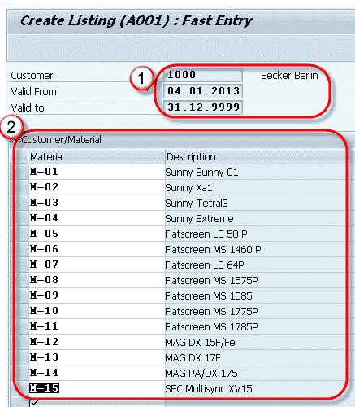

# 物料清单&排除：SAP VB01

> 原文： [https://www.guru99.com/all-about-material-exclusion-inclusion-listing.html](https://www.guru99.com/all-about-material-exclusion-inclusion-listing.html)

**What is Exclusion List?**

物质排除/列出是限制客户购买选择的规定。 例如，如果特定客户的“ **排除清单**”中定义了某些物料，则该客户无法从“排除清单”中购买物料。

示例–一家公司生产 10 种物料，而公司只想向客户 ABC 出售 6 种物料，然后公司将这 6 种物料的清单创建为“清单清单”（可以订购的产品），而其余 4 种物料可能位于“排除清单”中 。 在这种情况下，客户只能从“ **列表**”中购买 6 种物料。

物料排除/列出通过**条件技术**控制。 系统首先检查“排除列表”中的材料，然后再检查“列表”中的材料。 T 代码-1.创建 VB01，2.更改 VB02，3.显示 VB03。

## 物质排斥

**步骤 1）**

1.  在命令栏中输入 T 代码 VB01。
2.  单击排除类型字段。

在弹出窗口中选择 B001，如下所示

**步骤 2）**

1.  输入客户代码和有效期。
2.  输入材料代码作为排除清单。

**步骤 3）**

点击保存按钮。 将显示一条消息“已保存状态记录”。

当用户通过 t 代码 VA01 为物料 M-18，对于客户＃1000 创建销售订单时，显示消息“材料 M-18 已被排除”。

## 物料清单

**Step 1)**

1.  在命令字段中输入 T 代码 VB01。
2.  选择列表类型。

如下所示在弹出窗口中选择 A001-

**Step 2)**

1.  输入客户代码，有效期自/到。
2.  输入客户＃1000 可以购买的所有物料代码。

**Step 3)**

保存记录。

将显示一条消息“已保存状态记录”。

