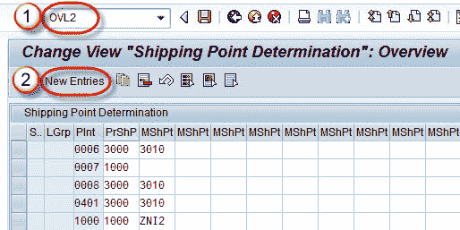
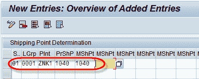

# 如何确定装运点：SAP OVL2

> 原文： [https://www.guru99.com/how-to-determine-shipping-point.html](https://www.guru99.com/how-to-determine-shipping-point.html)

**什么是装运点？**

装运点是一个独立的组织实体，其中进行货物的发行和交付处理。 可以为每个订单商品确定一个装运点。 确定装运点取决于以下三个因素：

1.  客户主记录中的运输条款和条件（运输屏幕）。 例如，公司与客户达成协议，应尽快交付产品。
2.  来自物料主数据的装载组（“销售/工厂数据”屏幕）。 例如，加载组定义了始终由起重机加载产品。
3.  交付工厂（将产品从其交付的工厂。可以将装运点分配给交付工厂，并且工厂可以具有多个装运点）。

**步骤 1）**

1.  在 OVL2 的命令字段中输入 T 代码。
2.  单击新条目按钮。

**步骤 2）**

*   输入运输条件。
*   输入加载组。
*   输入工厂（工厂是生产或存储货物的地方）。
*   输入建议的装运点（装运点是工厂中公司将货物运送到客户的位置）。

**步骤 3）**

点击保存  按钮。

显示消息“数据已保存”。

