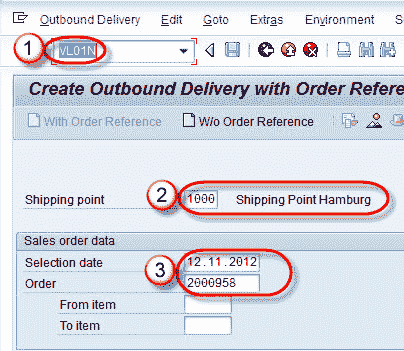
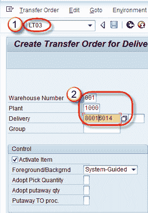
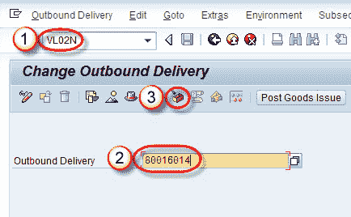
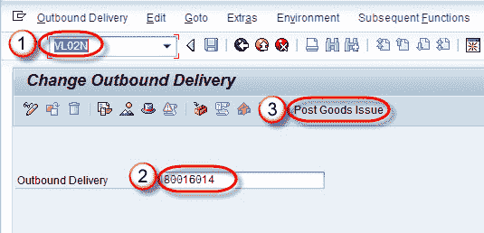
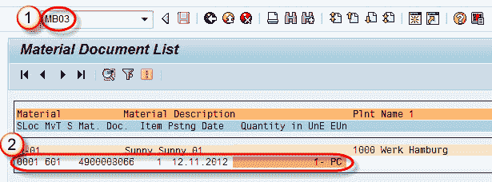
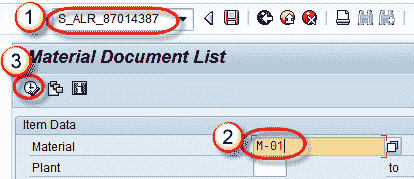

# 创建拣配，包装& PGI（发货后）：SAP LT03，VL02N

> 原文： [https://www.guru99.com/picking-packing-and-pgi.html](https://www.guru99.com/picking-packing-and-pgi.html)

**什么是领料？**

必须准备正确的数量和质量的销售订单中指定的商品，以便按客户要求的时间表进行运输。 物料拣选由仓库管理（WM）完成。 WM 拣配通过转储单完成。 转移订单是拣配清单的基础，用于从库存中撤回订购的货物。 有三种采摘方式-

1.  单独选择交货。
2.  可以安排按定义的时间间隔运行拣货。
3.  可以将 SAP SD 模块配置为自动执行拣配。

**什么是包装？**

包装功能用于在供应商和客户之间交换产品数据。 产品的包装由包装材料完成。 这些包装物料需要在物料主数据中使用物料类型“ VERP”创建。 我们可以通过两种方式在 SAP 中进行打包-

1.  手动包装
2.  自动包装

包装功能有很多步骤，例如手动包装和自动包装以及单层和多层包装。

**什么是后期发布（PGI）？**

发货是发货/装运处理的最后一步。 在此，将货物所有权转移给客户并更新库存。 货物交付后，承运人又将所有权转移给最终客户。

## 提取，包装和 PGI 的步骤如下-

1.  参考销售订单创建外向交货。
2.  创建领料请求。
3.  创建包装。
4.  创建 PGI。

**步骤 1）创建外向交货**

1.  在命令栏中输入 T 代码 VL01N。
2.  输入运送点。
3.  输入选择日期和销售订单。

单击保存  按钮。

消息“交货 80016014”已保存。

**步骤 2）创建领料请求**

1.  在命令字段中输入 T 代码 LT03。
2.  输入仓库编号/工厂/交货，然后按回车。

单击保存  按钮。

将显示一条消息“已创建转储单 0000002638”。

**步骤 3）创建包装** **[**

1.  在命令字段中输入 T 代码 VL02N。
2.  输入先前创建的外向交货编号。
3.  单击打包按钮。

**在下一个屏幕中，**

1.  选择标签“包装材料”
2.  输入包装材料的详细信息。

单击保存  按钮。

**步骤 4）** 或**发布良好（PGI）。**

通过 PGI（过后发货），物料或货物的所有者将由公司更改为客户。

1.  在命令字段中输入 T 代码 VL02N。
2.  输入外向交货编号。
3.  单击过帐发货按钮。

显示一条消息“已保存补货单”。 当我们执行 PGI 时，将创建两个文档-

*   **重大文件（**关于减少库存）

1.  在命令字段中输入 T 代码 MB03，然后在销售订单字段中输入销售订单编号并执行报告。
2.  物料凭证将显示。

*   **会计凭证**（售出的商品成本将记入贷方，库存价值将记入借方。）

1.  在命令字段中输入 T 代码 S_ALR_87014387。
2.  输入物料代码。
3.  点击执行按钮。

