# 免费创建退货订单&后续交货：SAP VL01N

> 原文： [https://www.guru99.com/how-to-create-returnsfree-of-charge-delivery-and-sub-sequent-delivery.html](https://www.guru99.com/how-to-create-returnsfree-of-charge-delivery-and-sub-sequent-delivery.html)

### 什么是退货？

退货是客户对产品或交付产品不满意的地方，&企业需要根据客户的退货要求创建退货。

### 什么是免费送货？

免费送货是免费向客户收取运费的地方。 此订单类型通常用于向客户发送免费样品。

### 什么是后续交货？

后续交货是指客户收到的货物数量少于订购的数量，或者如果货物在装运中损坏，企业将免费提供后续货物交付。

### 客户提出退货要求时该怎么办？

在退货过程中，销售部门可以采取以下任何一项操作。

1.  批准投诉并创建贷项凭证。当客户要退货时，可以完成此操作。 系统参考销售订单为客户创建贷项凭证。
2.  批准投诉，并在以后交付有争议的货物时免费实施。 当客户由于交货不足或运输损坏或任何其他正当理由而要更换商品时，可以执行此操作。
3.  如果投诉无效，请拒绝投诉。 例如，客户抱怨数据错误。

## 如何创建退货单

Sales Department can create return order by T-code VA01\. Return order can be created with reference to sales order or billing documents.

**步骤 1）**

1.  在命令字段中输入 T 代码 VA01。
2.  输入订单类型 RE（退货）。
3.  在组织数据块中输入销售区域数据。
4.  单击使用参考按钮创建。

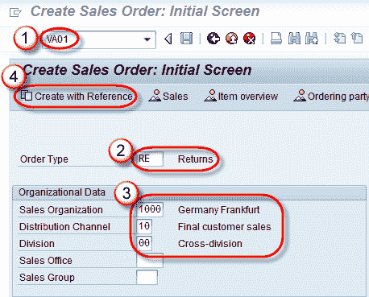

**步骤 2）**

1.  输入退货订单的销售订单编号参考。
2.  单击复制按钮。

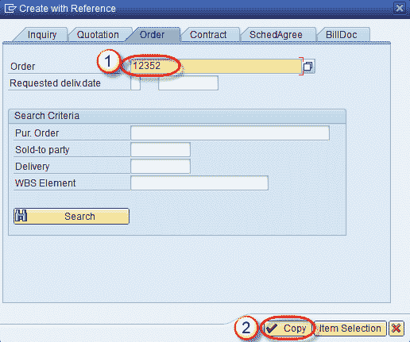

**步骤 3）**

1.  输入采购订单编号。
2.  输入采购订单日期。
3.  输入订单原因。
4.  输入订购数量。

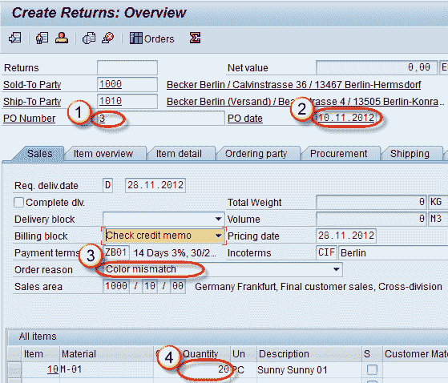

**步骤 4）**

单击保存  按钮。 显示类似“返回 60000295 已保存”的消息。

## 如何创建退货交货凭证

为了接收客户退货，销售部门创建退货订单。 根据退货订单，创建退货交货凭证。 退货交货凭证是使用 T 代码 VL01N 创建的。 标准退货交货单据类型为 LR。 创建退货交货凭证后，物流部门将收到退回的产品。

**Step 1)**

1.  在命令字段中输入 T 代码 VL01N。
2.  输入运送点。
3.  输入交货类型 LR（退货交货）。

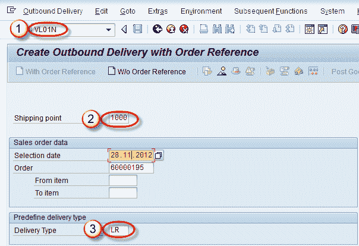

按 Enter 键。

**Step 2)**

输入退货交货数量。

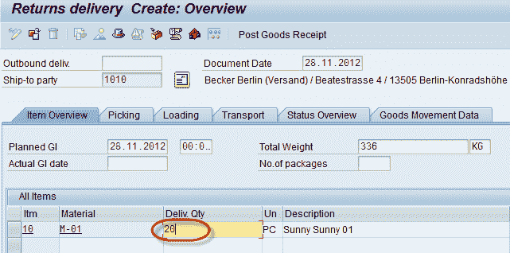

**Step 3)**

单击保存 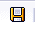 按钮。

显示一条消息“已保存回执交货 840000”。

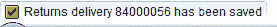

## 如何创建免费送货

免费送货流程会创建未开票的销售订单。 如果某些产品是免费提供给客户的样品，则将免费送货。此文档与计费无关，因为没有为客户免费送货计费。

**步骤 1）**

1.  在命令字段中输入 T 代码 VA01。
2.  输入订单类型 FD（免费送货）。
3.  在组织块中输入销售区域数据。
4.  单击使用参考创建。

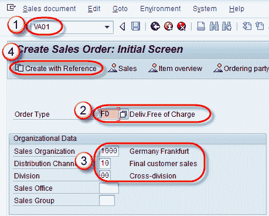

**Step 2)**

1.  输入销售订单编号。 供参考。
2.  单击复制按钮。

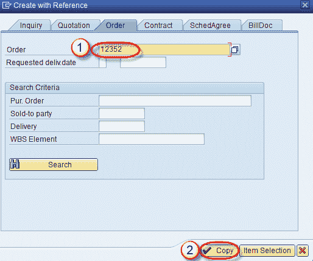

**Step 3)**

1.  输入售达方/收货方。
2.  输入订单原因。

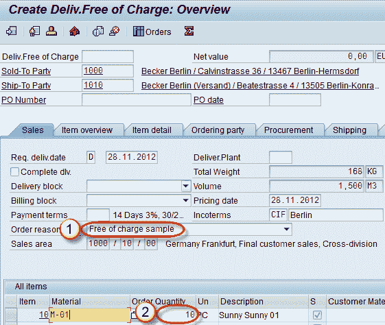

**Step 4)**

单击保存  按钮。

## 如何创建后续交货

退货过程一旦完成，客户可以要求

1.  好的替代品
2.  退款。

当客户选择替换选项时，将创建后续的销售订单。如果客户选择退款选项，则可以通过贷项凭证退款给客户。

**Step 1)**

1.  输入 T 代码 VA01。
2.  输入订单类型 SDF。
3.  在组织数据中输入销售区域数据。
4.  单击使用参考创建按钮。

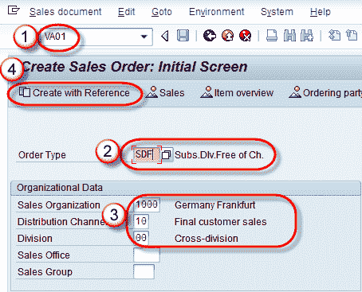

**Step 2)**

1.  输入销售订单编号。 供参考。
2.  单击复制按钮。

**步骤 3）**

1.  输入订单原因。
2.  输入我们免费创建后续交货的订单数量。

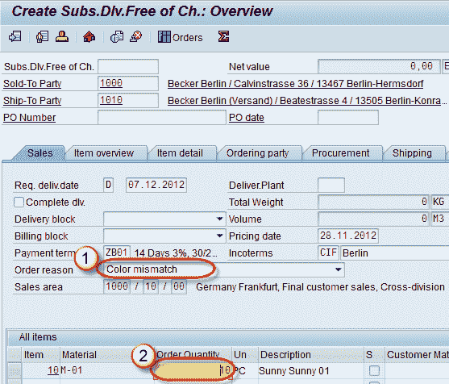

**步骤 4）**单击保存  按钮。

消息订阅。 Dlv。 不含 Ch。 显示“ 12355 已保存”。

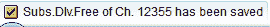