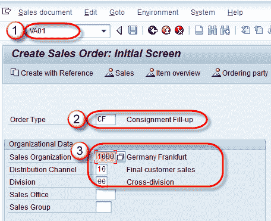
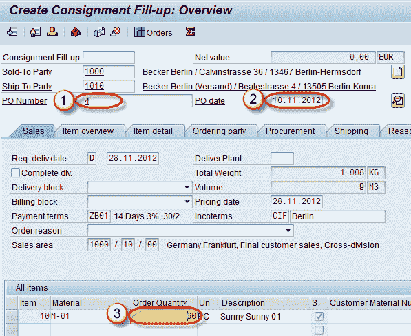
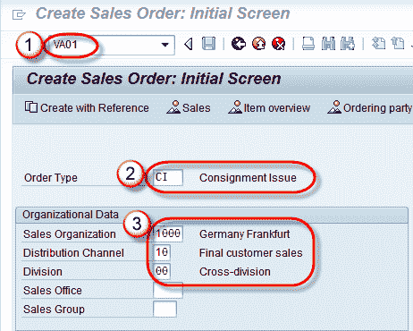
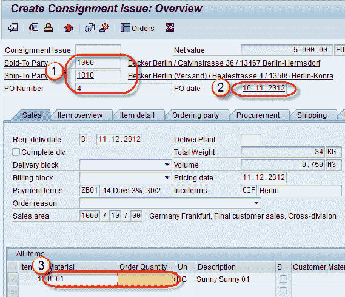
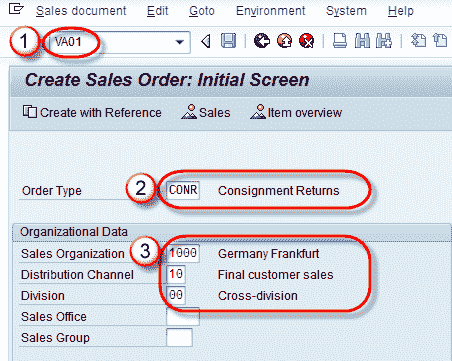
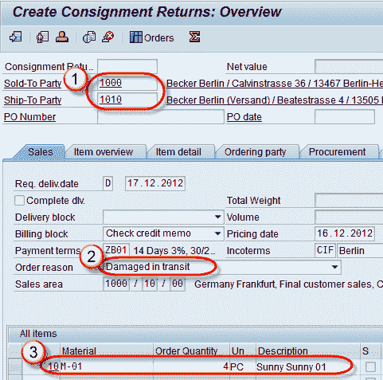
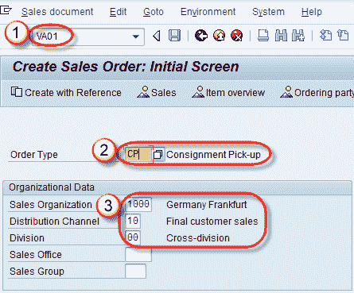
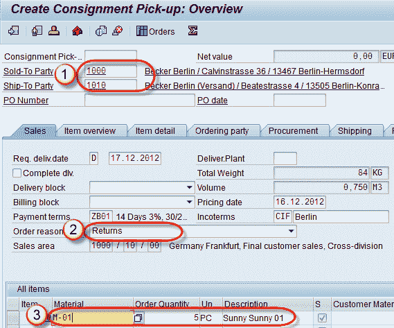

# SAP SD 中的所有关于寄售流程

> 原文： [https://www.guru99.com/all-about-consignment-process.html](https://www.guru99.com/all-about-consignment-process.html)

寄售流程是将产品存储在客户位置的地方，但此产品的所有者仍是公司。 客户将寄售库存存储在自己的仓库中。 客户可以随时从仓库中消费产品，并且按实际消费数量为客户开具账单。 在寄售库存处理中，SAP 系统中有四个主要交易，所有这些交易都支持单独的库存管理：

*   寄售补货（仓库补货）。
*   寄售发货（仓库中的库存发货）。
*   寄售退货（客户退货）。
*   寄售提货（生产退货）。

## 寄售补货

寄售填充是一个过程，公司将产品存储在客户现场，而公司仍然是该产品的所有者。 此过程称为寄售填充（ **CF** ）。 寄售填充的销售订单类型为– **KB** 。

在托运中，仅填写订单并进行交付。

**步骤 1）创建寄售填充**

1.  在命令字段中输入 T 代码 VA01。
2.  输入订单类型 CF（寄售货物）。
3.  在组织数据中输入销售区域。

**步骤 2）**

1.  输入采购订单编号。
2.  输入采购订单日期。
3.  输入订单数量。

**步骤 3）**

单击保存  按钮。

显示如下信息。

## 寄售发货

客户可以随时从其仓库访问产品以进行销售或使用，并且公司将仅为访问的产品开具发票，此发票称为托运发货（ **CI** ）。 寄售发货的销售订单类型为– **KE。**

在托运发货订单，交货和发票中。

**步骤 1）**

1.  在命令字段中输入 T 代码 VA01。
2.  输入订单类型 CI（寄售发货）。
3.  在组织数据块中输入销售区域数据。

**Step 2)**

1.  输入售达方/收货方/采购订单号。
2.  输入采购订单日期。
3.  输入物料和订购数量。

**步骤 3）**单击保存  按钮。

## 寄售退货

如果客户由于损坏，质量差，到期而退回产品，则此过程称为寄售退货（ **CONR）**。 寄回托运货物后，将退回托运货物。 即客户可以退回寄售产品，该产品是通过寄售发行过程发行给客户的。 寄售发货的销售订单类型为– **KA** 。

在寄售退货单，交货，发票和退货信用证中进行。

**Step 1)**

1.  在命令字段中输入 T 代码 VA01。
2.  输入订单类型 CONR（寄售退货）。
3.  在组织数据块中输入销售区域数据。

**步骤 2）**

1.  输入售达方/收货方。
2.  输入订单原因。
3.  输入物料和订购数量。

**Step 3)**

单击保存  按钮。

## 寄售提货

当客户要求公司退回产品时，公司将从客户现场包装该产品，此过程称为寄售提货（ **CP** ）。 在寄售提货过程中，产品不会发给客户，而仅作为寄售库存存储在客户仓库中。 寄售发货的销售订单类型为– **KR** 。

在寄售提货单中，发生退货交货。

**Step 1)**

1.  在命令字段中输入 T 代码 VA01。
2.  输入订单类型 CP（寄售提货）。
3.  在组织数据块中输入销售区域数据。

**Step 2)**

1.  输入售达方/收货方。
2.  输入订单原因。
3.  输入物料和订购数量。

**Step 3)**

单击保存  按钮。

### 摘要

这是销售订单类型

*   寄售填充（CF）= KB
*   寄售发货（CI）= KE
*   寄售退货（CONR）= KR
*   寄售取件（CP）= KA