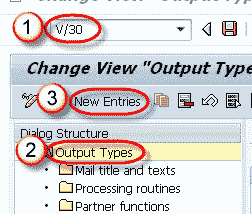
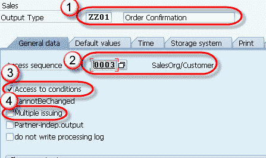
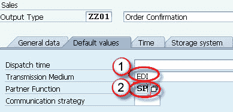
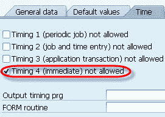

# 使用 Tcode V / 30 在 SAP SD 中进行输出确定

> 原文： [https://www.guru99.com/output-proposal-using-the-condition-technique.html](https://www.guru99.com/output-proposal-using-the-condition-technique.html)

**输出确定**是确定**“媒体”** （例如，从一个企业发送到其任何业务伙伴的打印输出，电传，传真，电子邮件或 EDI）的过程。

可以按照发票，订单确认，交货单或运输通知等文档中定义的格式将输出发送给业务合作伙伴（客户/供应商）。 输出确定可以通过两种方式维护：

1.  客户主数据–可以在客户主数据中维护输出确定。 客户主数据触发的输出建议没有使用访问序列的好处（搜索条件，用于获取条件类型的有效数据）。
2.  条件技术–输出确定可以通过条件技术来触发。

使用条件技术进行输出确定可以维持三个目的：

*   销售活动（销售电话，销售信函，电话等）的输出确定。
*   确定销售凭证（发票等）。
*   确定开票凭证（开票等）的输出。

**销售活动的输出确定。**

**步骤 1）**

1.  在命令字段中输入 T 代码 V / 30。
2.  选择输出类型节点。
3.  点击新条目”按钮。

**步骤 2）**

1.  输入输出类型，描述并选择常规数据选项卡。
2.  输入访问顺序。
3.  检查访问条件。
4.  未经检查的多次发行。

**步骤 3）**

1.  输入传输介质（输出介质）。
2.  输入合作伙伴功能。

**步骤 4）**

在时间选项卡中检查定时 4。

**步骤 5）**

点击保存按钮。 将会显示一条消息``数据已保存''。

