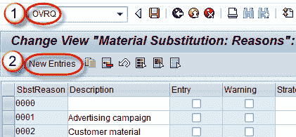
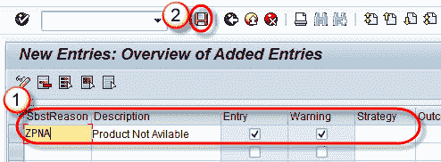

# SAP 中 OVRQ 替代原因

> 原文： [https://www.guru99.com/substituting-reason.html](https://www.guru99.com/substituting-reason.html)

替换原因是控制系统如何执行产品选择的过程。

发生材料替换动作时，需要替换原因。 它定义了以下内容-

*   定义应提供的替代材料的策略。
*   在替换材料之前向用户提供信息消息。

**步骤 1）**

1.  在命令字段中输入 T 代码 OVRQ。
2.  单击新条目按钮

**步骤 2）**

1.  输入替代原因和描述。
2.  点击保存按钮。

将显示一条消息“数据已保存”。