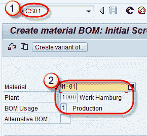
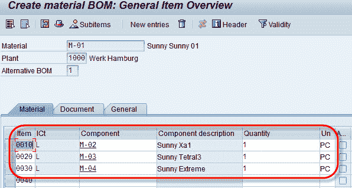

# CS01：如何在 SAP SD 中创建物料清单（BoM）

> 原文： [https://www.guru99.com/how-to-create-bill-of-materials.html](https://www.guru99.com/how-to-create-bill-of-materials.html)

物料清单（BOM）描述了一起创建产品的不同组件。 例如，一台计算机就是一种产品。 它是 CPU，键盘，监视器，鼠标等的组合。物料清单包含每个组件的物料编号，产品制造中所需的数量以及物料的计量单位。

SAP R / 3 允许创建各种类别的物料清单。 BOM 的某些类别是-

*   **物料清单（T 代码 CS01）**-为称为物料清单的物料创建的物料清单。
*   **设备 BOM（T 代码-IB01）-**设备 BOM 用于描述设备的结构，并为维护目的分配设备的备件。
*   **销售订单物料单（T-code-CS61）-**销售订单物料单用于根据客户要求按订单生产产品。
*   **功能位置 BOM（T 代码 IB11** ）-可以为每个功能位置或一组技术对象分别创建功能位置 BOM。
*   **文档 BOM（T-code-CS11）**-复杂的文档可能由多个文档组成，例如程序，纸张，技术图纸等。这些相关信息和文档对象使用 BOM 分组为一个单元。

**步骤 1）创建物料 BOM**

1.  在命令字段中输入 T 代码 CS01。
2.  输入物料/工厂/物料清单用法。

**步骤 2）**

输入物料代码，物料成分和数量。

**步骤 3）**

点击保存按钮。 显示为  的消息。