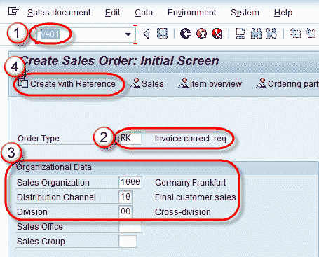
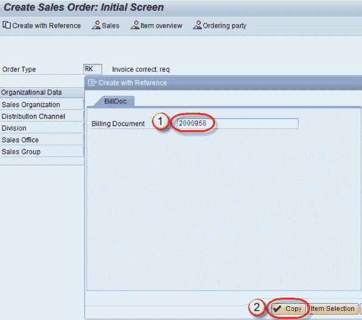
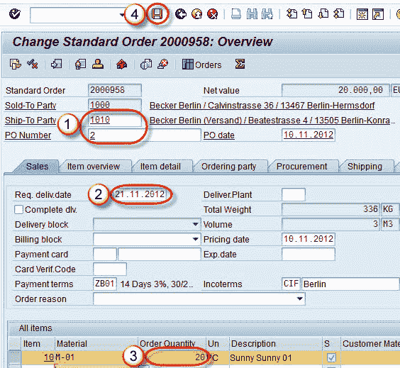

# 如何在 SAP SD 中创建发票更正请求

> 原文： [https://www.guru99.com/how-to-correct-invoice.html](https://www.guru99.com/how-to-correct-invoice.html)

**什么是发票更正？**

发票更正是一种为一个或多个订单项更正发票中数量或价格的过程。

系统计算原始金额和更正金额之间的差异。 发票更正请求将被系统自动阻止，直到已检查为止。 一旦获得批准，我们就可以移除障碍物。

**系统根据发票更正请求的总金额创建贷项凭证或借项凭证。**

**步骤 1）**

1.  在命令字段中输入 T 代码 VA01。
2.  在订单类型字段中输入发票更正请求。
3.  在组织数据中输入销售组织/分销渠道/部门。
4.  单击使用参考创建按钮，以参考销售单据创建发票更正。

**步骤 2）**

1.  输入需要更正的销售订单编号
2.  单击复制按钮。

**步骤 3）**

1.  收货方/采购订单号可以更改。
2.  输入要求。 交货日期
3.  订单数量可以更改。
4.  点击保存按钮。

显示一条消息``已保存数据''。