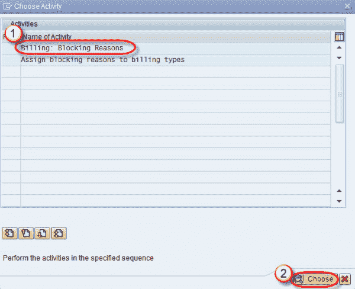
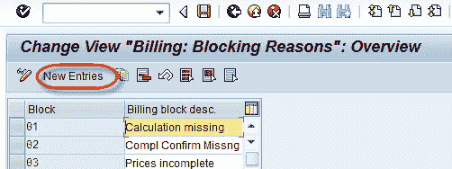
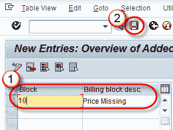
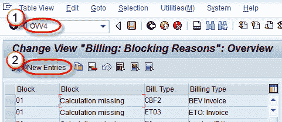
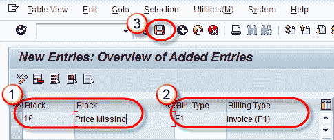

# 在 SAP 中定义&分配阻塞原因（OVV4，S_ALR_87007670）

> 原文： [https://www.guru99.com/steps-to-create-blocking-reason.html](https://www.guru99.com/steps-to-create-blocking-reason.html)

**What is Blocking Reason?**

冻结原因用于阻止客户创建账单。 可以根据业务需求定义阻塞原因。 创建阻塞原因后，它已分配给相应的文档类型并用于文档处理。 也可以在客户主数据中阻止客户。

封锁客户的原因有多种，如下所示-

*   由于参与非法活动，客户被列入黑名单。
*   客户拖欠付款。

屏蔽过程分为两步-

1.  创建阻止原因
2.  分配阻止原因

让我们详细了解这些步骤-

## 步骤 1）建立封锁原因

**步骤 1.1）**

1.  在命令字段中输入 T 代码 S_ALR_87007670。
2.  点击选择按钮。

**步骤 1.2）**

*   单击新条目按钮。

**步骤 1.3）**

1.  输入冻结代码和开票冻结描述。
2.  点击保存按钮。

**步骤 1.4）**

单击保存  按钮。

将显示一条消息“数据已保存”。

## 步骤 2）分配阻止原因

**步骤 2.1）**

1.  在命令字段中输入 T 代码 OVV4。
2.  单击新条目按钮。

**步骤 2.2）**

1.  输入阻止代码。
2.  输入帐单类型。
3.  保存记录。

**步骤 2.3）**

显示消息“数据已保存”。

