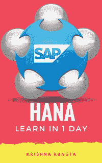
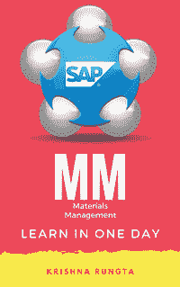
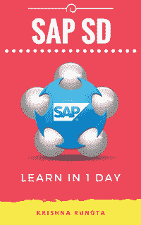
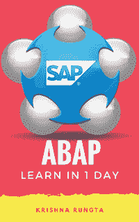
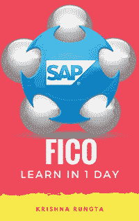

# 2020 年面向初学者的 6 本最佳 SAP 书籍

> 原文： [https://www.guru99.com/sap-books.html](https://www.guru99.com/sap-books.html)

SAP 上有大量书籍，选择重要书籍的选择变得困难。 以下是有关 SAP 培训的 6 本书，这些书籍应属于任何 ERP 专业人士的图书馆。

### [在 1 天之内学习 HANA](http://geni.us/h6Z8)

SAP Hana 之所以受欢迎，是因为它具有大量的主内存和强大的并行作业处理能力。 它使 SAP Hana 变得真正快速。 本书的目的是深入了解如何使用 SAP Hana。 本书不需要任何 SAP HANA 或软件开发经验。

该电子书涵盖了 HANA 架构，HANA Studio，SQL 脚本，数据类型，触发器，序列，运算符，函数，表达式，标识符，数据提供，建模，安全性&报告和物料主数据，销售，交付，开票， 定价，&信用管理。

[Check Latest Price and User Reviews on Amazon](http://geni.us/h6Z8)

### [SAP 入门级材料大师](http://geni.us/TEWr)

SAP MM 是 SAP 物流流程的核心模块之一.SAP MM 涵盖了广泛的业务功能领域。 毫无疑问，SAP MM 是一个非常大的主题，并且需要大量时间。 为了节省用户时间并简化主题，本书的内容虽小，但涵盖了 SAP MM 的所有重要方面。

该书涵盖主数据，采购，报价，采购订单，发票，定价，库存管理。

[Check Latest Price and User Reviews on Amazon](http://geni.us/TEWr)

### [在 1 天之内学习 SAP HR](http://geni.us/flb8)

SAP HR / HCM 在 SAP ERP 领域非常受欢迎。

在 1 天内学习 SAP HR / HCM 作为 SAP HR / HCM 模块速成班的入门指南。

该书涵盖了信息类型，操作，组织管理，组织单位，职位，时间，薪资，发薪后运行活动。

[Check Latest Price and User Reviews on Amazon](http://geni.us/flb8)

### [在 1 天之内学习 SAP SD](http://geni.us/MgDB)

SAP 销售和分销（SD）是 SAP 实施最广泛的模块之一。 它涵盖了诸如售前，询价，报价，销售订单处理，运输，交付和开票之类的业务活动。 SAP SD 跨行业使用。 本书是为没有或很少有 SAP SD 经验的初学者设计的。

该电子书涵盖客户主数据和物料主数据，销售，交货，开票，定价和&信用管理。

[Check Latest Price and User Reviews on Amazon](http://geni.us/MgDB)

### [1 天学习 ABAP](http://geni.us/ZvVTLHR)

如果您有权访问正确的学习资源，则无需花费太多精力就能精通 SAP ABAP 语言。 有了这本书，您可以在几分钟内开始第一个 SAP ABAP 程序

该书涵盖了数据字典，宏，包含，子例程，功能模块&组，本机和开放 SQL，内部表，表控件，报表编程，对话框编程，子屏幕，ABAP 列表查看器编程，SAP 脚本，智能表单，客户 和用户出口，BADI，ABAP 查询，SAP BDC，EDI，ALE 和 IDoc，BAPI，RFC。

[Check Latest Price and User Reviews on Amazon](http://geni.us/ZvVTLHR)

### [在 1 天之内学习 SAP FICO](http://geni.us/SBVMeH)

SAP FICO 支持实时财务信息，可帮助组织做出重要决策。 这本电子书经过精心准备，以使其简洁明了。

本书涵盖组织结构，总帐，应收帐款，应付帐款，**报告，**月末结算，催款，成本中心。

[Check Latest Price and User Reviews on Amazon](http://geni.us/SBVMeH)