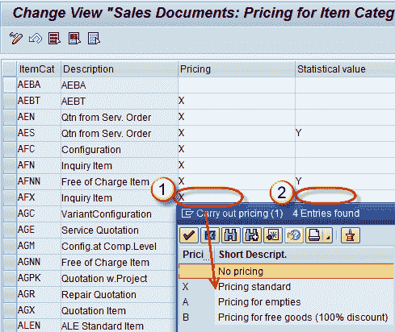
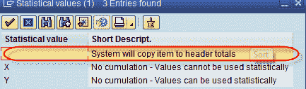

# 在 SAP 中按物料类别确定定价：OVKO

> 原文： [https://www.guru99.com/determine-pricing-by-item-category.html](https://www.guru99.com/determine-pricing-by-item-category.html)

并非所有项目都与定价相关。 定价程序中的标准要求检查项目是否与定价相关。 如果项目类别中的此开关设置为空白，则行项目将与定价无关。

项目类别控制项目的整体行为。 项目类别描述以下几点-

1.  该项目是否与定价相关。
2.  是否与交货相关。
3.  是否与帐单相关。
4.  它是一个免费项目，文本项目。
5.  它还有助于确定销售单据类型。

**步骤 1）**

*   在命令字段中输入 Tcode OVKO。
*   在定价字段中输入定价标志。

**步骤 2）**

输入统计值 Blank，X，Y。 统计值标志通过三种方式控制销售单据中的物料：

1.  将项目复制到标题总计。
2.  无累积-值不能用于统计目的（项目值不会复制到标题总计中）
3.  无累积-值可用于统计目的（项目值不会复制到标题总计中）

**步骤 3）**

单击保存  按钮。