# SAP SD 税收确定程序教程：VK12，OX10，OVK4，OVK1

> 原文： [https://www.guru99.com/all-about-tax-determination-procedure-in-sap-sd.html](https://www.guru99.com/all-about-tax-determination-procedure-in-sap-sd.html)

SAP 使用条件方法技术来计算系统中的税款（预扣税款除外）。 税收计算程序（系统中定义）与税收代码一起用于计算税收金额。

税法是税法计算程序的第一步。 税码描述以下内容-

*   **税种**（税种可以由 T 代码–OVK1 定义为  ）。
*   **计算/输入的税额**。
*   **总帐** **帐户**进行过帐。
*   **附加税**的计算。

每个国家/地区在标准系统中都有特定的税收程序。 计税程序包含以下字段：

*   **步骤**-确定该过程中的行顺序。
*   **条件类型**-指示税收计算模型如何工作（记录是固定金额还是百分比，以及是否可以自动处理记录。）
*   **参考步骤** s-系统获取其计算中使用的金额/值（例如为基本金额）。
*   **帐户/流程键**-提供税收程序和要向其过帐税收数据的 GL 帐户之间的链接。 这有助于自动税务帐户分配。 要启用此自动分配功能，需要定义以下内容：

## 步骤 1）税种

税种用于分组和管理类似的产品税率或服务税率。 为每个税码定义了税率。 税率与税种类型相关联并包含在税法中（在这种关系中，从技术上讲，一个税法可以针对各种税种具有多种税率。）税法已分配给税法， 附加到 GL 主记录中。 只要在文档处理中使用了总帐科目，便会访问特定的税收程序。 **步骤 1.1**

1.  在命令字段中输入 T 代码 OVK3。
2.  点击新条目按钮。

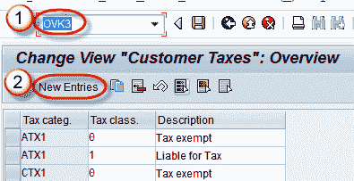

**步骤 1.2**

1.  输入税收类别，税收类和描述。
2.  点击保存按钮。

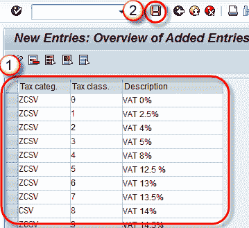

显示一条消息“数据已保存”。

## 步骤 2）定义税种

**步骤 2.1**

1.  在命令字段中输入 T 代码-OVK1。
2.  单击新条目按钮。

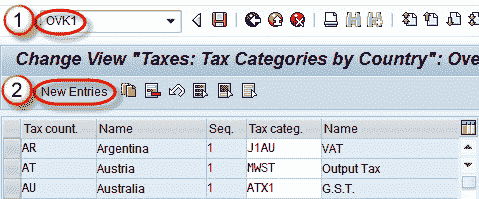

**步骤 2.2** 输入税收国家/序列/税收类别并保存数据。

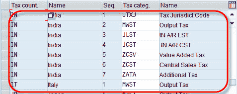

## 步骤 3）分配工厂进行税收确定。

**步骤 3.1**

1.  在命令字段中输入 T 代码 OX10。
2.  单击新条目按钮。

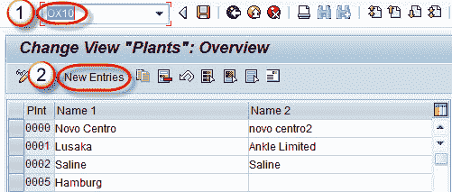

**步骤 3.2**

1.  输入工厂/名称 1。
2.  输入国家代码/城市代码。

保存数据。

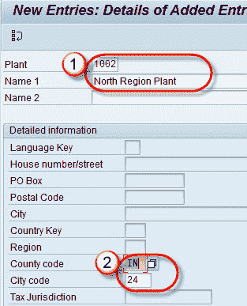

## 步骤 4 定义物料税。

1.  在命令字段中输入 T 代码 OVK4。
2.  单击新条目按钮。

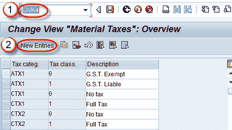

**步骤 4.1**

*   输入税收类别/税收分类和描述。
*   保存数据。

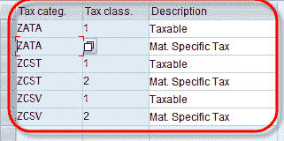

## **步骤 5** **定义税额确定**

**步骤 5.1**

1.  在命令字段中输入 T 代码 VK12。
2.  输入条件类型。

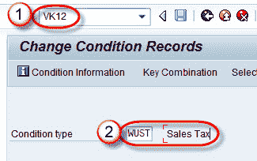

**步骤 5.2** 选择国内税。

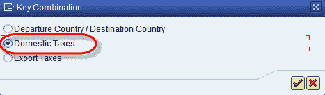

**步骤 5.3**

1.  输入国家/客户税类/物料税类。
2.  运行报告。

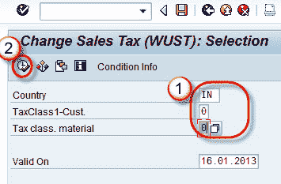

**步骤 5.4**

输入客户税类/物料税类/金额/有效期和税码。

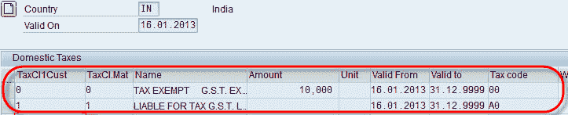

保存记录。