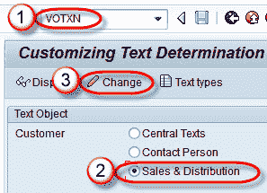
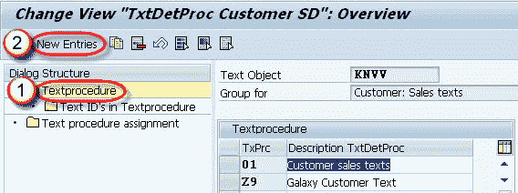
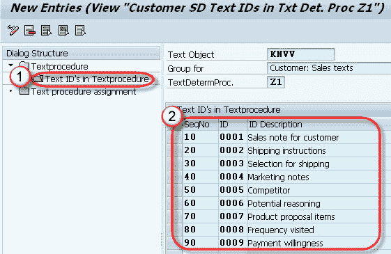
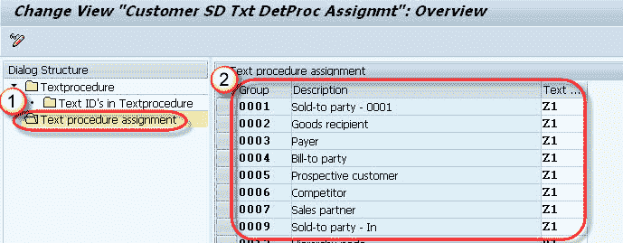

# 如何在 SAP 中创建文本类型：VOTXN

> 原文： [https://www.guru99.com/all-about-text-type.html](https://www.guru99.com/all-about-text-type.html)

**什么是文本类型？**

文本是一小段格式化或未格式化的文本，用于显示或存储主数据和交易数据中的信息。 例如，需要将温度敏感材料（需要低温存储区域的药物）保持在冷冻温度下。 可以在销售文档中配置带有特定注释的文本字段，以便在销售任何此类产品时，告知客户将药品存放在冷藏室中。 该文本被称为“ **物料销售文本**”。

**文本类型**

上例中的每个文本项（“材料销售文本”）称为**文本类型**。 它在内部包含**文本 ID** 。 这些是在*文本类型*部分中配置的。 文字可以定义为-

*   顾客
*   销售单据
*   交货
*   开票

**步骤 1）**

1.  在命令字段中输入 T 代码 VOTXN。
2.  选择客户模块的销售&分配单选按钮。
3.  单击更改按钮。

**步骤 2）**

1.  选择文本过程节点。
2.  单击新条目按钮。

**步骤 3）**

1.  选择文本过程节点。
2.  输入文本过程及其描述。
3.  点击保存按钮。

**步骤 4）**

1.  在文本过程节点中选择“文本 ID”。
2.  输入 SeqNo / ID / ID 描述。

**步骤 5）**

1.  选择文本过程分配。
2.  将文本过程分配给客户帐户组。

**步骤 6）**

点击保存按钮。 将显示一条消息“数据已保存”。

