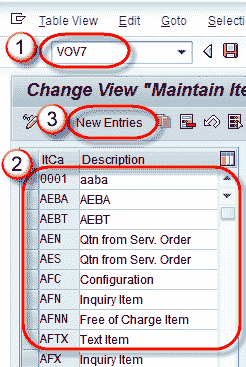
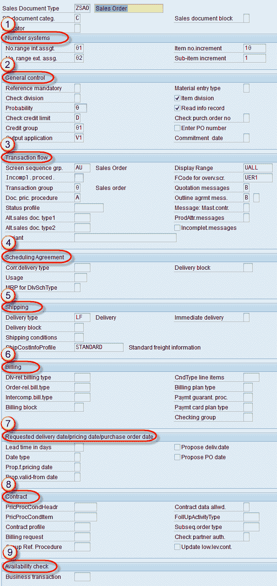
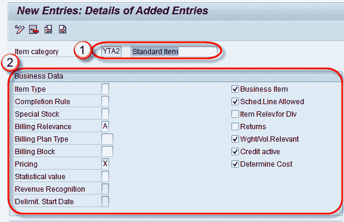
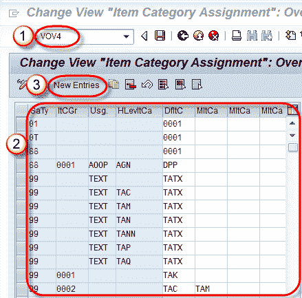
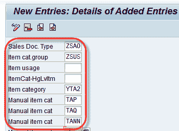

# SAP 项目类别确定：VOV7，VOV4

> 原文： [https://www.guru99.com/item-category-determination.html](https://www.guru99.com/item-category-determination.html)

**什么是商品类别？**

项目类别定义订单项在销售交易中的行为。

SAP 使用物料类别在每种销售单据类型中以不同方式处理物料。

例如

AFX-它是查询项目类别，与计费无关。

AGX –报价项目类别，与开票无关。

TAN –这是标准项目类别，与计费有关。

“定义物料”类别的 T 代码为 VOV7。

**步骤 1）**

1.  在命令栏中输入 Tcode VOV7。
2.  项目类别列表，包括 SAP 和用户定义项目类别。
3.  单击新条目  按钮，以创建项目类别。

**步骤 2）**在创建新的商品类别时，可以填写以下部分。

1.  业务数据（计费/定价等信息）。
2.  常规控制（确定自动批处理，四舍五入许可和订单数量是否为 1）。
3.  交易流程（项目屏幕明细）。
4.  物料清单（用于变型配置）。
5.  价值合同（用于价值合同）。
6.  服务管理（服务方案）。
7.  资源控制（与资源有关的计费方案）。

我们将在业务数据部分中输入数据。

**步骤 3）**

1.我们将创建 YTA2（标准项目类别）

2.输入开票相关性/定价。 检查一下

*   业务项目
*   谢德 允许行
*   gh
*   卷 相关的
*   有效信用
*   确定成本。

**步骤 4）**

单击“保存”。  按钮。

显示消息“数据已保存”。

## 项目类别确定

项目类别控制项目行为。 项目类别定义该项目与开单或定价相关。

销售单据中的项目类别取决于销售单据类型和物料。

项目类别确定是通过 T 代码–VOV4 完成的。 SAP 提供了许多标准项目类别，其中一些如下：

| **商品类别** | **说明** |
| TAN | 标准品 |
| 标签 | 个人采购订单 |
| 塔斯社 | 第三方物品 |
| 塔德 | 服务 |
| TATX | 文字项目 |
| 牙膏 | 免费的 |
| AFX | 咨询项目 |
| AGX | 报价项目 |

**Step 1)**

1.  在命令字段中输入 T 代码 VOV4。
2.  显示现有项目类别的列表。
3.  要创建新项目类别，请单击“新条目”。  按钮。

**步骤 2）**

要创建新项目类别，请输入以下数据-

*   销售单据 类型。
*   项目猫。 组。
*   物料类别（默认物料类别，可以用手动物料类别值覆盖）。
*   手动项目类别（如果业务需要，我们可以将手动项目类别添加到覆盖默认项目类别）。

**注意**：将自动为其定义的销售单据类型选择默认项目类别。 可以使用手册项目类别代替默认项目类别，或者我们可以用允许的手册项目类别替换销售单据中的默认项目类别。 例如 默认项目类别（YTA2）可以替换为手动项目类别（TAP，TAQ，TANN）。

**Step 3)**

单击保存  按钮。

消息“数据已保存”显示如下-

