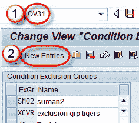
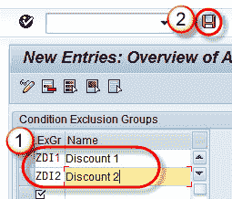
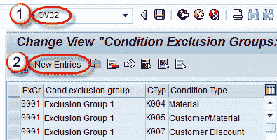
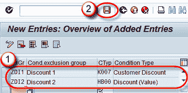
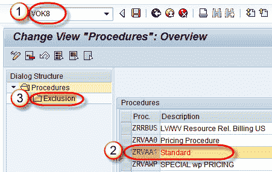
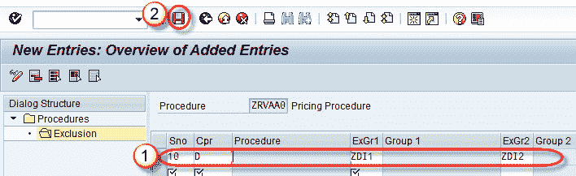

# 使用 Tcode OV31 的 SAP 中的条件排除组

> 原文： [https://www.guru99.com/all-about-condition-exclusion-group.html](https://www.guru99.com/all-about-condition-exclusion-group.html)

**什么是条件排除组？**

在任何正常情况下，定价程序中可能有不止一种条件类型，可为客户提供折扣。 如果自动确定折扣，则存在客户将获得所有相关折扣并因此以低于其应有的价格购买产品的风险。

通过使用“条件排除组”，您可以确保客户不会收到所有折扣，而只能获得最好的可用折扣条件类型。

T 代码 OV31。

**步骤 1）**

1.  在命令字段中输入 T 代码 OV31。
2.  单击新条目按钮。

**步骤 2）**

1.  输入条件排除组代码和名称。
2.  点击保存按钮。

将显示一条消息“数据已保存”。

## 将条件类型分配给排除组

.

**Step 1)**

1.  在命令字段中输入 T 代码 OV32。
2.  单击新条目按钮。

**Step 2)**

1.  将排除组分配给条件类型。
2.  点击保存按钮。

## 将排除组分配给过程。

**Step 1)**

1.  在命令字段中输入 T 代码 VOK8。
2.  选择过程。
3.  选择排除节点。
4.  点击保存按钮。

**Step 2)**

共有 7 个条件排除组，如下所示：

答：条件类型之间的最佳条件

B：条件类型内的最佳条件

C：两个排除组之间的最佳条件

D：独家

E：在条件类型内最差

F：两个排除组之间最不满意

L：条件类型之间最差

当按上述方法设置排除组时，在 VA01 中创建订单时，当用户输入 condition 的值时，条件 K007 将被停用。