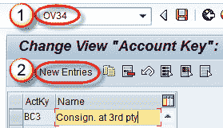
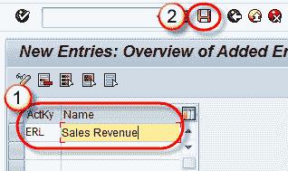

# 如何在 SAP 中创建记帐密钥：OV34

> 原文： [https://www.guru99.com/accounting-key.html](https://www.guru99.com/accounting-key.html)

**What is Accounting Key?**

条件类型将其值写入定价过程之外的配置中建立的键。 该密钥称为帐户密钥，它是一个表条目 ，它告诉定价程序将计算的条件值复制到何处。

[会计](/accounting.html)键使系统能够将金额过帐到某些类型的收入科目。 例如，系统可以将运费（由运费定价条件生成）过账到相关的运费收入科目。

**步骤 1）创建记帐密钥**

1.  在命令字段中输入 T 代码 OV34。
2.  单击新条目按钮。

**步骤 2）**

1.  输入[记帐](/accounting.html)键和名称。
2.  点击保存按钮。

将显示一条消息“数据已保存”。