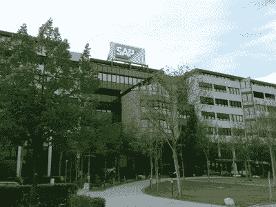

# SAP SD 面试的前 20 个问题&答案

> 原文： [https://www.guru99.com/sap-sd-interview-questions.html](https://www.guru99.com/sap-sd-interview-questions.html)

[下载 PDF](https://www.guru99.com/pdf/sap-sd-interview-questions.pdf)

**1）什么是 SAP SD？ 销售和分销的主要功能是什么？**

SAP SD 处理所有订单交付流程。 它执行用于产品和服务的销售，运输和开票的业务流程。

*   查询&报价
*   销售订单
*   销售退货
*   寄售
*   合同&计划协议
*   贷项&借项通知单请求
*   紧急订单&现金销售
*   拖欠订单

**2）销售和分销中的组织结构是什么？**

销售和分销的组织结构是。

*   销售组织
*   分销渠道
*   师
*   营业部
*   销售组 b

**3）解释里程碑和定期计费之间的区别是什么？**

*   定期：在合同期内每个账单全额支付
*   里程碑：每个帐单中的部分金额，直到全额支付

**4）解释如何确定装运点？**

运送地点取决于

运输条件+装货组+交货工厂=装运点。

**5）说明如何为销售组织分配分销渠道？**

要将分销分配给 SAP 中的销售组织，您必须遵循以下路径。

SPRO（SAP 项目参考对象）> IMG >企业结构>分配>销售和分销>分配分销渠道给销售组织。

**6）提及 SAP 中的销售凭证类型是什么？ 在 SAP SD 中定义销售凭证类型的配置步骤是什么？**

SAP 中可用的销售凭证类型为。

*   贷项通知单请求
*   借项通知单请求
*   标准订单
*   退货等

SAP SD 的配置步骤

IMG 菜单路径：SPRO > IMG >销售和分销>销售>销售单据>销售单据头>定义销售单据类型。

**7）解释什么是条件类型？ 在 SAP 中为定价定义条件类型的路径是什么？**

与您的日常定价活动相关的某些方面的表示称为条件类型。

定价条件类型的路径为。

SAP IMG 路径：SPRO > SAP 参考 IMG >销售和分销>基本功能>定价>定价控制>定义条件类型。

**8）提及什么是反向 PGI？ 您可以取消 PGI 并提及 PGI 的交易代码吗？**

完成 PGI 或过帐发货后，会在交货后保留可用库存的记录。 良好发行交易无法取消，但可以撤消。

反向 PGI 的交易 T 代码为 VL09。 无法进行部分数量冲销，在交货凭证中，您不能冲销一件/部分数量的 PGI。

**9）解释 SAP 贷项凭证请求和 SAP 贷项凭证之间的区别是什么？**

SAP 贷项凭证（T 代码 VF01）是根据贷项凭证请求（T 代码：Va01）创建的。 当您必须向客户付款时，会生成贷项凭证请求。 （账单过多或损坏或价格变动）。

**10）您什么时候使用 SAP 退货单和 SAP 贷项凭证？**

当客户退回任何先前购买的产品并需要退款或退款时，将执行 SAP 退货订单。 贷项通知单是在不退货的情况下贷记客户的贷项。

**11）解释什么是 SAP 过帐期间？ 打开和关闭过帐期间的交易代码是什么？**

SAP 过帐期间是为了确保业务销售订单的过帐期间与财务过帐日期一致，这意味着何时可以结帐财务会计并进行付款。

打开和关闭过帐期间的交易代码为 S_alr_87003642

**12）解释什么是复制控件以及何时可以进行复制控件转换？ 可以采用哪种方式进行复制控制转换？**

在 SAP SD 中，将数据从源文档复制到目标文档的过程由复制控件完成。 它们由称为路由的程序组成，该程序确定系统如何传输数据。 复制控制对于不想从订单到交货再重复计费的最终用户很有用。

复制控制可以通过以下方式完成：

*   销售凭证按销售凭证
*   按销售凭证开票凭证
*   按交货的销售单据
*   按开票凭证销售凭证
*   通过开票凭证交货

**13）复制控件设置为三个级别？ 可以通过哪些交易代码完成交易？**

在销售订单复制控制的三个级别上分别设置标题级别，项目级别和计划行级别。

*   VTAA：从销售订单到销售订单
*   VTLA：从销售订单到交货
*   VTAF：从开票凭证到销售订单
*   VTFA：从销售订单到开票凭证
*   VTFL：从交货到开票凭证
*   VTFF：从开票凭证到开票凭证

**14）说明如何在定价过程中包括条件类型？**

要将条件类型包括在定价过程中，您必须遵循以下路径

基本功能>定价>定价控制>定义并分配定价过程，然后在选择定价过程之后选择“维护定价过程”，然后选择“控制数据”并将您的条件类型添加到定价系统中。

**15）解释什么是形式发票，其类型是什么？**

形式发票是进出口谈判的参考文件。 标准形式发票单据类型为

*   关于订单– F5
*   关于交货-F8

**16）提及用于创建退货交货的交易代码吗？**

事务代码用于创建标准订单类型为 RE 的 T / C VA01 的退货交货，而退货凭证类型为 LR 的 T / C VL01 创建退货交货

**17）提到需要在两个位置配置 CIN（印度国家版本）？**

必须配置 CIN 的两个位置是财务会计>买卖税，另一个是 Logistic General->货物移动税

**18）解释紧急订单和现金销售之间的区别是什么？**

*   紧急订单：订单交付将在同一天完成，而结算将在以后完成
*   现金销售：帐单和订单交付将在同一天完成

**19）列出您可以控制销售凭证类型的五个功能吗？**

对于销售单据类型，您可以控制的五个功能是

*   文本
*   伙伴
*   价钱
*   税收
*   输出量
*   交货

**20）提及交付计划中可用的技术是什么？**

交付计划中可用的技术是

*   后退 Scdg：系统计算要求的交货日期
*   提前计划：系统根据物料可用日期计算最早的日期