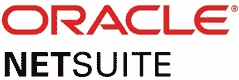
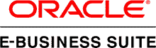
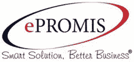
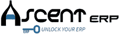
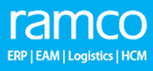

# 2020 年 10 种最佳 SAP ERP 替代方案

> 原文： [https://www.guru99.com/sap-erp-alternative.html](https://www.guru99.com/sap-erp-alternative.html)

SAP 是企业资源计划软件。 该工具映射了组织的关键业务功能。 SAP 可帮助您提高客户满意度。 但是，对于小型组织而言，这不是一个负担得起的工具，因为它需要专家维护整个系统，这给他们增加了额外的成本负担。

这里是精选的十大能够替代 SAP 的工具的清单。 该列表包括具有流行功能&最新下载链接的商业和开源工具。

### 1）[网络套件](http://bit.ly/2Og3twI)

[NetSuite](http://bit.ly/2Og3twI) 是 SAP 的另一种选择，可帮助您执行关键任务流程。 NetSuite ERP 可帮助组织加速增长并推动创新。

**功能**：

*   使您可以将数据与可视化分析相结合，以生成有意义的业务见解
*   缩短周期时间，吸引业务用户并改善您的计划流程
*   帮助您简化业务流程并释放加速增长所需的时间&资源
*   允许您随着公司的发展添加和自定义功能

 一起提供

### 2）Oracle 业务

 

[Oracle 电子商务](https://www.oracle.com/in/applications/ebusiness/)套件，也称为 Oracle EBS。 它是用于自动化 CRM，ERP 和供应链管理流程的一组集成业务应用程序。

**Features:**

*   帮助您减少管理时间和考勤记录的成本
*   轻松执行组织政策
*   员工提交，查看，跟踪，时间表的简便方法
*   通过分析劳动力数据改善决策
*   帮助您维护中央技能库
*   减少人员不足和人员过多

**下载链接**： [https://www.oracle.com/in/applications/ebusiness/](https://www.oracle.com/in/applications/ebusiness/)

### 3）Microsoft 动态

 

[Microsoft Dynamics](https://dynamics.microsoft.com/en-us/pricing/) 是一个是 ERP 和 CRM 软件的应用程序。 Microsoft 通过使用提供专门服务的经销合作伙伴来销售 Dynamics 应用程序。

**Features:**

*   允许您开发新的数据库驱动的应用程序
*   从数据创建模板 Excel 和 Word 文件以获取快速报告
*   最小化数据输入，从而减少可能的错误数量
*   使用易于配置的仪表板&图表可视化数据
*   帮助您使用工作流程开发自动化数据流程

**下载： [https://dynamics.microsoft.com/zh-cn/pricing/](https://dynamics.microsoft.com/en-us/pricing/)**

### 4）EPROMIS 商务套件

 

[EPROMIS 业务套件](https://www.epromis.net/)支持实时分析和决策。 此灵活，安全和可自定义的工具可帮助您管理业务流程。

**Features:**

*   EPROMIS ERP 在智能手机和平板电脑上运行，使用户可以随时随地访问信息
*   允许您选择最适合您的组织的部署平台
*   它使您可以随时随地实时访问数据。 帮助您执行实时数据分析以做出正确的决策
*   通过消除所有打印和归档要求来帮助您创建环境

**下载链接**： [https://www.epromis.net/](https://www.epromis.net/)

### 5）ERP 下一步

[ERP](https://erpnext.com/pricing) 软件使您可以完全控制自己的业务。 您可以将其部署在本地或云中。 其灵活的定价方案可以满足中小型组织的需求。

**Features:**

*   全面的用户界面
*   社交网络和消息传递服务
*   多币种支持
*   含税核算
*   库存仓库管理
*   休假和考勤管理选项
*   网站创建与设计

**下载链接**： [https://erpnext.com/pricing](https://erpnext.com/pricing)

### 6）财务力量

 

[FinancialForce](https://www.financialforce.com/) 是基于 Salesforce 平台构建的 Cloud ERP 工具。 这些应用程序可帮助公司合并前台和后台。 这可以帮助您实时访问产生更好业务的数据。

**Features:**

*   帮助您进行有效的会计和财务管理
*   在社交协作的帮助下，始终以客户为中心
*   仪表板报告功能使您可以访问指标，资源利用率和动态数据
*   它提供了人力资源管理，劳动力管理，员工敬业度，人才培养&管理以及劳动力报告和分析方面的应用程序。

**下载链接**： [https://www.financialforce.com/](https://www.financialforce.com/)

### 7）AscentERP

 

[AscentERP](https://www.ascenterp.com/) 由制造和分销企业主创建，以提高他们的业务效率。 它是市场上高度灵活，可持续和可扩展的解决方案。

**Features:**

*   允许您增加内部和外部的沟通
*   调度引擎以确保及时交付
*   人力和机器资源成本跟踪
*   序列号和批次跟踪
*   KPI 和业务指标报告

**下载链接**： [https://www.ascenterp.com/](https://www.ascenterp.com/)

### 8）爆发

 

[Birst](https://www.infor.com/products/birst) 是高级企业商业智能和分析软件平台。 它有助于组织理解和优化复杂的业务流程。

**Features:**

*   联网的 BI 虚拟化了整个分析和数据生态系统，使您可以改变 BI 方法
*   可通过任何设备访问的信息
*   借助数据创造收入的能力
*   Birst 消除了 BI 仪表板和发现之间的差异。 这有助于您创建适应现代工作风格的用户体验
*   Birst 平台可进行数据管理，而可视化分析可帮助您将其嵌入到应用程序中

**下载链接**： [https://www.infor.com/products/birst](https://www.infor.com/products/birst)

### 9）Epicor ERP

 

[Epicor ERP](https://www.epicor.com/en-us/) 工具提供用于会计，库存控制，生产前物料计划和制造执行的功能。 该工具提供了许多重要的性能指标来监控产品的获利能力。

**Features:**

*   制造业增长战略
*   企业内容管理
*   财务管理
*   计划与排程
*   生产管理&供应链管理
*   全球业务管理

**下载链接**： [https://www.epicor.com/zh-cn/](https://www.epicor.com/en-us/)

### 10）Ramco ERP

 

[Ramco ERP](https://www.ramco.com/) 是最全面的云 ERP 解决方案。 它可以帮助您满足快速发展的企业的需求。 该解决方案使您可以优化和加快复杂的业务流程。

**Features:**

*   您可以在本地或基于云部署此解决方案
*   可扩展，灵活的按使用付费模式，适合各种规模的企业
*   位置和上下文感知功能允许启用地理功能的移动 ERP 应用程序
*   直观的 ERP，可让您通过工具箱例外地管理业务
*   提供对多种操作系统的支持：Microsoft，Linux 或 iOS

**下载链接**： [https://www.ramco.com/](https://www.ramco.com/)